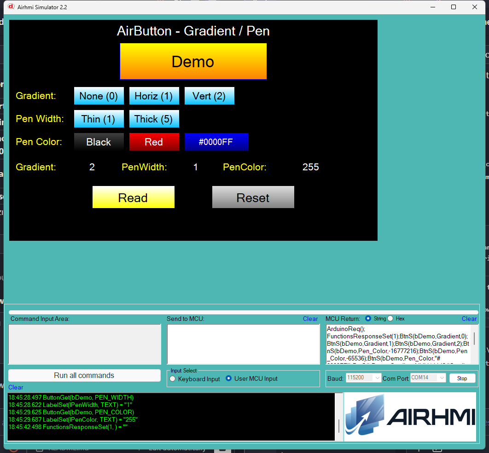

# Arduino ile AirButton Gradient ve Pen (Kenar) Yönetimi

Bu örnek, AirHMI butonunun **Gradient** (renk geçişi) ve **Pen_*** (kenar) özelliklerini Arduino tarafından kontrol eder.

## Klasör Yapısı

```
Gradient/
├── Gradient.ino    ← Arduino sketch'i
├── Gradient.ahi    ← AirHMI panel projesi (800×480)
├── 1.png           ← Simülatör ekran görüntüsü
└── README.md       ← Bu doküman
```

## Gradient Modları

| Değer | Anlam | Render |
|---|---|---|
| `0` | None | Düz dolgu, yalnızca `Color` |
| `1` | Horizontal | Soldan sağa `Color → ColorTo` |
| `2` | Vertical | Yukarıdan aşağı `Color → ColorTo` |

## Kullanılan AirButton Metotları

```cpp
// Gradient mode (panel atoi parse)
bDemo.Set_gradient(0);    // None
bDemo.Set_gradient(1);    // Horizontal
bDemo.Set_gradient(2);    // Vertical

// Pen (kenar)
bDemo.Set_pen_width(5);            // 5 px kalınlık
bDemo.Set_pen_color(0xFFFF0000);   // kırmızı (signed int)
bDemo.Set_pen_colorRGB("#0000FF"); // mavi (hex string)

// Get
uint32_t v;
bDemo.Get_gradient(&v);
bDemo.Get_pen_width(&v);
bDemo.Get_pen_color(&v);
```

Panel komutları:
- `BtnS(b,Gradient,N)` — N = 0/1/2
- `BtnS(b,Pen_Width,N)`
- `BtnS(b,Pen_Color,N)` — signed int
- `BtnS(b,Pen_Color,"#RRGGBB")` — hex string

## Panel Tarafı (Gradient.ahi)

| Nesne | Tür | İşlev |
|---|---|---|
| `bDemo` | EButton | Test butonu (Color sarı, ColorTo turuncu) |
| `bGradNone` / `bGradH` / `bGradV` | EButton | Set_gradient(0/1/2) |
| `bPenThin` / `bPenThick` | EButton | Set_pen_width(1/5) |
| `bPenBlack` / `bPenRed` | EButton | Set_pen_color (signed int) |
| `bPenHexBlue` | EButton | Set_pen_colorRGB("#0000FF") |
| `bRead` | EButton | Gradient + PenWidth + PenColor okur |
| `bReset` | EButton | Default'a (Vert / 1 / siyah) döner |
| `lGradient` / `lPenWidth` / `lPenColor` | ELabelBox | Get sonuçları |

## Çalışma Akışı

1. Yükleme — `.ahi` simülatöre, `.ino` Arduino'ya
2. **None / Horiz / Vert** → bDemo gradient modu değişir (sarı düz / yatay geçiş / dikey geçiş)
3. **Thin / Thick** → kenar kalınlığı 1 / 5 px
4. **Black / Red / #0000FF** → kenar rengi
5. **Read** → mevcut Gradient + PenWidth + PenColor değerleri etiketlerde
6. **Reset** → Vert + 1 px + siyah default

## Genel Özet

| Yön | Arduino Çağrısı | Panel Komutu |
|---|---|---|
| Yazma | `Set_gradient(uint32_t)` | `BtnS(b,Gradient,N)` |
| Yazma | `Set_pen_width(uint32_t)` | `BtnS(b,Pen_Width,N)` |
| Yazma | `Set_pen_color(uint32_t)` | `BtnS(b,Pen_Color,N)` |
| Yazma | `Set_pen_colorRGB(String)` | `BtnS(b,Pen_Color,"#RGB")` |
| Okuma | `Get_gradient(uint32_t*)` | `BtnG(b,Gradient,NULL)` |
| Okuma | `Get_pen_width(uint32_t*)` | `BtnG(b,Pen_Width,NULL)` |
| Okuma | `Get_pen_color(uint32_t*)` | `BtnG(b,Pen_Color,NULL)` |

## Notlar

- **Pen_Color signed**: Renk panel'de signed int olarak saklanır. `Set_pen_color(uint32_t)` `%ld` + `(int32_t)` cast ile gönderir, böylece negatif renkler doğru parse edilir.
- **Pen_Color hex**: `Set_pen_colorRGB("#FF00FF")` çift tırnak içinde gönderir; panel `remove_quotes()` + `strtol(...,16)` ile parse eder.
- **Pen_Width >0** olmazsa simülatör kenar çizmez (`if (PenWidth > 0)` kontrolü var).


