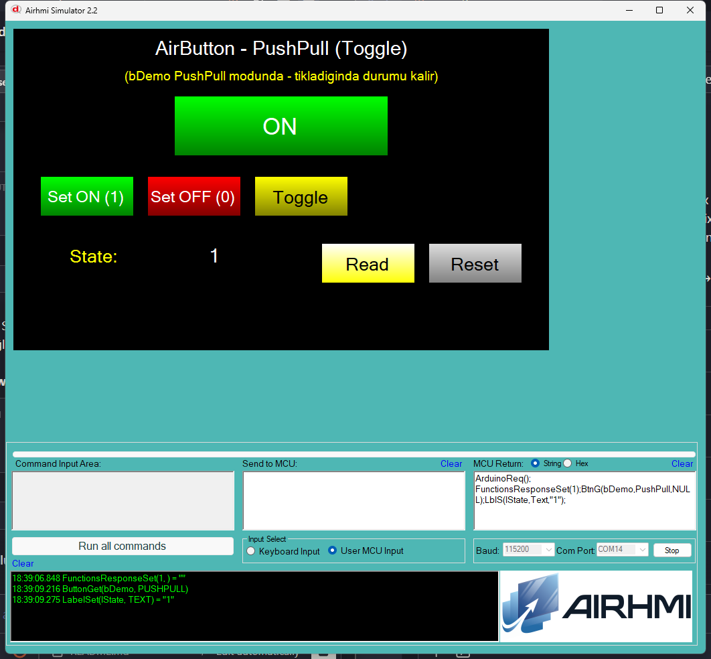

# Arduino ile AirButton Toggle (Push-Pull) Yönetimi

Bu örnek, AirHMI butonunun **PushPull** (toggle/latch) state'ini Arduino tarafından kontrol eder. Push-pull modunda olan bir buton, state'ini bir sonraki tıklamaya kadar korur (kalıcı).

## Klasör Yapısı

```
PushPull/
├── PushPull.ino    ← Arduino sketch'i
├── PushPull.ahi    ← AirHMI panel projesi (800×480)
├── 1.png           ← Simülatör ekran görüntüsü
└── README.md       ← Bu doküman
```

## PushPull Mantığı

| State | Görünüm | emWin/Panel render |
|---|---|---|
| `PushPullState = 1` | **Pressed/ON** — `Press_Color`, `PressFontColor`, `PressCaption` |
| `PushPullState = 0` | **Released/OFF** — `Color`, `Font_Color`, `Caption` |

> **Mode flag:** Buton'un toggle olarak davranması için `.ahi` dosyasında `<PushPull>True</PushPull>` olmalı. Aksi halde momentary buton olur ve state kalmaz.

## Kullanılan AirButton Metotları

```cpp
bDemo.Set_pushpull(1);   // toggle → ON  (pressed appearance)
bDemo.Set_pushpull(0);   // toggle → OFF (normal appearance)

uint32_t state = 0;
bDemo.Get_pushpull(&state);
```

Panel komutları: `BtnS(b,PushPull,1)` / `BtnS(b,PushPull,0)` / `BtnG(b,PushPull,NULL)`

## Panel Tarafı (PushPull.ahi)

| Nesne | Tür | İşlev |
|---|---|---|
| `bDemo` | EButton (`PushPull=True`) | Toggle buton — Color/Caption (off) ↔ Press_Color/PressCaption (on) |
| `bSetOn` | EButton | `Set_pushpull(1)` |
| `bSetOff` | EButton | `Set_pushpull(0)` |
| `bToggle` | EButton | Get → state'in tersini Set |
| `bRead` | EButton | Get_pushpull → lState |
| `bReset` | EButton | state=0 |
| `lState` | ELabelBox | Mevcut state (0 / 1) |

## Çalışma Akışı

1. Yükleme — `.ahi` simülatöre, `.ino` Arduino'ya
2. **Set ON** → bDemo yeşil "ON" görünür
3. **Set OFF** → bDemo gri "OFF" görünür
4. **Toggle** → mevcut tersine çevirir (round-trip ile state takip)
5. bDemo'ya direkt tıkla → simülatör de toggle yapar
6. **Read** → mevcut state etiket'te
7. **Reset** → state=0

## Genel Özet

| Yön | Arduino Çağrısı | Panel Komutu |
|---|---|---|
| Yazma | `Set_pushpull(uint32_t)` | `BtnS(b,PushPull,N)` |
| Okuma | `Get_pushpull(uint32_t*)` | `BtnG(b,PushPull,NULL)` |

## Notlar

### 🔧 Panel Firmware Inversion Düzeltmesi
Önceki firmware'da [03_button.c:506](file)'da `btn->PushPullState = atoi(value) ? 0 : 1` şeklinde **ters mantık** vardı (Set 1 → state 0). Düzeltildi → `atoi(value) ? 1 : 0` (intuitive).

### 🔧 Simulator Paint Düzeltmesi
Simulator [Button.cs:384, 613](file) eski panel inversion'ına göre yazılmıştı (`PushPullState == 0` ise pressed görünüm). Panel düzeltmesi sonrası tutarsız oldu, simulator paint kodu düzeltildi → `PushPullState == 1` ise pressed.

### emWin Render Tutarlılığı
Hem panel firmware (`emwin/button.c:57,91,108,130,178`) hem simulator paint kodu artık aynı semantik:
- state == 1 → `Press_Color`, `PressFontColor`, `PressCaption` / `CaptionPushPull`
- state == 0 → `Color`, `Font_Color`, `Caption`

### Touch Event Davranışı
Panel firmware [touch_event.c:213](file): bDemo'ya direkt tıklandığında state==0 ise OnDown event tetiklenir (going-on), state==1 ise OnUp tetiklenir (going-off). Sonra state toggle'lanır. Simulator de benzer davranışı sergiler.


