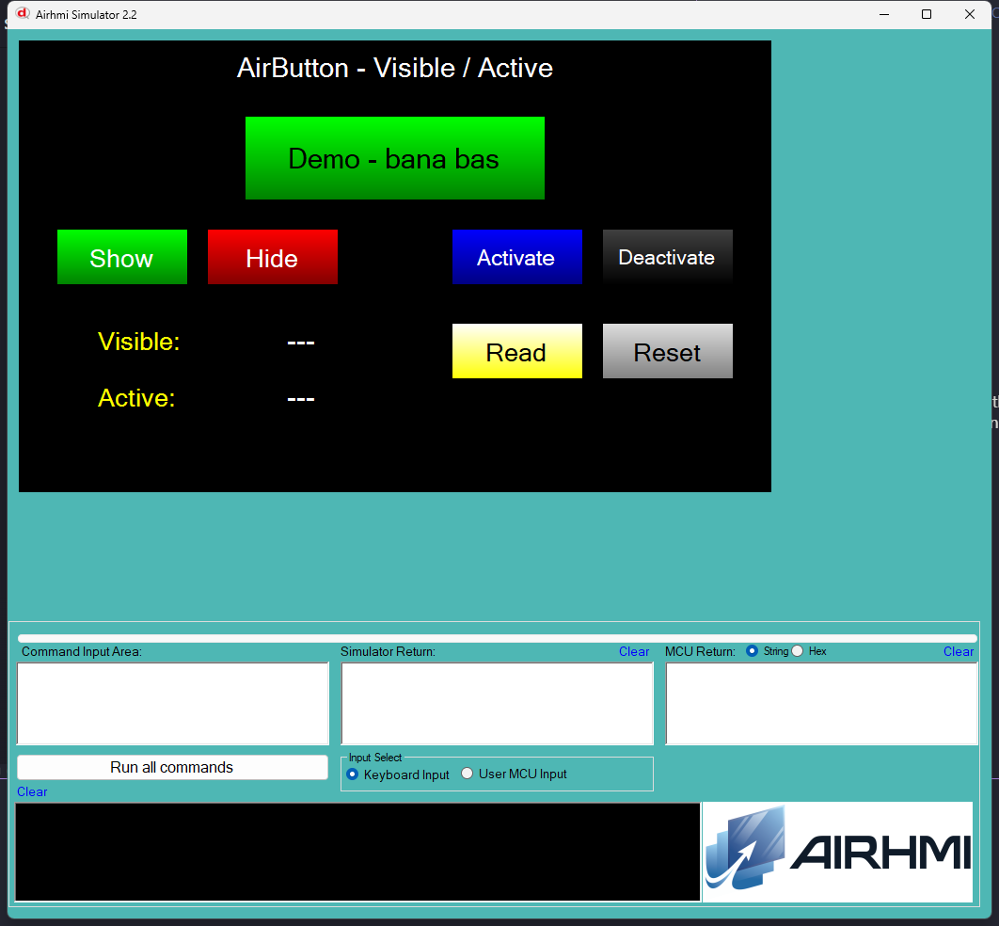

# Arduino ile AirButton Görünürlük ve Etkinlik Yönetimi (Visible / Active)

Bu örnek, AirHMI butonunun **Visible** (görünür/gizli) ve **Active** (etkin/pasif) özelliklerini Arduino tarafından kontrol eder.

## Klasör Yapısı

```
Visible_Active/
├── Visible_Active.ino    ← Arduino sketch'i
├── Visible_Active.ahi    ← AirHMI panel projesi (800×480)
├── 1.png                 ← Simülatör ekran görüntüsü
└── README.md             ← Bu doküman
```

## Visible vs Active

| Özellik | Anlamı |
|---|---|
| `Visible = 1` | Buton ekranda görünür |
| `Visible = 0` | Buton tamamen gizlenir (yer kaplamaz görünmez) |
| `Active = 1` | Buton dokunmaya yanıt verir (touch event tetiklenir) |
| `Active = 0` | Buton görünür ama **dokunulamaz** (panel firmware [touch_event.c:189](file) `ActiveObject == 0` ise event break eder) |

## Kullanılan AirButton Metotları

### Yazma
```cpp
bDemo.Set_visible(1);   // göster
bDemo.Set_visible(0);   // gizle
bDemo.Set_active(1);    // aktif
bDemo.Set_active(0);    // pasif
```
- Panel komutları: `BtnS(b,Visible,1)` / `BtnS(b,Active,0)` vb.
- Panel yalnızca `"1"`, `"0"`, `"TRUE"`, `"FALSE"` string'lerini kabul eder.

### Okuma
```cpp
uint32_t v = 0;
bDemo.Get_visible(&v);   // 0 ya da 1
bDemo.Get_active(&v);    // 0 ya da 1
```

## Panel Tarafı (Visible_Active.ahi)

| Nesne | Tür | İşlev |
|---|---|---|
| `bDemo` | EButton | Test butonu (gizlenir/gösterilir, etkinleştirilir/pasifleştirilir) |
| `bShow` | EButton | `Set_visible(1)` |
| `bHide` | EButton | `Set_visible(0)` |
| `bActivate` | EButton | `Set_active(1)` |
| `bDeactivate` | EButton | `Set_active(0)` |
| `bRead` | EButton | Visible + Active okur, etiketlere yazar |
| `bReset` | EButton | Default değerlere döner (1, 1) |
| `lVisible` / `lActive` | ELabelBox | Get sonuçları |

## Çalışma Akışı

1. **Yükleme**
   - `Visible_Active.ahi`'yi simülatöre veya panele yükle.
   - `Visible_Active.ino`'yu Arduino'ya yükle.
2. **Test**
   - **Hide** → bDemo gizlenir (kaybolur).
   - **Show** → bDemo geri görünür.
   - **Deactivate** → bDemo gri görünür (simülatör WinForms `Enabled=false`); dokunmaya yanıt vermez.
   - **Activate** → bDemo tekrar yanıt verir.
   - **Read** → mevcut Visible/Active (0 veya 1) etiketlerde.
   - **Reset** → her ikisini de 1'e geri çevirir.

## Genel Özet

| Yön | Arduino Çağrısı | Panel Komutu |
|---|---|---|
| Yazma | `Set_visible(uint32_t)` | `BtnS(b,Visible,N)` |
| Yazma | `Set_active(uint32_t)` | `BtnS(b,Active,N)` |
| Okuma | `Get_visible(uint32_t*)` | `BtnG(b,Visible,NULL)` |
| Okuma | `Get_active(uint32_t*)` | `BtnG(b,Active,NULL)` |

## Notlar

- **Simülatör Active fix:** Önceki versiyonda `ACTIVE` set yalnızca data property'sini güncelliyordu, WinForms `btn.Enabled` atanmıyordu. `PicocParser.cs`'e thread-safe `btn.Enabled = (ActiveObject == 1)` ataması eklendi → simulator artık deactivate edilen butonu gri ve dokunulamaz gösteriyor.
- **Visible attribute adı:** Set tarafında panel yalnızca `"VISIBLE"` matches eder (`"VIS"` etmez). Get tarafı her ikisini de kabul eder. AirButton kütüphanesi `,Visible,` gönderiyor.
- **Panel firmware Active:** [03_button.c:330](file) sadece data set ediyor; touch event kontrolü ([touch_event.c:189](file)) `if (ActiveObject == 0) break;` ile yapılıyor (görsel gri-out yok, ama dokunma reddediliyor).


