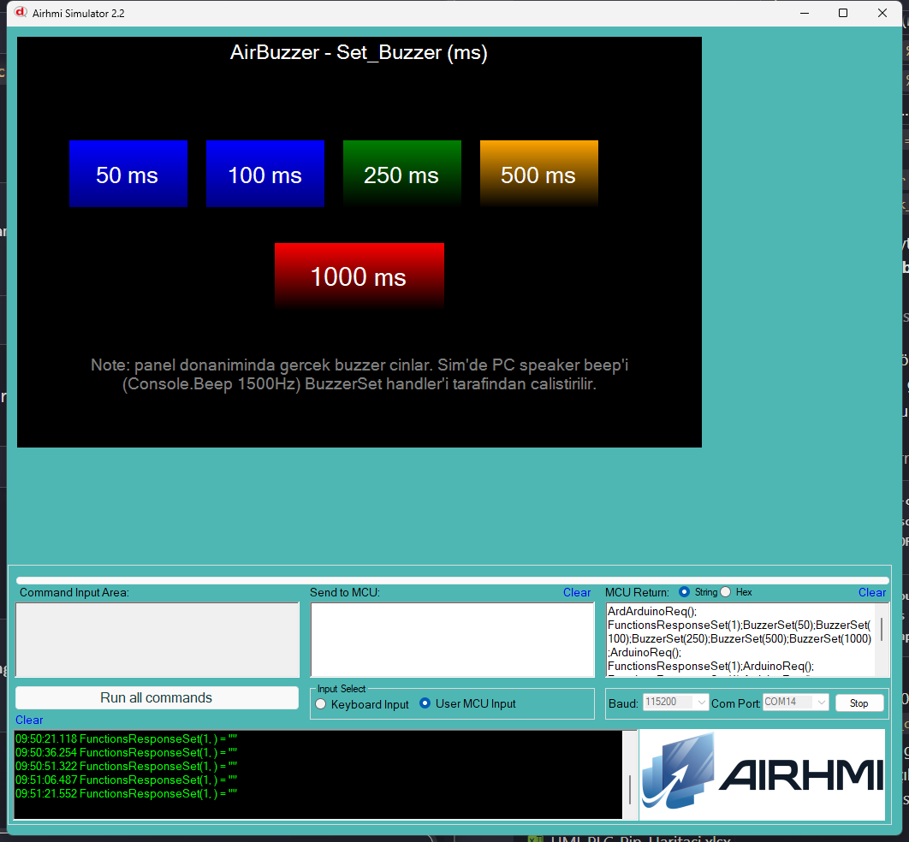

# Arduino ile AirBuzzer

Bu ornek panel kart uzerindeki donanim buzzer'ini Arduino tarafindan
sureli olarak cinlatir.

## Klasor Yapisi

```
Basics/
| - Basics.ino
| - Basics.ahi
| - 1.png
| - README.md
```

## Kullanilan Metotlar

```cpp
AirBuzzer buz = AirBuzzer("buz");

buz.Set_Buzzer(50);    // 50 ms
buz.Set_Buzzer(100);   // 100 ms
buz.Set_Buzzer(250);   // 250 ms
buz.Set_Buzzer(500);   // 500 ms
buz.Set_Buzzer(1000);  // 1000 ms
```

Panel komutu: `BuzzerSet(N)` (N = ms).

## Panel Tarafi (Basics.ahi)

| Nesne | Tur | Islev |
|---|---|---|
| `bShort` | EButton | `Set_Buzzer(50)` |
| `bClick` | EButton | `Set_Buzzer(100)` |
| `bBeep`  | EButton | `Set_Buzzer(250)` |
| `bMid`   | EButton | `Set_Buzzer(500)` |
| `bLong`  | EButton | `Set_Buzzer(1000)` |

## Genel Ozet

| Yon | Arduino Cagrisi | Panel Komutu |
|---|---|---|
| Yazma | `Set_Buzzer(uint32_t ms)` | `BuzzerSet(N)` |

## Notlar

### 🔧 Bu Ornekte Yapilan Eklemeler / Duzeltmeler

1. **`PicocParser.cs` (simulator)** — `BuzzerSet` case'ine
   `Console.Beep(1500, ms)` eklendi. Simulator'de PC speaker uzerinden
   duyumsal geri donut alinir. Arka plan thread'inde calisir
   (`Task.Run`) — UI bloklanmaz; surekli aramalarda 3000 ms ile sinirli.

### Test Sonucu

- Her butona basildiginda PC speaker'dan ilgili surede beep duyulur
- Gercek panel'de panel kart uzerindeki buzzer cinlar
- MCU log'da `BuzzerSet(50);BuzzerSet(100);...` komutlari sirayla gozukur

### Panel Kaynak Kodu Durumu

`AirBuzzer.cpp` ve panel firmware **degismedi** — komut zaten dogru
formatta. Sadece simulator'e duyumsal feedback eklendi.


