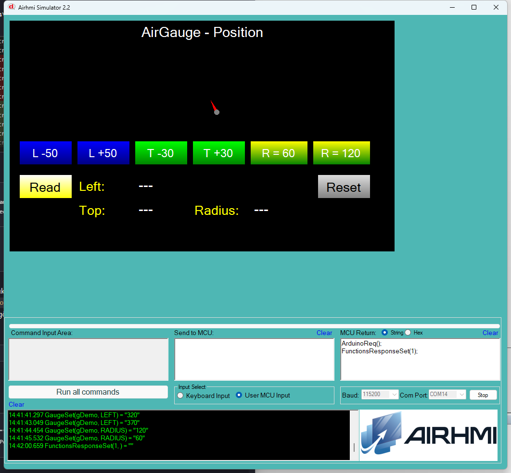

# Arduino ile AirGauge Konum / Yaricap Yonetimi (Position)

Bu ornek, AirHMI gauge nesnesinin **Left**, **Top** ve **Radius**
ozelliklerini Arduino tarafindan kontrol eder.

## Klasor Yapisi

```
Position/
| - Position.ino    <- Arduino sketch'i
| - Position.ahi    <- AirHMI panel projesi (800x480)
| - 1.png           <- Simulator ekran goruntusu
| - README.md       <- Bu dokuman
```

## Kullanilan AirGauge Metotlari

```cpp
gDemo.Set_left(370);          // x ekseninde 370 px
gDemo.Set_top(100);           // y ekseninde 100 px
gDemo.Set_radius(120);        // yaricap 120 (sim'de Width=Height=240 + ibre olcekleme)

uint32_t v;
gDemo.Get_left(&v);
gDemo.Get_top(&v);
gDemo.Get_radius(&v);         // sim'de Width/2 fallback
```

Panel komutlari: `GgS(g,Left|Top|Radius,N)` / `GgG(g,Left|Top|Radius,NULL)`.

## Panel Tarafi (Position.ahi)

| Nesne | Tur | Islev |
|---|---|---|
| `gDemo` | EveGauge | Test edilen ana gauge (default Left=320, Top=70, Width=160) |
| `bMoveL` / `bMoveR` | EButton | `Set_left(curLeft -50/+50)` (clamp 0..700) |
| `bMoveU` / `bMoveD` | EButton | `Set_top(curTop -30/+30)` (clamp 0..400) |
| `bRSmall` / `bRBig` | EButton | `Set_radius(60)` / `Set_radius(120)` |
| `bRead` | EButton | Tum 3 Get -> lLeft / lTop / lRad |
| `bReset` | EButton | Default'a don |
| `lLeft` / `lTop` / `lRad` | ELabel | Get sonuclari |

## Genel Ozet

| Yon | Arduino Cagrisi | Panel Komutu |
|---|---|---|
| Yazma | `Set_left(uint32_t)` | `GgS(g,Left,N)` |
| Yazma | `Set_top(uint32_t)` | `GgS(g,Top,N)` |
| Yazma | `Set_radius(uint32_t)` | `GgS(g,Radius,N)` |
| Okuma | `Get_left(uint32_t*)` | `GgG(g,Left,NULL)` |
| Okuma | `Get_top(uint32_t*)` | `GgG(g,Top,NULL)` |
| Okuma | `Get_radius(uint32_t*)` | `GgG(g,Radius,NULL)` |

## Calisma Akisi

1. Arduino UNO COM14'e yukle
2. Simulatoru ac, Position.ahi yukle
3. COM14'e baglan (115200 baud)
4. L-50/L+50/T-30/T+30 ile gauge'i ekranda gez (her butonda Arduino-side
   clamp uygulanir)
5. R=60 / R=120 ile gauge boyutunu degistir; ibre + merkez de orantili
   olceklenir
6. Read ile aktif degerleri lLeft / lTop / lRad'a yaz

## Notlar

### 🔧 Bu Ornekte Yapilan Eklemeler / Duzeltmeler

1. **PicocParser.cs `GaugeSet` RADIUS case eklendi**. Onceden
   yoktu — `Set_radius` sim'de yutuluyordu. Artik:
   - `Width = Height = 2 * radius`
   - `obj.Size` runtime guncelleme
   - **`NeedleX/NeedleY/NeedleHeight/NeedleWidth/NeedleCenterSize`
     orantili olcekleme** (ahi default rad=80'e gore: ibre uzun=0.5*rad,
     ibre kalin=0.125*rad, merkez=0.19*rad). `GaugeControl.OnPaint`
     bu degerlerle ciziyor; sadece Size set'i yetersizdi.
   - `obj.Invalidate()` zorla repaint
2. **PicocParser.cs `GaugeGet` RADIUS** — `Width / 2` fallback (TEveGauge'da
   `Radius` field'i yok — Value/ alt-orneginde eklenmisti).
3. **AirGauge.cpp** `buf[10] -> buf[16]` overflow guard tum SET'lerde.
4. **04_gauge.c** Get'lerine Arduino framing zaten Value/ alt-orneginde
   eklenmisti — Position degisiklikleri gerek kalmadan calisti.

### Bilinen Sinirlamalar

- Sim'de gauge `Radius` field'i yok; Width/Height ile temsil ediliyor.
  Get_radius `Width / 2` doner — ahi'de Width=2*radius olarak
  ayarlandiginda dogru. Eger `Set_radius` yapilmadan Width farkliysa,
  Get sonucu yaklasik olur.
- Panel firmware `04_gauge.c` Set tarafinda RADIUS dogrudan `evegauge->Radius`'u
  guncelliyor — gercek render etkisi panel donanimina baglidir
  (simulator'deki olcekleme yalnizca sim'e ozel mapping).


