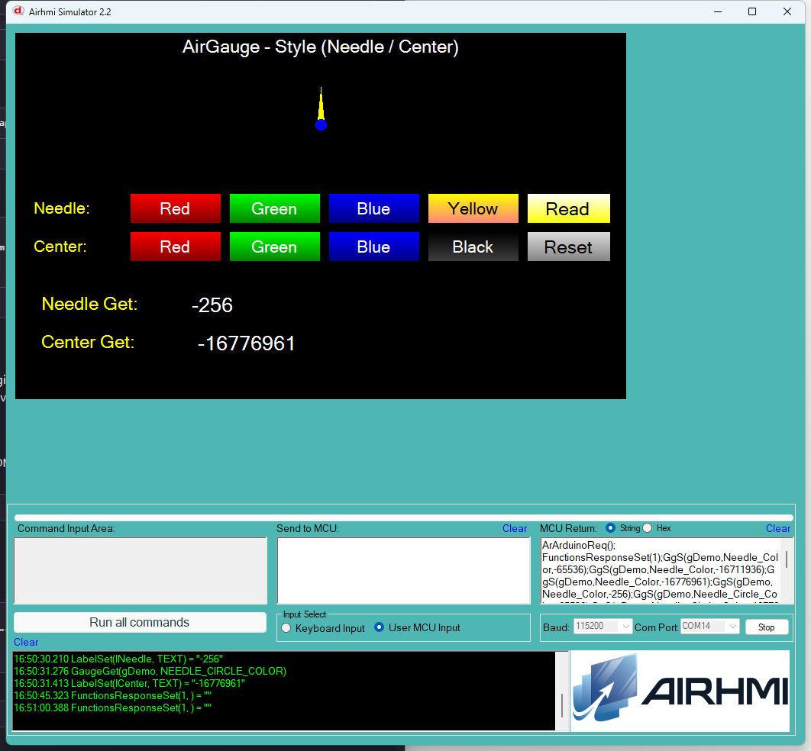

# Arduino ile AirGauge Renk Yonetimi (Style — Needle / Center)

Bu ornek, AirHMI gauge nesnesinin **ibre rengi** ve **ibre merkez yuvarlak
rengi** ozelliklerini Arduino tarafindan kontrol eder.

> Not: Panel firmware'da gauge govde rengi (`COLOR`) ayri bir attribute
> ama AHI Studio default'unda `NoBackGround=True` oldugu icin govde
> ekranda gorulmuyor; bu nedenle bu ornekte sadece **ibre + merkez**
> renkleri test ediliyor.

## Klasor Yapisi

```
Style/
| - Style.ino
| - Style.ahi
| - 1.png
| - README.md
```

## Renk Format'i

Panel ve simulator renkleri **signed int** olarak saklar (AHI Studio uyumlu):

| Renk | Hex (ARGB) | Signed Decimal |
|---|---|---|
| Kirmizi | 0xFFFF0000 | `-65536` |
| Yesil   | 0xFF00FF00 | `-16711936` |
| Mavi    | 0xFF0000FF | `-16776961` |
| Sari    | 0xFFFFFF00 | `-256` |
| Siyah   | 0xFF000000 | `-16777216` |
| Gri (default merkez) | 0xFF808080 | `-8355712` |

Arduino tarafinda `Set_needleColor((uint32_t)signedValue)` kullaniyoruz —
`(uint32_t)(int32_t)` cast ile bit pattern dogru gider.

## Kullanilan Metotlar

```cpp
gDemo.Set_needleColor((uint32_t)-65536);          // ibre kirmizi
gDemo.Set_needleCenterColor((uint32_t)-16776961); // merkez mavi

uint32_t v;
gDemo.Get_needleColor(&v);                        // ibre rengini oku
gDemo.Get_needleCenterColor(&v);                  // merkez rengini oku
```

Panel komutlari:
- `GgS(g,Needle_Color,N)` / `GgG(g,Needle_Color,NULL)`
- `GgS(g,Needle_Circle_Color,N)` / `GgG(g,Needle_Circle_Color,NULL)`

## Panel Tarafi (Style.ahi)

| Nesne | Tur | Islev |
|---|---|---|
| `gDemo` | EveGauge | Test edilen ana gauge |
| `bNeedleR` / `bNeedleG` / `bNeedleB` / `bNeedleY` | EButton | `Set_needleColor(R/G/B/Y)` |
| `bCenterR` / `bCenterG` / `bCenterB` / `bCenterK` | EButton | `Set_needleCenterColor(R/G/B/K)` |
| `bRead` | EButton | 2 Get -> `lNeedle` / `lCenter` |
| `bReset` | EButton | needle red, center gri |
| `lNeedle` / `lCenter` | ELabel | Get sonuclari |

## Genel Ozet

| Yon | Arduino Cagrisi | Panel Komutu |
|---|---|---|
| Yazma | `Set_needleColor(uint32_t)` | `GgS(g,Needle_Color,N)` |
| Yazma | `Set_needleCenterColor(uint32_t)` | `GgS(g,Needle_Circle_Color,N)` |
| Okuma | `Get_needleColor(uint32_t*)` | `GgG(g,Needle_Color,NULL)` |
| Okuma | `Get_needleCenterColor(uint32_t*)` | `GgG(g,Needle_Circle_Color,NULL)` |

## Calisma Akisi

1. Arduino UNO COM14'e yukle
2. Simulatoru ac, Style.ahi yukle
3. COM14'e baglan (115200 baud)
4. Needle satirindaki butonlarla ibre rengini degistir
5. Center satirindaki butonlarla merkez yuvarlak rengini degistir
6. Read ile aktif degerleri lNeedle / lCenter'a yaz
7. Reset ile default'a don

## Notlar

### 🔧 Bu Ornekte Yapilan Eklemeler / Duzeltmeler

1. **AirGauge.h / AirGauge.cpp** — Yeni 4 metot eklendi (Arduino API'de
   yoktu, source kodda vardi):
   - `Set_needleColor(uint32_t)` / `Get_needleColor(uint32_t*)`
   - `Set_needleCenterColor(uint32_t)` / `Get_needleCenterColor(uint32_t*)`
   - Hepsi `%ld + (int32_t)` cast ile signed renk format'i kullaniyor.
2. **Simulator** — `NEEDLE_COLOR` ve `NEEDLE_CIRCLE_COLOR` Set handler'lari
   `PicocParser.cs`'de zaten vardi (Pen_Color / NeedleCenterColor field'larina
   yaziyor + obj.penColor / obj.needleCenterColor runtime guncellemesi).
   Get tarafi Value/ alt-orneginde framing eklenmis ve `objectisinthispage
   == 0 && SC.Mode != 1` bypass'i ile birlikte calisiyor.
3. **Panel firmware** (`04_gauge.c`) — Set tarafi (NEEDLE_COLOR,
   NEEDLE_CIRCLE_COLOR) zaten vardi. Get tarafi framing'i Value/
   alt-orneginde eklenmisti. Bu ornek icin **ek degisiklik gerekmedi**.

### Test Sonucu

Sim'de ibre **Red/Green/Blue/Yellow** ile, merkez yuvarlak da
**Red/Green/Blue/Black** ile beklendigi sekilde renkleniyor. Get_needleColor
ve Get_needleCenterColor signed int decimal'i geri okuyor (-256 = sari,
-16776961 = mavi).

### Panel Kaynak Kodu Durumu

`04_gauge.c` **kaynak guncel** (Set + Get hepsi tam, framing dogru) ancak
panel donanimina flash test yapilmadi — bu test simulator uzerinden.


