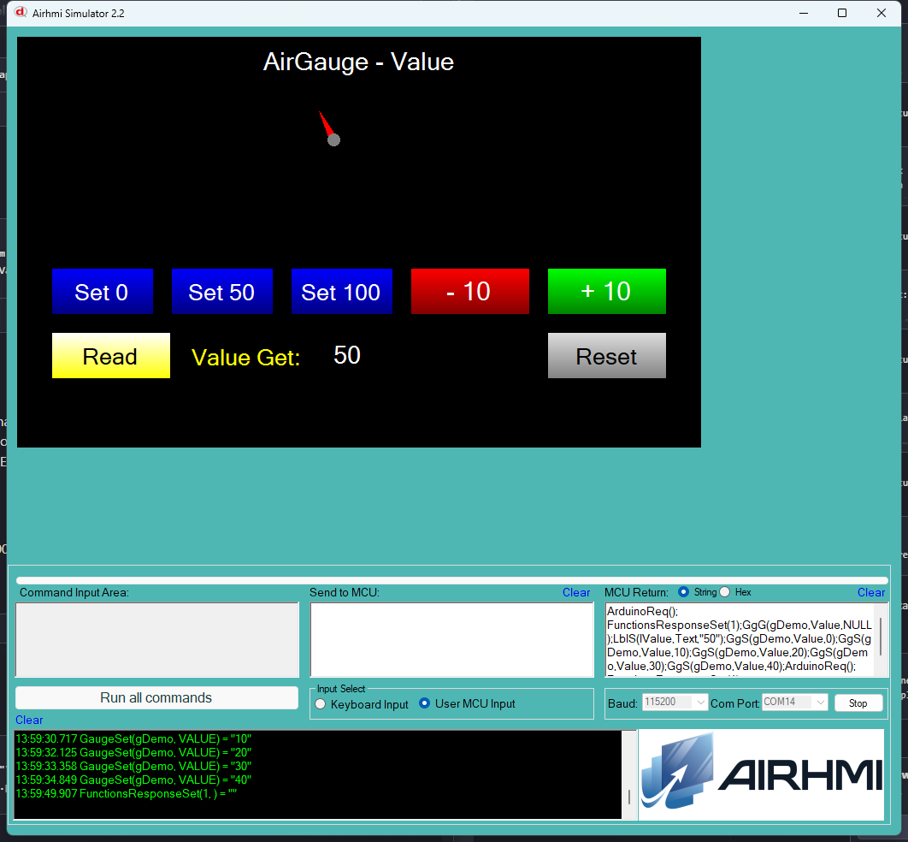

# Arduino ile AirGauge Deger Yonetimi (Value)

Bu ornek, AirHMI gauge nesnesinin **Value** (gosterge ibresi degeri)
ozelligini Arduino tarafindan kontrol eder. Set ile degeri yazar, Get ile
panel'den okur.

## Klasor Yapisi

```
Value/
| - Value.ino    <- Arduino sketch'i
| - Value.ahi    <- AirHMI panel projesi (800x480)
| - 1.png        <- Simulator ekran goruntusu
| - README.md    <- Bu dokuman
```

## Kullanilan AirGauge Metotlari

```cpp
gDemo.Set_value(50);          // ibreyi 50'ye getir (0..Range)

uint32_t v;
gDemo.Get_value(&v);          // panel'deki guncel degeri oku
```

Panel komutlari: `GgS(g,Value,N)` / `GgG(g,Value,NULL)`.

## Panel Tarafi (Value.ahi)

| Nesne | Tur | Islev |
|---|---|---|
| `gDemo` | EveGauge (Range=100, Major=10, Minor=5) | Test edilen ana gauge |
| `bSet0` / `bSet50` / `bSet100` | EButton | `Set_value(0/50/100)` |
| `bInc` / `bDec` | EButton | Local sayac +/-10 + `Set_value` (Arduino-side clamp 0..100) |
| `bRead` | EButton | `Get_value` -> `lValue` |
| `bReset` | EButton | `Set_value(0)`, lValue "---" |
| `lValue` | ELabel | Get sonucu |

## Genel Ozet

| Yon | Arduino Cagrisi | Panel Komutu |
|---|---|---|
| Yazma | `Set_value(uint32_t)` | `GgS(g,Value,N)` |
| Okuma | `Get_value(uint32_t*)` | `GgG(g,Value,NULL)` |

## Calisma Akisi

1. Arduino UNO COM14'e yukle: `arduino-cli compile && upload`
2. Simulatoru ac: `Airhmi_Simulator.exe Value.ahi`
3. COM14'e baglan (115200 baud)
4. Set / Inc / Dec butonlariyla ibreyi gez, Read ile geri oku
5. Reset ile sifira don

## Notlar

### 🔧 Bu Ornekte Yapilan Eklemeler / Duzeltmeler

1. **PicocParser.cs** — `GgG` alias'i eklendi (sadece `GaugeGet` vardi —
   Arduino'nun gonderdigi `GgG` sim'de mapleniyor degildi; Get hic
   calismiyordu). Gauge GET handler'ina `sendFramedG` lambda + Arduino
   mode bypass (`SC.Mode != 1`) + `RADIUS`/`COLOR`/`VIS` case'leri
   eklendi (sim'de Radius/Color field'i yok — Pen_Color/Width fallback).
2. **Panel firmware `04_gauge.c`** — `CGaugeGetEx`'teki 8 attribute'a
   `if(isArduinoConnected()) PRINTF("%c%d%c%c",1,X,0x7E,0x6F)` framing
   eklendi. `COLOR` Get hic yokmus (Arduino `Get_color` sessiz null
   donuyor du), yeni eklendi.
3. **AirGauge.cpp** — 6x `buf[10]` -> `buf[16]` (uint32_t overflow guard)
   ve `Set_color` icinde `%lu` -> `%ld + (int32_t)` cast (negatif renk
   degerleri panel'de signed int olarak saklanir).

### Bilinen Sinirlamalar

- `Set_color` / `Set_radius` simulator'de yutulur (TEveGauge'da `Color` ve
  `Radius` field'i yok — gauge body sim'de Pen_Color / Width ile
  ciziliyor). Panel firmware'da ikisi de gercek render'a girer.
- ScrollEnable / Scroll mantigi gauge'da yok.

### Panel Kaynak Kodu Durumu

`04_gauge.c` ve `FT_Screen.h` (Nuvoton firmware) **kaynak guncellendi**
ancak panel donanimi flash'lanmadi — bu test simulator uzerinden yapildi.


