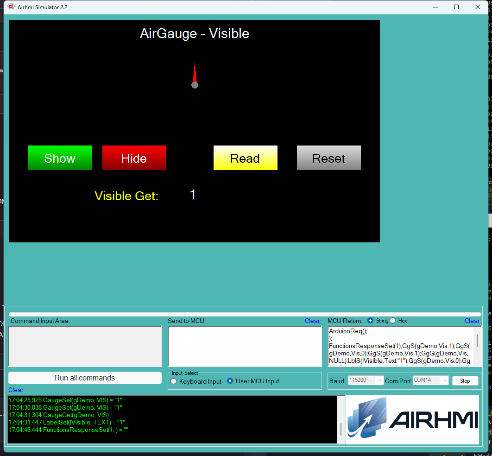

# Arduino ile AirGauge Gorunurluk Yonetimi (Visible)

Bu ornek, AirHMI gauge nesnesinin **Visible** ozelligini Arduino tarafindan
kontrol eder. `Set_visible(1)` gauge'i gosterir, `Set_visible(0)` gizler.

## Klasor Yapisi

```
Visible/
| - Visible.ino
| - Visible.ahi
| - 1.png
| - README.md
```

## Kullanilan Metotlar

```cpp
gDemo.Set_visible(1);          // goster
gDemo.Set_visible(0);          // gizle

uint32_t v;
gDemo.Get_visible(&v);         // 0 / 1
```

Panel komutlari: `GgS(g,Vis,N)` / `GgG(g,Vis,NULL)` (`Vis` ve `Visible`
ikisi de panel firmware'da ve sim'de kabul edilir).

## Panel Tarafi (Visible.ahi)

| Nesne | Tur | Islev |
|---|---|---|
| `gDemo` | EveGauge | Test edilen ana gauge |
| `bShow` / `bHide` | EButton | `Set_visible(1/0)` |
| `bRead` | EButton | `Get_visible` -> `lVisible` |
| `bReset` | EButton | `Set_visible(1)` |
| `lVisible` | ELabel | Get sonucu (0 / 1) |

## Genel Ozet

| Yon | Arduino Cagrisi | Panel Komutu |
|---|---|---|
| Yazma | `Set_visible(uint32_t)` | `GgS(g,Vis,N)` |
| Okuma | `Get_visible(uint32_t*)` | `GgG(g,Vis,NULL)` |

## Calisma Akisi

1. Arduino UNO COM14'e yukle
2. Simulatoru ac, Visible.ahi yukle
3. COM14'e baglan (115200 baud)
4. Hide ile gauge'i gizle, Show ile geri getir
5. Read ile durumu lVisible'a yaz
6. Reset ile default'a (gosterilir) don

## Notlar

### 🔧 Bu Ornekte Yapilan Eklemeler / Duzeltmeler

Bu alt-ornek icin **ek katman degisikligi gerekmedi**:
- AirGauge.cpp `Set_visible` / `Get_visible` zaten vardi (`buf[10]->buf[16]`
  fix Value/ alt-orneginde uygulanmis).
- PicocParser.cs gauge VISIBLE/VIS Set handler'i + Get framing zaten
  Value/ iterasyonunda eklenmis.
- Panel firmware `04_gauge.c` VISIBLE/VIS Set + Get framing Value/
  alt-orneginde tamamlanmis.

### Test Sonucu

Sim'de gauge **Hide**'da gizlenir (workSpace.Visible=false), **Show**'da
geri gelir. Read sonucunda `lVisible` 0 veya 1 doner.


