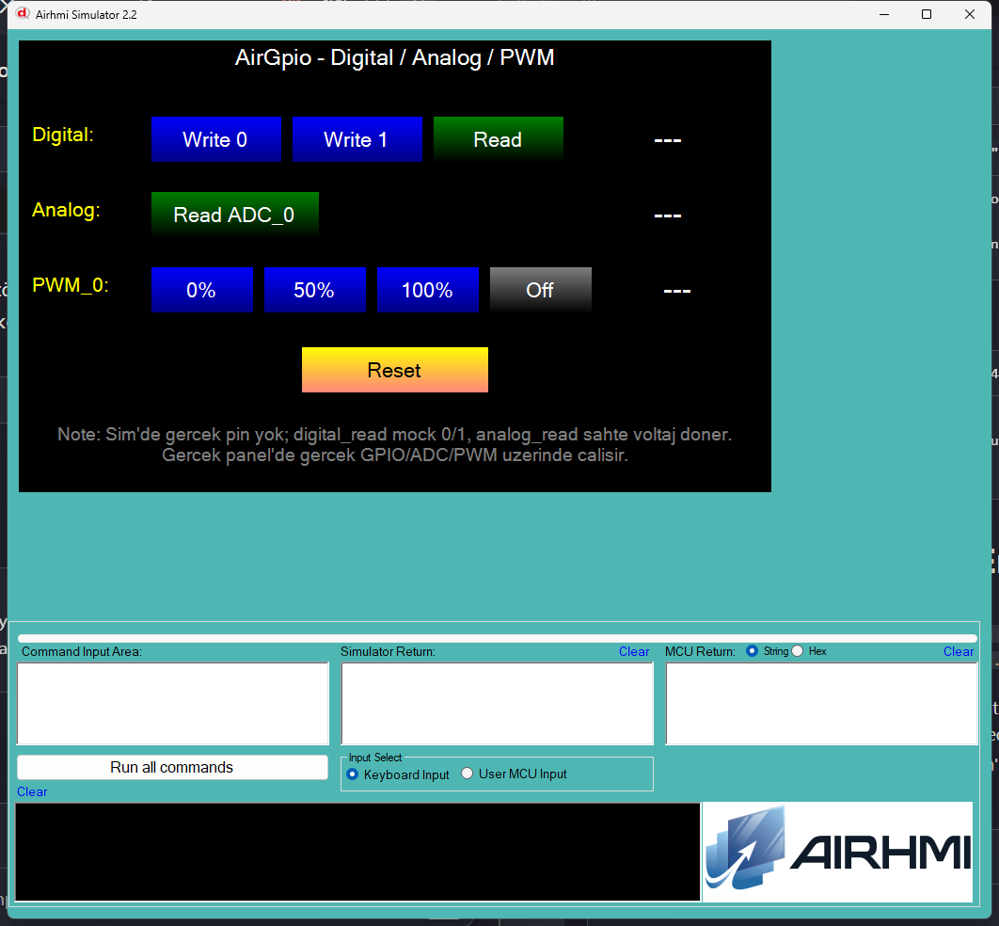

# Arduino ile AirGpio Temel Kullanim

Bu ornek, AirHMI panel'inin **GPIO / ADC / PWM** donanim katmanini Arduino
tarafindan kontrol eder. Tek ekranda 4 fonksiyon test edilir:

- **digital_write / digital_read** : `GPIO_0` portuna 0/1 yaz, oku
- **analog_read** : `ADC_0` portundan voltaj oku (V)
- **set_pwmfreq** : `PWM_0` icin %0 / %50 / %100 / Off (5 kHz)

> Sim'de gercek pin yok — `digital_read` mock olarak son yazilan degeri
> doner, `analog_read` sabit voltaj (1.6500V) doner. Gercek panel
> donaniminda gercek GPIO/ADC/PWM uzerinde calisir.

## Klasor Yapisi

```
Basics/
| - Basics.ino
| - Basics.ahi
| - 1.png
| - README.md
```

## Kullanilan Metotlar

```cpp
AirGpio gpio;

gpio.digital_write(0, 1);   // GPIO_0 = 1
gpio.digital_write(0, 0);   // GPIO_0 = 0

uint32_t v = gpio.digital_read(0);   // 0 / 1

double  vAdc = gpio.analog_read(0);  // ornek: 1.6500 (V)

gpio.set_pwmfreq(0, 5000,  50);  // PWM_0, 5 kHz, %50
gpio.set_pwmfreq(0, 0,      0);  // PWM_0 off
```

Panel komutlari: `GPIO_Write(GPIO_X,N)` / `GPIO_Read(GPIO_X,NULL)` /
`ADC_Read(N,Text,NULL)` / `PWM_Set(ch,freq,duty)`.

## Panel Tarafi (Basics.ahi)

| Nesne | Tur | Islev |
|---|---|---|
| `bWrite0` / `bWrite1` | EButton | `digital_write(0, 0/1)` |
| `bRead`               | EButton | `digital_read(0)` -> `lDigital` |
| `bAdc`                | EButton | `analog_read(0)` -> `lAdc` |
| `bPwm0` / `bPwm50` / `bPwm100` | EButton | 5 kHz, %0/%50/%100 |
| `bPwmOff`             | EButton | PWM off (`freq=0, duty=0`) |
| `bReset`              | EButton | GPIO=0, PWM off, etiketleri sifirla |
| `lDigital` / `lAdc` / `lPwm` | ELabelBox | okuma / durum etiketleri |

## Genel Ozet

| Yon | Arduino Cagrisi | Panel Komutu |
|---|---|---|
| Yazma | `digital_write(uint32_t port, uint32_t v)` | `GPIO_Write(GPIO_X, N)` |
| Okuma | `digital_read(uint32_t port)` | `GPIO_Read(GPIO_X, NULL)` |
| Okuma | `analog_read(uint32_t port)` -> `double` | `ADC_Read(N, Text, NULL)` |
| Yazma | `set_pwmfreq(port, freq, duty)` | `PWM_Set(ch, freq, duty)` |

## Notlar

### 🔧 Bu Ornekte Yapilan Eklemeler / Duzeltmeler

1. **`PicocParser.cs`** (simulator) — `GPIO_Write` / `GPIO_Read` /
   `ADC_Read` / `PWM_Set` case'leri uncomment + genisletildi:
   - `gpioState` static dictionary eklendi (write -> set, read -> oku).
   - `GPIO_Read` ve `ADC_Read` icin `0x01..0x7E 0x6F` Arduino framing
     gonderiliyor (`SC.Mode == 1` modunda).
   - `ADC_Read` 3 parametreli (`port, "Text", NULL`) oldugu icin
     3-param section'a tasindi.
   - `PWM_Set` / `PwmSet` case'i 3-param section'a eklendi.
2. **`17_gpio_adc.c`** (panel firmware) — `CGPIO_ReadEx` numeric Get
   yanitina `isArduinoConnected()` framing eklendi (ADC_Read gibi).
   `CADC_ReadEx` ve `CPWM_SetEx` zaten dogru.

### Test Sonucu

- `digital_write(0, 1)` -> `lDigital` "Read" sonrasi `1`
- `digital_write(0, 0)` -> `lDigital` "Read" sonrasi `0`
- `analog_read(0)` -> `lAdc` "1.6500" (sim mock voltaj)
- `set_pwmfreq(0, 5000, 50)` -> `lPwm` "50%" (Arduino yan etiketi)
- `Reset` -> tum etiketler `---`, GPIO_0=0, PWM off

### Panel Kaynak Kodu Durumu

`17_gpio_adc.c` **kaynak guncel** (CGPIO_ReadEx framed); panel donanima
flash test yapilmadi — sim uzerinden test.


