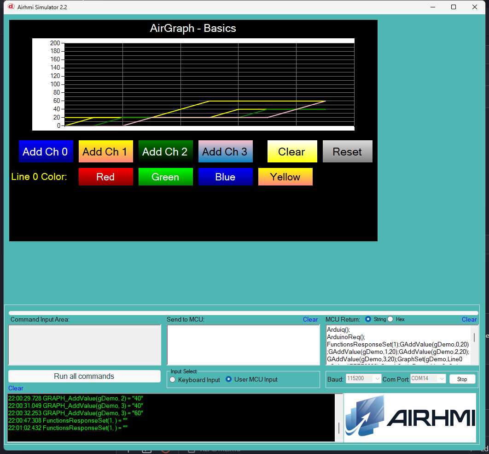

# Arduino ile AirGraph Temel Kullanim (Basics)

Bu ornek, AirHMI graph nesnesinin uc temel metodu — `addValue`,
`Set_line_color`, `clear` — Arduino tarafindan kontrol eder.

## Klasor Yapisi

```
Basics/
| - Basics.ino
| - Basics.ahi
| - 1.png
| - README.md
```

## Kullanilan Metotlar

```cpp
gDemo.addValue(0, 50);                    // channel 0'a 50 ekle
gDemo.addValue(1, 100);                   // channel 1
gDemo.Set_line_color(0, "#FFFF0000");     // channel 0 cizgi rengi kirmizi
gDemo.clear();                            // tum kanallari temizle
```

Panel komutlari:
- `GAddValue(g,ch,value);`
- `GraphSet(g,LineN_Color,#AARRGGBB);`
- `GRAPH_Clear(g);`

## Renk Format'i

`Set_line_color` panel'e **`#AARRGGBB`** hex string gonderir:

| Renk | Hex |
|---|---|
| Kirmizi | `#FFFF0000` |
| Yesil | `#FF00FF00` |
| Mavi | `#FF0000FF` |
| Sari | `#FFFFFF00` |

## Panel Tarafi (Basics.ahi)

| Nesne | Tur | Islev |
|---|---|---|
| `gDemo` | EGraph (Line_Count=4) | Test edilen ana graph |
| `bAdd0` / `bAdd1` / `bAdd2` / `bAdd3` | EButton | Her bastikta channel N'ye 20'ser artan deger ekler (0..200 arasi testere) |
| `bColR/G/B/Y` | EButton | `Set_line_color(0, "#...")` — channel 0 |
| `bClear` | EButton | `clear()` |
| `bReset` | EButton | counter sifirlama + clear + line 0 default mavi |

## Genel Ozet

| Yon | Arduino Cagrisi | Panel Komutu |
|---|---|---|
| Yazma | `addValue(uint32_t ch, uint32_t v)` | `GAddValue(g,ch,v);` |
| Yazma | `Set_line_color(ch, "#hex")` | `GraphSet(g,LineN_Color,#hex);` |
| Yazma | `clear()` | `GRAPH_Clear(g);` |

## Calisma Akisi

1. Arduino UNO COM14'e yukle
2. Simulatoru ac, Basics.ahi yukle
3. COM14'e baglan (115200 baud)
4. Add Ch 0/1/2/3 ile her kanal'a 4-5 kez bas — testere desenli cizgiler
5. Red/Green/Blue/Yellow ile channel 0 cizgi rengini degistir
6. Clear ile graf'i temizle
7. Reset ile default'a don

## Notlar

### 🔧 Bu Ornekte Yapilan Eklemeler / Duzeltmeler

1. **AirGraph.cpp** — `buf[10]`/`buf2[10]` -> `buf[16]`/`buf2[16]`
   overflow guard (uint32_t).
2. **PicocParser.cs GraphGet** — `sendFramedGr` lambda eklendi (Arduino
   bagli moddaysa numeric Get yanitlarini frame'le). Onceden hicbir
   GraphGet attribute framed degildi.
3. **Panel firmware `11_graph.c` GraphGet** — 9 attribute (LEFT, TOP,
   WIDTH, HEIGHT, VISIBLE/VIS, LINE0_COLOR, LINE1_COLOR, LINE2_COLOR,
   LINE3_COLOR) Arduino framing'i `if(isArduinoConnected())
   PRINTF("%c%d%c%c",1,X,0x7E,0x6F)` ile sarildi. VIS alias panel'de
   yokmus, eklendi.

### Test Sonucu

Sim'de **4 kanala** Arduino butonlariyla deger ekleniyor (testere
paterni); **channel 0 line color** 4 farkli renk ile degisiyor;
**Clear** graf'i tamamen sifirliyor.

### Panel Kaynak Kodu Durumu

`11_graph.c` **kaynak guncel** (Set 8 + Get 9 attribute, hepsi framed,
VIS alias dahil); panel donanima flash test yapilmadi — sim uzerinden.


