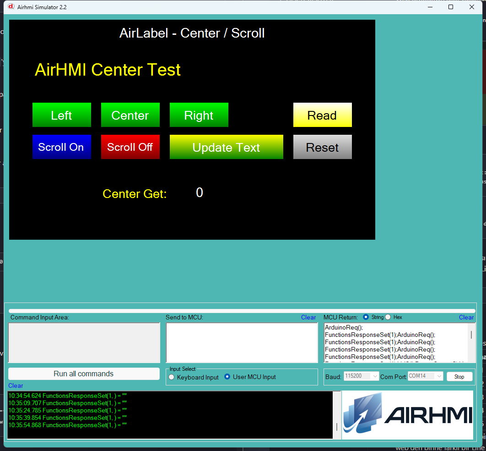

# Arduino ile AirLabel Hizalama ve Kaydirma Yonetimi (Center / Scroll)

Bu ornek, AirHMI etiketinin **Center** (yatay hizalama) ve **Scroll** (kaydirma animasyonu) ozelliklerini Arduino tarafindan kontrol eder.

## Klasor Yapisi

```
Center_Scroll/
| - Center_Scroll.ino    <- Arduino sketch'i
| - Center_Scroll.ahi    <- AirHMI panel projesi (800x480)
| - 1.png                <- Simulator ekran goruntusu
| - README.md            <- Bu dokuman
```

## Center vs Scroll

| Ozellik | Anlami |
|---|---|
| `Center = 0` | Metin sola yasli |
| `Center = 1` | Metin ortada |
| `Center = 2` | Metin saga yasli |
| `ScrollEnable = 0` | Kaydirma kapali (varsayilan) |
| `ScrollEnable = 1..6` | Kaydirma modu (panel firmware GUI_ANIM ile yon belirler) |
| `ScrollSpeed`        | Animasyon suresi catpani: sure = N x 50 ms |

> Not: ScrollEnable / ScrollSpeed yalnizca **panel firmware**'da
> animasyon olusturur. Simulator'de bu alanlar mevcut degil — komutlar
> sessizce yutulur (CMD_FINISHED yine doner).

## Kullanilan AirLabel Metotlari

```cpp
bDemo.Set_center(0);          // sola
bDemo.Set_center(1);          // ortala
bDemo.Set_center(2);          // saga

uint32_t v;
bDemo.Get_center(&v);         // mevcut hizalama (0/1/2)

bDemo.Set_scrollEnable(5);    // mod 5 (panel-only)
bDemo.Set_scrollEnable(0);    // kaydirma kapat
bDemo.Set_scrollSpeed(6);     // 6 x 50 ms = 300 ms (panel-only)
```

Panel komutlari:
- `LblS(l,Center,N)` / `LGet(l,Center,NULL)`
- `LblS(l,ScrollEnable,N)` (yalnizca SET — Get yok)
- `LblS(l,ScrollSpeed,N)`  (yalnizca SET — Get yok)

## Panel Tarafi (Center_Scroll.ahi)

| Nesne | Tur | Islev |
|---|---|---|
| `bDemo` | ELabelBox (700x80, sabit boyut) | Test edilen ana etiket |
| `bLeft` / `bCenter` / `bRight` | EButton | `Set_center(0/1/2)` |
| `bScrollOn` | EButton | `Set_scrollEnable(5)` + `Set_scrollSpeed(6)` |
| `bScrollOff` | EButton | `Set_scrollEnable(0)` |
| `bUpdate` | EButton | `setText(...)` ile metni doner; ScrollEnable acikken animasyon tetikler |
| `bRead` | EButton | `Get_center` -> `lCenter` |
| `bReset` | EButton | Default (center=0, scroll off, ilk metin) |
| `lCenter` | ELabel | Get sonucu |

> ELabelBox secildi cunku ELabel auto-size yapar (genislik metne kilitlenir),
> CENTER'in gorsel etkisi yalnizca sabit kutuda gozlemlenir.

## Genel Ozet

| Yon | Arduino Cagrisi | Panel Komutu |
|---|---|---|
| Yazma | `Set_center(uint32_t)` | `LblS(l,Center,N)` |
| Okuma | `Get_center(uint32_t*)` | `LGet(l,Center,NULL)` |
| Yazma | `Set_scrollEnable(uint32_t)` | `LblS(l,ScrollEnable,N)` |
| Yazma | `Set_scrollSpeed(uint32_t)` | `LblS(l,ScrollSpeed,N)` |

## Calisma Akisi

1. Arduino UNO COM14'e yukle: `arduino-cli compile && upload`
2. Simulatoru ac: `Airhmi_Simulator.exe Center_Scroll.ahi`
3. COM14'e baglan (115200 baud)
4. Left / Center / Right butonlariyla hizalamayi degistir, Read ile geri oku
5. Scroll On + Update Text ile (panel firmware'da) animasyonu izle
6. Reset ile default'a don

## Notlar

### 🔧 Bu Ornekte Yapilan Eklemeler / Duzeltmeler

1. **AirLabel.cpp/h** — Yeni metotlar eklendi:
   - `Set_center(uint32_t)` / `Get_center(uint32_t*)`
   - `Set_scrollEnable(uint32_t)` (write-only, panel CENTER attribute karsiligi)
   - `Set_scrollSpeed(uint32_t)` (write-only)
2. **PicocParser.cs LabelSet/LabelGet** — `CENTER` case'i hem ELabel hem
   ELabelBox icin eklendi: TLabel.Center field guncellenip
   `obj.TextAlign = MiddleLeft/MiddleCenter/MiddleRight` + `obj.Refresh()` ile
   gorsel zorla repaint ediliyor (TextAlign tek basina Invalidate tetiklemiyordu).
3. **Panel firmware** (`02_label.c`) — CENTER hem SET hem GET zaten
   destekliyordu, Get yanitlari `isArduinoConnected()` framing'i ile
   donuyor (onceki AirLabel/Position iterasyonunda eklendi). Burada degisiklik yok.

### Bilinen Sinirlamalar

- **ScrollEnable / ScrollSpeed simulator'de gorsel etki yapmaz.** TLabel
  struct'inda bu field'lar yok; runtime ekleme isi struct + Form1 paint
  loop ile geniş bir is. Panel firmware tarafinda GUI_ANIM aktiftir,
  `02_label.c` line 195 cevresindeki kaydirma kodu `setText` cagrisiyla
  tetiklenir.


