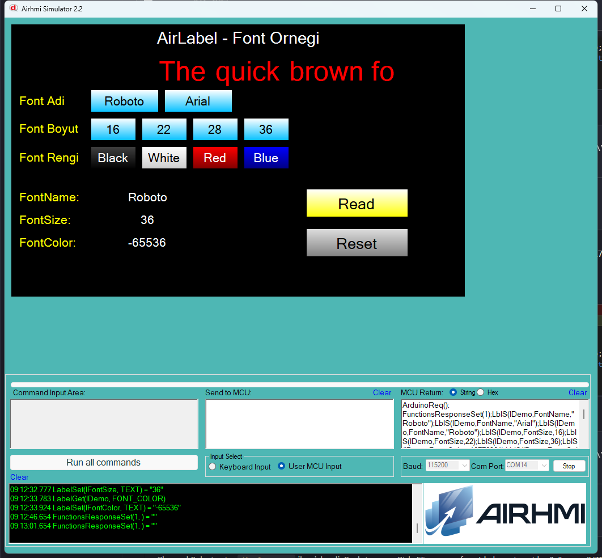

# Arduino ile AirLabel Yazı Tipi Yönetimi (Font)

Bu örnek, AirHMI etiketinin **yazı tipi adını, boyutunu ve rengini** Arduino tarafından kontrol eder.

## Klasör Yapısı

```
Font/
├── Font.ino    ← Arduino sketch'i
├── Font.ahi    ← AirHMI panel projesi (800×480)
├── 1.png       ← Simülatör ekran görüntüsü
└── README.md   ← Bu doküman
```

## Kullanılan AirLabel Metotları

```cpp
lDemo.Set_fontName(String("Roboto"));   // font ailesi (quote'lu)
lDemo.Set_fontSize(28);                 // panel limit 4..500
lDemo.Set_fontColor(0xFFFFFFFF);        // signed int (%ld cast)

char buf[24] = {0};
lDemo.getFontName(buf, sizeof(buf));

uint32_t v;
lDemo.Get_fontSize(&v);
lDemo.Get_fontColor(&v);
```

Panel komutları:
- `LblS(l,FontName,"...")`
- `LblS(l,FontSize,N)`
- `LblS(l,Font_Color,N)` (decimal int)
- `LGet(l,FontName,NULL)` / `LGet(l,FontSize,NULL)` / `LGet(l,Font_Color,NULL)`

## Panel Tarafı (Font.ahi)

| Nesne | Tür | İşlev |
|---|---|---|
| `lDemo` | ELabel | "The quick brown fox" demo etiket |
| `bRoboto` / `bArial` | EButton | Font adı presetleri |
| `bSize16/22/28/36` | EButton | Font boyutu presetleri |
| `bBlack/White/Red/Blue` | EButton | Font rengi presetleri |
| `bRead` | EButton | FontName + FontSize + FontColor okur |
| `bReset` | EButton | Roboto / 28 / beyaz default |
| `lFontName` / `lFontSize` / `lFontColor` | ELabelBox | Get sonuçları |

## Çalışma Akışı

1. Yükleme — `.ahi` simülatöre, `.ino` Arduino'ya
2. Font adı butonlarına bas → lDemo metni o fontla görünür
3. Boyut butonlarına bas → metin büyür/küçülür
4. Renk butonlarına bas → metin rengi değişir
5. **Read** → mevcut font ayarları etiketlerde
6. **Reset** → Roboto / 28 / beyaz default

## Genel Özet

| Yön | Arduino Çağrısı | Panel Komutu |
|---|---|---|
| Yazma | `Set_fontName(String)` | `LblS(l,FontName,"...")` |
| Yazma | `Set_fontSize(uint32_t)` | `LblS(l,FontSize,N)` |
| Yazma | `Set_fontColor(uint32_t)` | `LblS(l,Font_Color,N)` |
| Okuma | `getFontName(char*, int)` | `LGet(l,FontName,NULL)` |
| Okuma | `Get_fontSize(uint32_t*)` | `LGet(l,FontSize,NULL)` |
| Okuma | `Get_fontColor(uint32_t*)` | `LGet(l,Font_Color,NULL)` |

## Notlar

- **Simulator framing fix:** Label numeric Get yanıtları (FONTSIZE, FONT_COLOR, vb.) önceden sadece `.ToString()` döndürüyordu (Arduino framing yok). PicocParser.cs'e `sendFramed` lambda eklendi → 16 attribute (Label + LabelBox) için `0x01...0x7E 0x6F` framing.
- **Font_Color signed:** AirLabel `Set_fontColor` artık `%ld + (int32_t)` cast kullanıyor, negatif renk değerleri (.ahi format'ı) doğru parse ediliyor.
- **`Set_fontName` quote'lu:** Boşluklu adlar (örn. "Times New Roman") destekleniyor.


