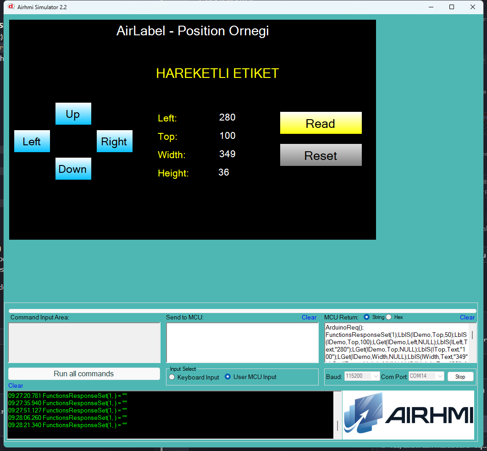

# Arduino ile AirLabel Konum Yönetimi (Position)

Bu örnek, AirHMI etiketinin **Left, Top, Width, Height** özelliklerini Arduino tarafından kontrol eder.

## Klasör Yapısı

```
Position/
├── Position.ino    ← Arduino sketch'i
├── Position.ahi    ← AirHMI panel projesi (800×480)
├── 1.png           ← Simülatör ekran görüntüsü
└── README.md       ← Bu doküman
```

## Kullanılan AirLabel Metotları

```cpp
// Konum ve boyut yazma
lDemo.Set_left(280);
lDemo.Set_top(60);
lDemo.Set_width(200);
lDemo.Set_height(40);

// Okuma
uint32_t v;
lDemo.Get_left(&v);
lDemo.Get_top(&v);
lDemo.Get_width(&v);
lDemo.Get_height(&v);
```

## Panel Tarafı (Position.ahi)

| Nesne | Tür | İşlev |
|---|---|---|
| `lDemo` | ELabel | Hareketli ana etiket |
| `bUp` / `bDown` | EButton | Top ±50 px |
| `bLeft` / `bRight` | EButton | Left ±50 px |
| `bRead` | EButton | Left/Top/Width/Height okur |
| `bReset` | EButton | Default konuma döner |
| `lLeft` / `lTop` / `lWidth` / `lHeight` | ELabel | Get sonuçları |

## Genel Özet

| Yön | Arduino Çağrısı | Panel Komutu |
|---|---|---|
| Yazma | `Set_left/top/width/height(uint32_t)` | `LblS(l,Left/Top/Width/Height,N)` |
| Okuma | `Get_left/top/width/height(uint32_t*)` | `LGet(l,Left/Top/Width/Height,NULL)` |

## Notlar

### 🔧 Simulator Düzeltmeleri (Bu Örnekte)
- **PicocParser.cs LabelGet**: WIDTH/HEIGHT case'leri eksikti, eklendi
- **PicocParser.cs LabelSet**: WIDTH/HEIGHT data + WinForms `obj.Width/Height` görsel update eklendi
- **WIDTH/HEIGHT auto-size fallback**: ELabel auto-size yaptığı için `Labels[k].Width` data field 0 kalır; Get artık `obj.Width` (gerçek WinForms boyutu) döndürür

### 🔧 Panel Firmware Düzeltmeleri (02_label.c)
- **WIDTH, HEIGHT, FONTNAME, CENTER** önceden sadece `sprintf(value,...)` yapıyordu → `value==NULL` Arduino çağrısında **null pointer dereference riski** vardı, NULL guard + Arduino framing eklendi
- **VISIBLE, ACTIVE, LEFT, TOP, FONT_COLOR, FONTSIZE, CAPTION** ham `PRINTF` yapıyordu (framing yok) → 11 attribute için `if(isArduinoConnected()) PRINTF("%c%d%c%c",1,X,0x7E,0x6F)` eklendi

### Sınır Kontrolü
- Sketch içinde Arduino-side sınır kontrolü (LCD_WIDTH=800, LCD_HEIGHT=480) — etiket ekran dışına taşmayı önler


