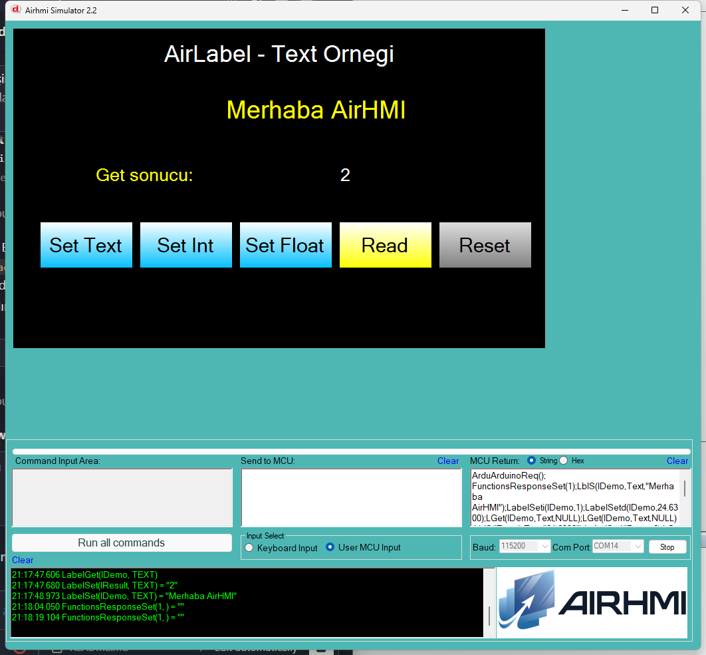

# Arduino ile AirLabel Metin Yönetimi (Text)

Bu örnek, Arduino tarafından AirHMI panelindeki bir etiket'in (label) metnini yazmak ve okumak için `AirLabel` sınıfının metin metotlarını gösterir.

## Klasör Yapısı

```
Text/
├── Text.ino    ← Arduino sketch'i
├── Text.ahi    ← AirHMI panel projesi (800×480)
├── 1.png       ← Simülatör ekran görüntüsü
└── README.md   ← Bu doküman
```

## Kullanılan AirLabel Metotları

### Yazma
```cpp
lDemo.setText("Merhaba AirHMI");   // düz metin (panel quote'lar)
lDemo.setTexti(12345);             // tamsayı → LabelSeti
lDemo.setTextf(24.78);             // ondalık → LabelSetd (dtostrf)
```
Panel komutları: `LblS(l,Text,"...")`, `LabelSeti(l,N)`, `LabelSetd(l,F)`

### Okuma
```cpp
char buf[32] = {0};
lDemo.getText(buf, sizeof(buf));
```
Panel komutu: `LGet(l,Text,NULL)` → framed yanıt

## Panel Tarafı (Text.ahi)

| Nesne | Tür | İşlev |
|---|---|---|
| `lDemo` | ELabel | Metni yazılan/okunan ana etiket |
| `bSetText` | EButton | `setText("Merhaba AirHMI")` |
| `bSetInt` | EButton | `setTexti(counter++)` |
| `bSetFloat` | EButton | `setTextf(temperature += 0.13)` |
| `bRead` | EButton | `getText` → `lResult.setText(buf)` |
| `bReset` | EButton | "Test Label" / "---" default |
| `lResult` | ELabelBox | Get sonucu |

## Çalışma Akışı

1. `Text.ahi`'yi simülatöre veya panele yükle
2. `Text.ino`'yu Arduino'ya yükle (COM14)
3. **Set Text** → lDemo "Merhaba AirHMI" olur
4. **Set Int** → her tıklamada artan tamsayı
5. **Set Float** → her tıklamada artan ondalık
6. **Read** → lDemo'nun mevcut metni lResult'a yansır
7. **Reset** → default'a dön

## Genel Özet

| Yön | Arduino Çağrısı | Panel Komutu |
|---|---|---|
| Yazma | `setText(const char*)` | `LblS(l,Text,"...")` |
| Yazma | `setTexti(uint32_t)` | `LabelSeti(l,N)` |
| Yazma | `setTextf(double)` | `LabelSetd(l,F)` |
| Okuma | `getText(char*, len)` | `LGet(l,Text,NULL)` |

## Notlar

- **ELabel vs ELabelBox:** `lDemo` dinamik (`ELabel` — runtime'da değiştirilebilir, AirLabel API hedefi). `lResult` statik (`ELabelBox` — sadece display).
- **Virgüllü metin:** Panel parser strtok virgüllü string'leri ayırıcı sayar (AirButton ile aynı sınırlama). `setText("Merhaba, Dünya")` çalışmaz; virgülsüz kullan.
- **Yeni metotlar:** `setTexti`/`setTextf` kütüphaneye yeni eklendi (panel `LabelSeti`/`LabelSetd` shortcut'larına karşılık gelir, AirButton API'si ile simetrik).


