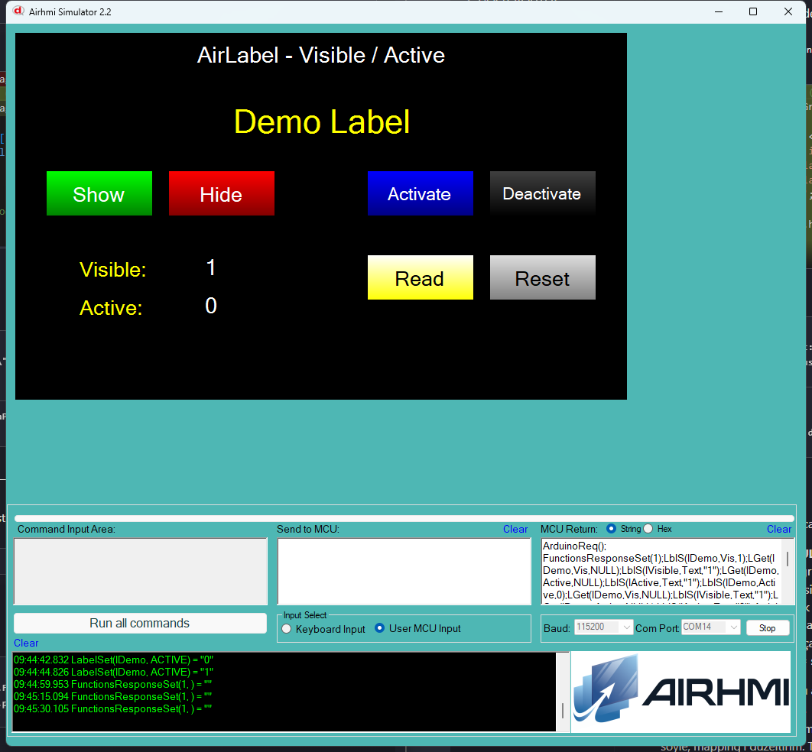

# Arduino ile AirLabel Görünürlük ve Etkinlik Yönetimi (Visible / Active)

Bu örnek, AirHMI etiketinin **Visible** (görünür/gizli) ve **Active** (etkin/pasif) özelliklerini Arduino tarafından kontrol eder.

## Klasör Yapısı

```
Visible_Active/
├── Visible_Active.ino    ← Arduino sketch'i
├── Visible_Active.ahi    ← AirHMI panel projesi (800×480)
├── 1.png                 ← Simülatör ekran görüntüsü
└── README.md             ← Bu doküman
```

## Visible vs Active

| Özellik | Anlamı |
|---|---|
| `Visible = 1` | Etiket ekranda görünür |
| `Visible = 0` | Etiket gizli (yer kaplamaz) |
| `Active = 1` | Etiket dokunma olaylarına yanıt verir (keypad açma vb.) |
| `Active = 0` | Etiket görünür ama **dokunulamaz** (simulator `obj.Enabled=false`) |

## Kullanılan AirLabel Metotları

```cpp
lDemo.Set_visible(1);    // göster
lDemo.Set_visible(0);    // gizle
lDemo.Set_active(1);     // aktif (yeni metot)
lDemo.Set_active(0);     // pasif (yeni metot)

uint32_t v;
lDemo.Get_visible(&v);
lDemo.Get_active(&v);
```

Panel komutları: `LblS(l,Vis,N)` / `LblS(l,Active,N)` / `LGet(l,Vis,NULL)` / `LGet(l,Active,NULL)`

## Panel Tarafı (Visible_Active.ahi)

| Nesne | Tür | İşlev |
|---|---|---|
| `lDemo` | ELabel | Test edilen ana etiket |
| `bShow` / `bHide` | EButton | `Set_visible(1/0)` |
| `bActivate` / `bDeactivate` | EButton | `Set_active(1/0)` |
| `bRead` | EButton | Visible + Active okur, etiketlere yazar |
| `bReset` | EButton | (1, 1) default |
| `lVisible` / `lActive` | ELabel | Get sonuçları |

## Genel Özet

| Yön | Arduino Çağrısı | Panel Komutu |
|---|---|---|
| Yazma | `Set_visible(uint32_t)` | `LblS(l,Vis,N)` |
| Yazma | `Set_active(uint32_t)` | `LblS(l,Active,N)` |
| Okuma | `Get_visible(uint32_t*)` | `LGet(l,Vis,NULL)` |
| Okuma | `Get_active(uint32_t*)` | `LGet(l,Active,NULL)` |

## Notlar

### 🔧 Bu Örnekte Yapılan Düzeltmeler
1. **AirLabel.cpp/h** — `Set_active`, `Get_active` metotları eklendi (yoktu)
2. **PicocParser.cs LabelSet ACTIVE** — `obj.Enabled` görsel update eklendi (button paterni)
3. **PicocParser.cs ButtonGet/LabelGet/LabelBoxGet** — `objectisinthispage == 0 && SC.Mode != 1` koşulu eklendi → Arduino mode'da `null` dönmüyor (re-handshake / sayfa değişikliği sonrası Get bozulmasın diye)

### Panel Firmware
`02_label.c` — `VISIBLE/VIS`, `ACTIVE` Get framing'i Position iterasyonunda eklenmişti, burada ek değişiklik yok.


