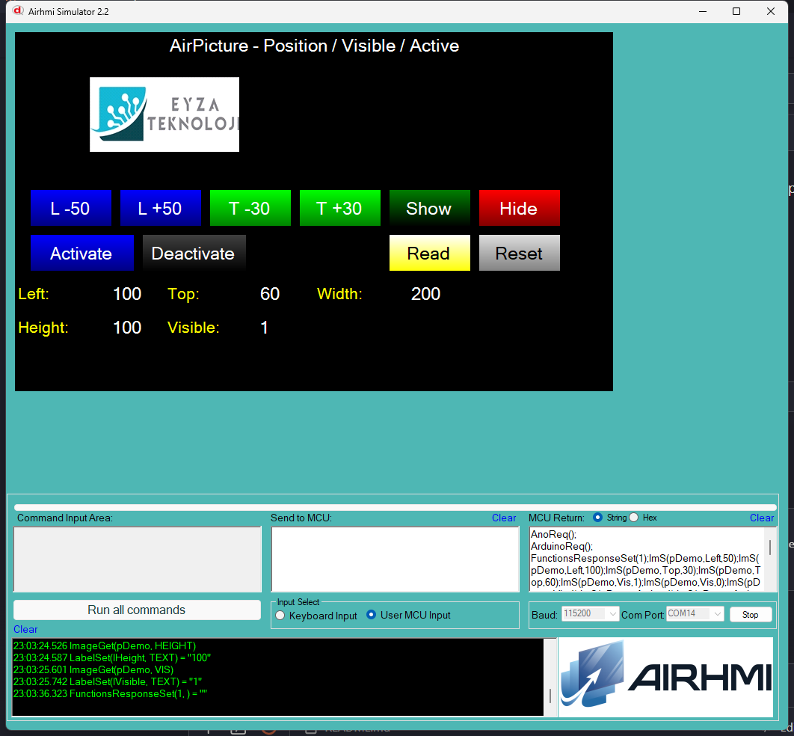

# Arduino ile AirPicture Konum / Gorunurluk / Etkinlik Yonetimi

Bu ornek, AirHMI resim (EImage) nesnesinin **Position**, **Visible** ve
**Active** ozelliklerini Arduino tarafindan kontrol eder.

> Not: `Set_Image_File` (resim dosyasi degistirme) bu ornekte test
> edilmedi — panel'de gercek resim asseti olmasi gerekir. Set/Get_visible,
> Set/Get_left/top/width/height ve Set_active test edilmistir.

## Klasor Yapisi

```
File_Position/
| - File_Position.ino
| - File_Position.ahi
| - 1.png
| - README.md
```

## Kullanilan Metotlar

```cpp
pDemo.Set_left(150);     // x
pDemo.Set_top(80);       // y
pDemo.Set_visible(0);    // gizle
pDemo.Set_active(0);     // tiklamayi devre disi
pDemo.Set_width(200);    // genislik
pDemo.Set_height(100);   // yukseklik

uint32_t v;
pDemo.Get_left(&v);
pDemo.Get_top(&v);
pDemo.Get_width(&v);
pDemo.Get_height(&v);
pDemo.Get_visible(&v);
```

Panel komutlari: `ImS(p,Left|Top|Width|Height|Vis|Active,N)` /
`ImG(p,...,NULL)`.

## Panel Tarafi (File_Position.ahi)

| Nesne | Tur | Islev |
|---|---|---|
| `pDemo` | EImage (200×100) | Test edilen ana resim (placeholder) |
| `bMoveL` / `bMoveR` | EButton | `Set_left(curLeft -50/+50)`, clamp 0..700 |
| `bMoveU` / `bMoveD` | EButton | `Set_top(curTop -30/+30)`, clamp 0..400 |
| `bShow` / `bHide` | EButton | `Set_visible(1/0)` |
| `bActivate` / `bDeactivate` | EButton | `Set_active(1/0)` |
| `bRead` | EButton | 5 Get -> lLeft / lTop / lWidth / lHeight / lVisible |
| `bReset` | EButton | Default'a don |

## Genel Ozet

| Yon | Arduino Cagrisi | Panel Komutu |
|---|---|---|
| Yazma | `Set_left(uint32_t)` | `ImS(p,Left,N)` |
| Yazma | `Set_top(uint32_t)` | `ImS(p,Top,N)` |
| Yazma | `Set_width(uint32_t)` | `ImS(p,Width,N)` |
| Yazma | `Set_height(uint32_t)` | `ImS(p,Height,N)` |
| Yazma | `Set_visible(uint32_t)` | `ImS(p,Vis,N)` |
| Yazma | `Set_active(uint32_t)` | `ImS(p,Active,N)` |
| Okuma | `Get_left(uint32_t*)` | `ImG(p,Left,NULL)` |
| Okuma | `Get_top(uint32_t*)` | `ImG(p,Top,NULL)` |
| Okuma | `Get_width(uint32_t*)` | `ImG(p,Width,NULL)` |
| Okuma | `Get_height(uint32_t*)` | `ImG(p,Height,NULL)` |
| Okuma | `Get_visible(uint32_t*)` | `ImG(p,Vis,NULL)` |

## Calisma Akisi

1. Arduino UNO COM14'e yukle
2. Simulatoru ac, File_Position.ahi yukle
3. COM14'e baglan (115200 baud)
4. L/R/U/D ile resmi ekranda gez
5. Show/Hide, Activate/Deactivate ile durumu degistir
6. Read ile aktif degerleri lLeft/lTop/lWidth/lHeight/lVisible'a yaz

## Notlar

### 🔧 Bu Ornekte Yapilan Eklemeler / Duzeltmeler

1. **AirPicture.cpp** — 7x `buf[10]` -> `buf[16]` overflow guard
   (uint32_t max 10 char + null gerek).
2. **PicocParser.cs ImageGet** — `sendFramedIm` lambda + `SC.Mode != 1`
   bypass eklendi (Arduino mode'da CurrentScreen sayfa kontrolu atlanir,
   re-handshake sonrasi Get null donmesin).
3. **Panel firmware `08_image.c` ImageGet** — 6 attribute (VIS/VISIBLE,
   ACTIVE, LEFT, TOP, WIDTH, HEIGHT) Arduino framing'i eklendi
   (`if(isArduinoConnected()) PRINTF("%c%d%c%c",1,X,0x7E,0x6F)`).
   Onceden hicbiri framed degildi.

### Bilinen Sinirlamalar

- `Set_Image_File` (resim degistirme): panel'de gercek dosya gerek;
  bu ornekte placeholder kullanildi (Picture_Hex bos). Yapildiginda
  Studio normalizasyonu `Picture_Name=pDemo.png` ekler.

### Panel Kaynak Kodu Durumu

`08_image.c` **kaynak guncel** (Set 18 attribute + Get 13 attribute,
6 numeric Get framed); panel donanima flash test yapilmadi — sim uzerinden.


