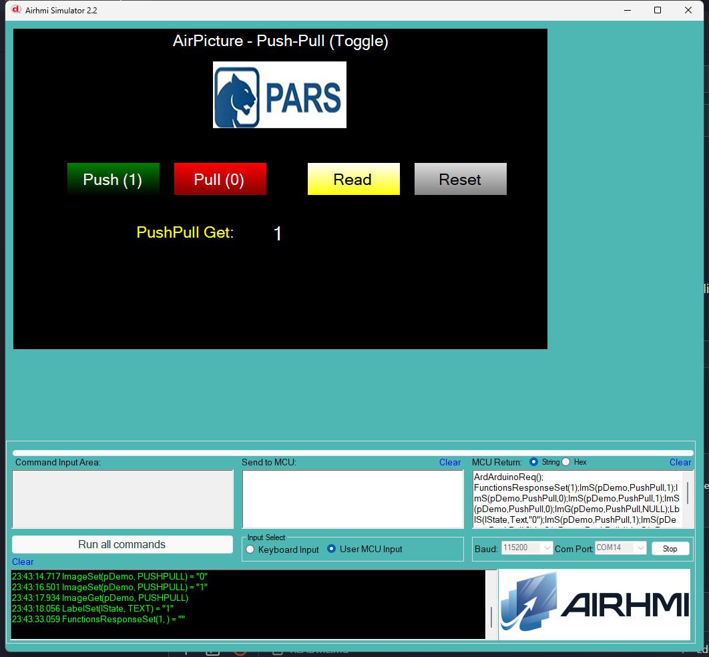

# Arduino ile AirPicture Push-Pull (Toggle) Yonetimi

Bu ornek, AirHMI resim nesnesinin **PushPull** ozelligini Arduino tarafindan
kontrol eder — basili tutma davranisi gibi calisir.

## PushPull Mantigi

Panel'de `PushPull=True` design-time flag'i olan resmin **iki gorseli** olur:
- `pDemo`           — varsayilan (pull)
- `pDemo_press`     — basili (push)

`Set_pushpull(1)` -> "press" gorseli; `Set_pushpull(0)` -> default gorsel.
`Get_pushpull()`  -> mevcut state (0 / 1).

## Klasor Yapisi

```
PushPull/
| - PushPull.ino
| - PushPull.ahi
| - 1.png
| - README.md
```

## Kullanilan Metotlar

```cpp
pDemo.Set_pushpull(1);     // press gorseli
pDemo.Set_pushpull(0);     // default gorsel

uint32_t v;
pDemo.Get_pushpull(&v);    // 0 / 1
```

Panel komutlari: `ImS(p,PushPull,N)` / `ImG(p,PushPull,NULL)`.

## Panel Tarafi (PushPull.ahi)

| Nesne | Tur | Islev |
|---|---|---|
| `pDemo` | EImage (PushPull=True, Picture_Press_Name=pDemorp.png) | Test edilen resim |
| `bOn` | EButton | `Set_pushpull(1)` — press |
| `bOff` | EButton | `Set_pushpull(0)` — pull |
| `bRead` | EButton | `Get_pushpull` -> `lState` |
| `bReset` | EButton | `Set_pushpull(0)` |
| `lState` | ELabel | Get sonucu (0 / 1) |

## Genel Ozet

| Yon | Arduino Cagrisi | Panel Komutu |
|---|---|---|
| Yazma | `Set_pushpull(uint32_t)` | `ImS(p,PushPull,N)` |
| Okuma | `Get_pushpull(uint32_t*)` | `ImG(p,PushPull,NULL)` |

## Notlar

### 🔧 Bu Ornekte Yapilan Eklemeler / Duzeltmeler

1. **AirPicture.cpp/.h** — `Set_pushpull(uint32_t)` ve `Get_pushpull(uint32_t*)`
   yeni eklendi (Arduino API'de yoktu).
2. **Panel firmware `08_image.c` ImageGet** — `PUSHPULL` Get hic yokmus,
   eklendi (`PushPullState` field'ini doner) + Arduino framing.
3. **Sim PicocParser ImageSet** — PUSHPULL Set zaten vardi
   (PushPullState toggle + `<name>_press` image visibility takasi).

### Test Sonucu

- `Set_pushpull(1)` -> panel'de `pDemo_press` gorunur, `pDemo` gizlenir
- `Set_pushpull(0)` -> tersi
- `Get_pushpull()` -> 0 veya 1 dogru doner

Sim'de press image `pDemorp.png` Studio tarafindan otomatik eklendi (ahi
dosyasi normalize). Sim'de iki image arasindaki gorsel takas calisir.

### Panel Kaynak Kodu Durumu

`08_image.c` PUSHPULL Set zaten vardi, **Get framed olarak yeni eklendi**.
Donanima flash test yapilmadi — sim uzerinden test.


