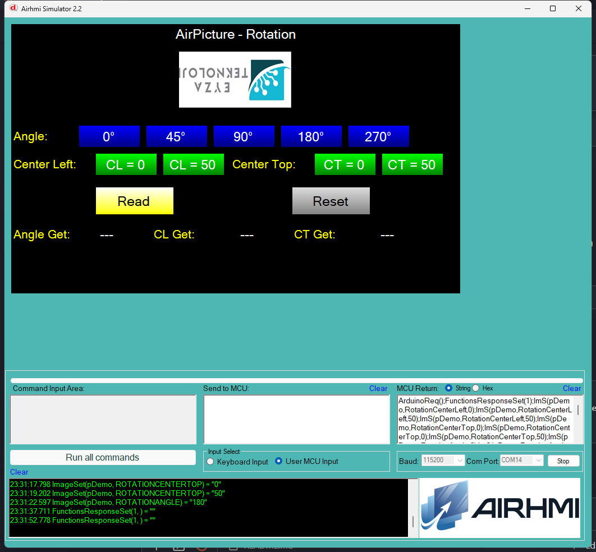

# Arduino ile AirPicture Rotasyon Yonetimi

Bu ornek, AirHMI resim nesnesinin rotasyon ozelliklerini Arduino tarafindan
kontrol eder:

- **Set/Get_rotationAngle** — derece (0..359)
- **Set/Get_rotationCenterLeft** — pivot X (yuzde 0..100)
- **Set/Get_rotationCenterTop** — pivot Y (yuzde 0..100)

## Klasor Yapisi

```
Rotation/
| - Rotation.ino
| - Rotation.ahi
| - 1.png
| - README.md
```

## Kullanilan Metotlar

```cpp
pDemo.Set_rotationAngle(45);          // 45° dondur
pDemo.Set_rotationCenterLeft(50);     // pivot x = orta
pDemo.Set_rotationCenterTop(50);      // pivot y = orta

uint32_t v;
pDemo.Get_rotationAngle(&v);
pDemo.Get_rotationCenterLeft(&v);
pDemo.Get_rotationCenterTop(&v);
```

Panel komutlari:
- `ImS(p,RotationAngle,N)` / `ImG(p,RotationAngle,NULL)`
- `ImS(p,RotationCenterLeft,N)` / `ImG(p,RotationCenterLeft,NULL)`
- `ImS(p,RotationCenterTop,N)` / `ImG(p,RotationCenterTop,NULL)`

## Pivot Mantigi (Sim'de)

Sim'de rotasyon `Graphics.RotateTransform` ile uygulanir. Pivot **yuzde**
olarak yorumlanir:

| Deger | Anlami |
|---|---|
| 0 | Sol/Ust kenar |
| 50 | Orta |
| 100 | Sag/Alt kenar |

Pivot piksel koordinati = (Image.Width × CL/100, Image.Height × CT/100).

## Panel Tarafi (Rotation.ahi)

| Nesne | Tur | Islev |
|---|---|---|
| `pDemo` | EImage (200×120) | Test edilen resim |
| `bA0/bA45/bA90/bA180/bA270` | EButton | `Set_rotationAngle(...)` |
| `bCL0` / `bCL50` | EButton | `Set_rotationCenterLeft(0/50)` |
| `bCT0` / `bCT50` | EButton | `Set_rotationCenterTop(0/50)` |
| `bRead` | EButton | 3 Get -> lAng / lCL / lCT |
| `bReset` | EButton | Default'a don (0/0/0) |
| `lAng` / `lCL` / `lCT` | ELabel | Get sonuclari |

## Genel Ozet

| Yon | Arduino Cagrisi | Panel Komutu |
|---|---|---|
| Yazma | `Set_rotationAngle(uint32_t)` | `ImS(p,RotationAngle,N)` |
| Yazma | `Set_rotationCenterLeft(uint32_t)` | `ImS(p,RotationCenterLeft,N)` |
| Yazma | `Set_rotationCenterTop(uint32_t)` | `ImS(p,RotationCenterTop,N)` |
| Okuma | `Get_rotationAngle(uint32_t*)` | `ImG(p,RotationAngle,NULL)` |
| Okuma | `Get_rotationCenterLeft(uint32_t*)` | `ImG(p,RotationCenterLeft,NULL)` |
| Okuma | `Get_rotationCenterTop(uint32_t*)` | `ImG(p,RotationCenterTop,NULL)` |

## Notlar

### 🔧 Bu Ornekte Yapilan Eklemeler / Duzeltmeler

1. **AirPicture.cpp/.h** — Yeni metotlar eklendi (Arduino API'de yoktu):
   `Set/Get_rotationAngle`, `Set/Get_rotationCenterLeft`,
   `Set/Get_rotationCenterTop`.
2. **PicocParser.cs `ApplyImageRotation` helper** — Orijinal image'dan
   `Graphics.RotateTransform` ile rotated bitmap olusturup PictureBox.Image'a
   atar. Pivot yuzde mantiginda. ROTATIONANGLE / ROTATIONCENTERLEFT /
   ROTATIONCENTERTOP Set'lerinden cagrilir.
3. **PicocParser.cs ImageGet** — `BLEND_COLOR`, `ROTATIONANGLE`,
   `ROTATIONCENTERLEFT`, `ROTATIONCENTERTOP`, `IMAGE_FILE_REPLACE` Set
   handler'lari eklendi (yoktu); 4 yeni Get attribute eklendi.
4. **Panel firmware `08_image.c` ImageGet** — BLEND_COLOR,
   ROTATIONANGLE, ROTATIONCENTERLEFT, ROTATIONCENTERTOP Get'lerine Arduino
   framing eklendi; `PUSHPULL` Get hic yokmus, eklendi.

### Test Sonucu

Sim'de **Rotation Angle** (0/45/90/180/270) gercek gorsel rotasyon yapiyor.
**Center Left/Top** pivot'u degistirip ayni acida farkli rotasyon merkezi
yaratiyor (orn. 45° + CL=0,CT=0 sol-ust pivot vs CL=50,CT=50 orta pivot).
Read sonuclari lAng/lCL/lCT'ye dogru yaziliyor.

### Panel Kaynak Kodu Durumu

`08_image.c` ROTATIONANGLE/ROTATIONCENTERLEFT/TOP **Set + Get** zaten panel
firmware'da vardi (Get'e framing yeni eklendi). Donanima flash test
yapilmadi — sim uzerinden test.


