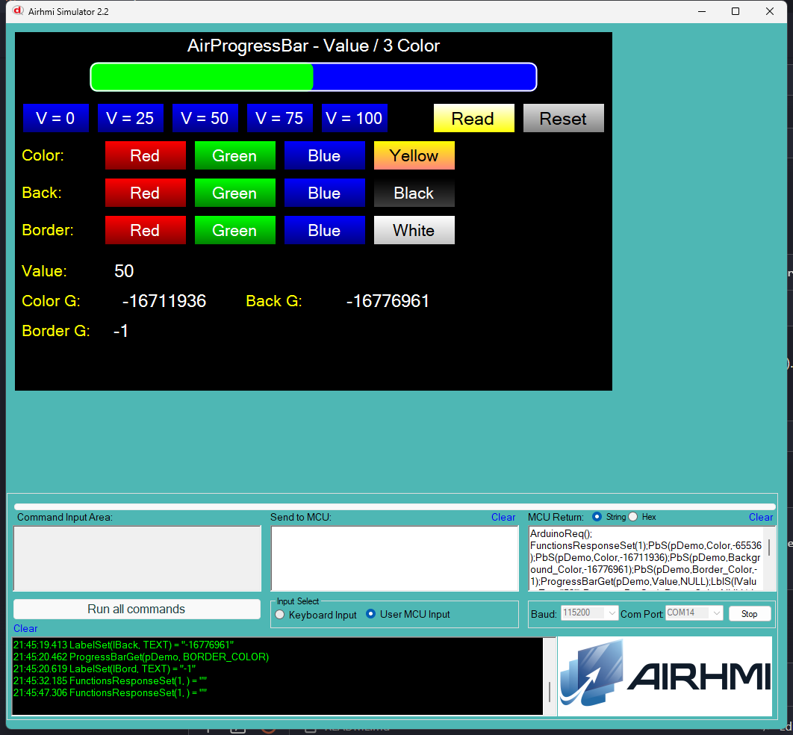

# Arduino ile AirProgressBar Deger ve 3 Renk Yonetimi (Value / Color)

Bu ornek, AirHMI progress bar nesnesinin **Value** ve uc farkli renk
ozelligini Arduino tarafindan kontrol eder:

- **Color** — progress'in **dolu** kismi (oncesi)
- **Background_Color** — progress'in **bos** kismi (sonrasi/arka)
- **Border_Color** — progress bar'in **kenar cizgisi**

## Klasor Yapisi

```
Value_Color/
| - Value_Color.ino
| - Value_Color.ahi
| - 1.png
| - README.md
```

## Kullanilan Metotlar

```cpp
pDemo.Set_Value(50);                            // 0..Range
pDemo.Set_Color((uint32_t)-16711936);           // dolu (yesil)
pDemo.Set_BackgroundColor((uint32_t)-16776961); // bos (mavi)
pDemo.Set_BorderColor((uint32_t)-1);            // kenar (beyaz)

uint32_t v;
pDemo.Get_Value(&v);
pDemo.Get_Color(&v);
pDemo.Get_BackgroundColor(&v);
pDemo.Get_BorderColor(&v);
```

Panel komutlari:
- `PbS(p,Value,N)` / `ProgressBarGet(p,Value,NULL)`
- `PbS(p,Color,N)` / `ProgressBarGet(p,Color,NULL)`
- `PbS(p,Background_Color,N)` / `ProgressBarGet(p,Background_Color,NULL)`
- `PbS(p,Border_Color,N)` / `ProgressBarGet(p,Border_Color,NULL)`

## Renk Format'i (signed int)

| Renk | Decimal |
|---|---|
| Kirmizi | -65536 |
| Yesil | -16711936 |
| Mavi | -16776961 |
| Sari | -256 |
| Beyaz | -1 |
| Siyah | -16777216 |

## Panel Tarafi (Value_Color.ahi)

| Nesne | Tur | Islev |
|---|---|---|
| `pDemo` | EveProgressBar (Range=100, BorderSize=2) | Test edilen ana progress bar |
| `bV0` / `bV25` / `bV50` / `bV75` / `bV100` | EButton | `Set_Value(...)` |
| `bColR/G/B/Y` | EButton | `Set_Color(...)` (dolu) |
| `bBackR/G/B/K` | EButton | `Set_BackgroundColor(...)` (bos) |
| `bBordR/G/B/W` | EButton | `Set_BorderColor(...)` (kenar) |
| `bRead` | EButton | 4 Get -> lValue / lCol / lBack / lBord |
| `bReset` | EButton | Default'a don |

## Genel Ozet

| Yon | Arduino Cagrisi | Panel Komutu |
|---|---|---|
| Yazma | `Set_Value(uint32_t)` | `PbS(p,Value,N)` |
| Yazma | `Set_Color(uint32_t)` | `PbS(p,Color,N)` |
| Yazma | `Set_BackgroundColor(uint32_t)` | `PbS(p,Background_Color,N)` |
| Yazma | `Set_BorderColor(uint32_t)` | `PbS(p,Border_Color,N)` |
| Okuma | `Get_Value(uint32_t*)` | `ProgressBarGet(p,Value,NULL)` |
| Okuma | `Get_Color(uint32_t*)` | `ProgressBarGet(p,Color,NULL)` |
| Okuma | `Get_BackgroundColor(uint32_t*)` | `ProgressBarGet(p,Background_Color,NULL)` |
| Okuma | `Get_BorderColor(uint32_t*)` | `ProgressBarGet(p,Border_Color,NULL)` |

## Notlar

### 🔧 Bu Ornekte Yapilan Eklemeler / Duzeltmeler

1. **AirProgressBar.cpp/.h** —
   - `buf[10]` -> `buf[16]` overflow guard
   - `Set_Color`'da `%lu` -> `%ld + (int32_t)` cast (signed renk)
   - **Yeni metotlar** (Arduino API'de yoktu, source kodda vardi):
     `Set_BackgroundColor` / `Get_BackgroundColor`
     `Set_BorderColor` / `Get_BorderColor`
2. **PicocParser.cs function dispatch** — `case "ProgressBarGet"` ve `case "PbG"`
   alias'lari hic yokmus, eklendi. Arduino'nun gonderdigi `ProgressBarGet(...)`
   sim'de tanitilmiyor, butun Get'ler null donuyor du. Fix sonrasi calisiyor.
3. **PicocParser.cs ProgressBarGet** — `sendFramedPb` lambda + `SC.Mode != 1`
   bypass + `VIS` alias eklendi.
4. **Panel firmware `06_progressbar.c`** — `CProgressBarGetEx`'teki 7 attribute'a
   `if(isArduinoConnected()) PRINTF("%c%d%c%c",1,X,0x7E,0x6F)` framing eklendi
   (hicbiri framed degildi).

### Test Sonucu

Sim'de progress bar 5 farkli value (0/25/50/75/100) ile dolup bosaliyor;
3 renk satiri (Color/Back/Border) bagimsiz kontrol ediliyor; Read sonucunda
4 ayri Get degeri lValue / lCol / lBack / lBord alanlarina yaziliyor.

### Panel Kaynak Kodu Durumu

`06_progressbar.c` **kaynak guncel** (Set 14 attribute + Get 7 attribute,
hepsinde framing); panel donanima flash test yapilmadi — sim uzerinden test.


