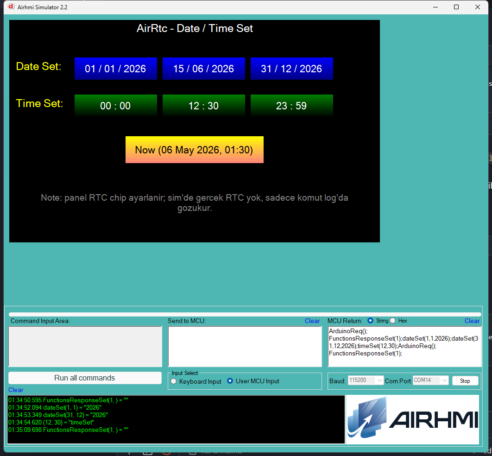

# Arduino ile AirRtc Tarih / Saat Ayarlama

Bu ornek, AirHMI panelinin **dahili RTC (gercek zaman saati) chip'inin**
tarih ve saatini Arduino tarafindan ayarlar.

## Klasor Yapisi

```
DateTime/
| - DateTime.ino
| - DateTime.ahi
| - 1.png
| - README.md
```

## Kullanilan Metotlar

```cpp
AirRtc rtc;

rtc.dateSet(15, 6, 2026);   // gun, ay, yil
rtc.timeSet(12, 30);        // saat, dakika
```

> Get karsiliklari yok. Panel firmware'da `CdateGetEx`/`CtimeGetEx`
> mevcut ama pointer-out parametre alir (`int *days, int *months`),
> picoc dispatch'inde Arduino'dan dogrudan cagrilamaz. Sadece panel-side
> picoc script'lerinden kullanilabilir.

Panel komutlari: `dateSet(d,m,y);` / `timeSet(h,m);` (3 ve 2 parametreli).

## Panel Tarafi (DateTime.ahi)

| Nesne | Tur | Islev |
|---|---|---|
| `bDate1/2/3` | EButton | 3 farkli tarih (01/01/2026, 15/06/2026, 31/12/2026) |
| `bTime1/2/3` | EButton | 3 farkli saat (00:00, 12:30, 23:59) |
| `bNow` | EButton | Sabit "now" (06/05/2026 + 01:30) |

## Genel Ozet

| Yon | Arduino Cagrisi | Panel Komutu |
|---|---|---|
| Yazma | `dateSet(int d, int m, int y)` | `dateSet(d,m,y);` |
| Yazma | `timeSet(int h, int m)` | `timeSet(h,m);` |

## Notlar

### 🔧 Bu Ornekte Yapilan Eklemeler / Duzeltmeler

1. **AirRtc.cpp** — `sDay/sMonth/sYear/sHour/sMin` `[10]` -> `[16]` overflow
   guard (tutarlilik, int 16-bit icin 5 char yeterli ama yine de).
2. **PicocParser.cs `case "timeSet":`** — Dispatch tablosunda `result =
   string.Join(...)` satiri eksikti, `dateSet`'te vardi. Onceden
   `timeSet` komutu sim'de silently dropped oluyordu. Eklendi.
3. **Panel firmware `19_time_date.c`** — Degisiklik gerekmedi:
   `CdateSetEx`/`CtimeSetEx` zaten RTC chip'ine dogru yaziyor;
   `library_common.c` dispatch tablosunda `dateSet`/`timeSet` 3 ve 2
   `int*` parametreli olarak baglanmis.

### Panel Kaynak Kodu Durumu

`19_time_date.c` ve `library_common.c` **kaynak guncel** (degisiklik
yok); panel donanima flash test yapilmadi — sim uzerinden test.

### Sim Sinirlamasi

Sim'de gercek RTC chip yok — `dateSet/timeSet` komutlari log'a yazilir
ama saat/tarih simulator'da gosterilmez. Panel donanim flash'landiginda
gercek RTC ayarlanir.


