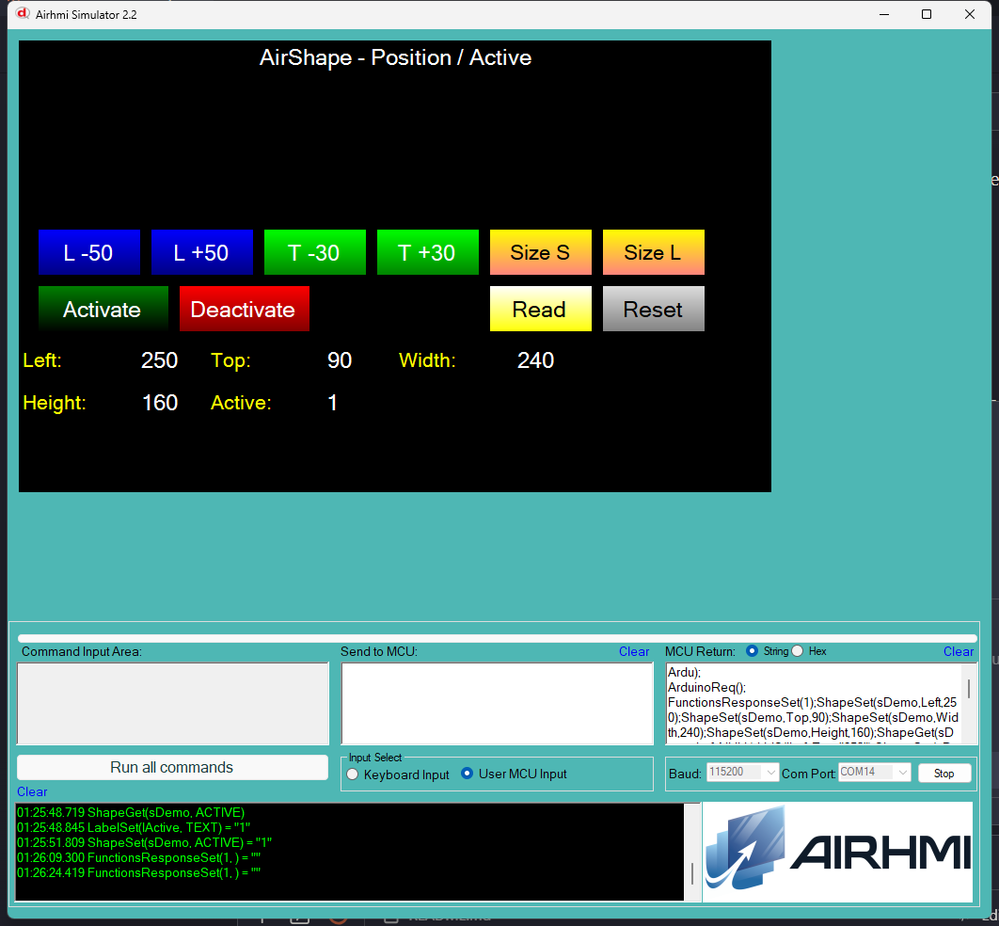

# Arduino ile AirShape Konum / Etkinlik Yonetimi

Bu ornek, AirHMI shape (TransShape) nesnesinin **Position** ve **Active**
ozelliklerini Arduino tarafindan kontrol eder.

> Shape, ekranda **gorunmez bir touch alani** olarak kullanilir — `Active=1`
> oldugunda dokunma olaylarina yanit verir, alanin uzerine basilirsa
> OnDown/OnPress callback'leri tetiklenir.

## Klasor Yapisi

```
Position_Active/
| - Position_Active.ino
| - Position_Active.ahi
| - 1.png
| - README.md
```

## Kullanilan Metotlar

```cpp
sDemo.Set_left(250);     // x
sDemo.Set_top(80);       // y
sDemo.Set_width(160);    // w
sDemo.Set_height(120);   // h
sDemo.Set_active(1);     // touch yanitini ac
sDemo.Set_active(0);     // kapat

uint32_t v;
sDemo.Get_left(&v);
sDemo.Get_top(&v);
sDemo.Get_width(&v);
sDemo.Get_height(&v);
sDemo.Get_Active(&v);    // 0 / 1
```

Panel komutlari: `ShapeSet(s,Left|Top|Width|Height|Active,N)` /
`ShapeGet(s,...,NULL)`.

## Panel Tarafi (Position_Active.ahi)

| Nesne | Tur | Islev |
|---|---|---|
| `sDemo` | EShape (160×120 default) | Test edilen shape |
| `bMoveL/R/U/D` | EButton | `Set_left/top` -50/+50, -30/+30 (clamp) |
| `bSizeS` | EButton | `Set_width(120)` + `Set_height(80)` |
| `bSizeL` | EButton | `Set_width(240)` + `Set_height(160)` |
| `bActivate` / `bDeactivate` | EButton | `Set_active(1/0)` |
| `bRead` | EButton | 5 Get -> lLeft / lTop / lWidth / lHeight / lActive |
| `bReset` | EButton | Default'a don |

## Genel Ozet

| Yon | Arduino Cagrisi | Panel Komutu |
|---|---|---|
| Yazma | `Set_left(uint32_t)` | `ShapeSet(s,Left,N)` |
| Yazma | `Set_top(uint32_t)` | `ShapeSet(s,Top,N)` |
| Yazma | `Set_width(uint32_t)` | `ShapeSet(s,Width,N)` |
| Yazma | `Set_height(uint32_t)` | `ShapeSet(s,Height,N)` |
| Yazma | `Set_active(uint32_t)` | `ShapeSet(s,Active,N)` |
| Okuma | `Get_left(uint32_t*)` | `ShapeGet(s,Left,NULL)` |
| Okuma | `Get_top(uint32_t*)` | `ShapeGet(s,Top,NULL)` |
| Okuma | `Get_width(uint32_t*)` | `ShapeGet(s,Width,NULL)` |
| Okuma | `Get_height(uint32_t*)` | `ShapeGet(s,Height,NULL)` |
| Okuma | `Get_Active(uint32_t*)` | `ShapeGet(s,Active,NULL)` |

## Notlar

### 🔧 Bu Ornekte Yapilan Eklemeler / Duzeltmeler

1. **AirShape.cpp** — 5x `buf[10]` -> `buf[16]` overflow guard.
2. **AirShape.cpp `Get_Active` BUG fix** — Onceden `,Vis,` gonderiyordu.
   Panel'de Shape icin **VIS attribute YOK** (sadece ACTIVE var) — bu yuzden
   Get_Active hep null/0 donuyor du. Simdi `,Active,` gondererek panel'in
   destekledigi attribute ile sorgulanir.
3. **PicocParser.cs ShapeGet** — `sendFramedSh` lambda eklendi (Arduino
   bagli moddaysa numeric Get yanitlarini frame'le).
4. **Panel firmware `09_shape.c` ShapeGet** — 5 attribute'a Arduino
   framing eklendi (LEFT, TOP, WIDTH, HEIGHT, ACTIVE).

### Test Sonucu

- L/R/U/D → shape ekranda hareket eder (sim'de gorunmez ama field'lar
  guncellenir, Read ile takip edilir)
- Size S/Size L → boyut degisir
- Activate/Deactivate → touch yanitlanma durumu
- Read → 5 Get sonucu dogru doner (Active artik bug fix ile dogru)

### Panel Kaynak Kodu Durumu

`09_shape.c` **kaynak guncel** (Set + Get framed); panel donanima flash
test yapilmadi — sim uzerinden test.


