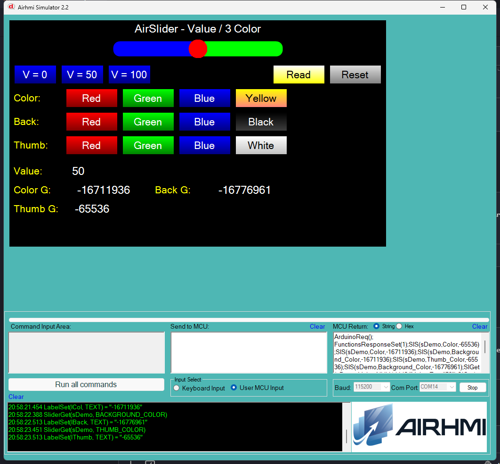

# Arduino ile AirSlider Deger ve 3 Renk Yonetimi (Value / Color)

Bu ornek, AirHMI slider nesnesinin **Value** ve uc farkli **renk
ozelligini** Arduino tarafindan kontrol eder:

- **Color** — track'in **oncesi/dolu** kismi (varsayilan: thumb'in solu)
- **Background_Color** — track'in **sonrasi/bos** kismi (thumb'in sagi)
- **Thumb_Color** — ortadaki **yuvarlak surukleyici** (thumb)

## Klasor Yapisi

```
Value_Color/
| - Value_Color.ino
| - Value_Color.ahi
| - 1.png
| - README.md
```

## Kullanilan Metotlar

```cpp
sDemo.Set_Value(50);                          // 0..Range
sDemo.Set_Color((uint32_t)-16711936);         // track once (yesil)
sDemo.Set_BackgroundColor((uint32_t)-16776961); // track sonra (mavi)
sDemo.Set_ThumbColor((uint32_t)-65536);       // yuvarlak (kirmizi)

uint32_t v;
sDemo.Get_Value(&v);
sDemo.Get_Color(&v);
sDemo.Get_BackgroundColor(&v);
sDemo.Get_ThumbColor(&v);
```

Panel komutlari:
- `SlS(s,Value,N)` / `SlGet(s,Value,NULL)`
- `SlS(s,Color,N)` / `SlGet(s,Color,NULL)`
- `SlS(s,Background_Color,N)` / `SlGet(s,Background_Color,NULL)`
- `SlS(s,Thumb_Color,N)` / `SlGet(s,Thumb_Color,NULL)`

## Renk Format'i

Panel ve simulator renkleri **signed int** olarak saklar. Sik kullanilan
degerler:

| Renk | Signed Decimal |
|---|---|
| Kirmizi | -65536 |
| Yesil | -16711936 |
| Mavi | -16776961 |
| Sari | -256 |
| Beyaz | -1 |
| Siyah | -16777216 |

## Panel Tarafi (Value_Color.ahi)

| Nesne | Tur | Islev |
|---|---|---|
| `sDemo` | EveSlider (horizontal, Range=100) | Test edilen ana slider |
| `bV0` / `bV50` / `bV100` | EButton | `Set_Value(0/50/100)` |
| `bColR/G/B/Y` | EButton | `Set_Color(R/G/B/Y)` |
| `bBackR/G/B/K` | EButton | `Set_BackgroundColor(R/G/B/K)` |
| `bThumbR/G/B/W` | EButton | `Set_ThumbColor(R/G/B/W)` |
| `bRead` | EButton | 4 Get -> lValue / lCol / lBack / lThumb |
| `bReset` | EButton | Default'a don |
| `lValue` / `lCol` / `lBack` / `lThumb` | ELabel | Get sonuclari |

## Genel Ozet

| Yon | Arduino Cagrisi | Panel Komutu |
|---|---|---|
| Yazma | `Set_Value(uint32_t)` | `SlS(s,Value,N)` |
| Yazma | `Set_Color(uint32_t)` | `SlS(s,Color,N)` |
| Yazma | `Set_BackgroundColor(uint32_t)` | `SlS(s,Background_Color,N)` |
| Yazma | `Set_ThumbColor(uint32_t)` | `SlS(s,Thumb_Color,N)` |
| Okuma | `Get_Value(uint32_t*)` | `SlGet(s,Value,NULL)` |
| Okuma | `Get_Color(uint32_t*)` | `SlGet(s,Color,NULL)` |
| Okuma | `Get_BackgroundColor(uint32_t*)` | `SlGet(s,Background_Color,NULL)` |
| Okuma | `Get_ThumbColor(uint32_t*)` | `SlGet(s,Thumb_Color,NULL)` |

## Notlar

### 🔧 Bu Ornekte Yapilan Eklemeler / Duzeltmeler

1. **AirSlider.cpp/.h** —
   - `buf[10]` -> `buf[16]` overflow guard (Set_Value, Set_Color)
   - `Set_Color`'da `%lu` -> `%ld + (int32_t)` cast (negatif renk degerleri)
   - **Yeni metotlar** eklendi (Arduino API'de yoktu, source kodda vardi):
     `Set_BackgroundColor` / `Get_BackgroundColor`
     `Set_ThumbColor` / `Get_ThumbColor`
2. **PicocParser.cs SliderSet VALUE** — Hardcoded `* 86 / 100` mantigi
   kaldirildi. Onceden Set 100 -> Get 86 olarak buguyordu; simdi
   Set 100 -> Get 100 dogru.
3. **PicocParser.cs SliderGet** — `sendFramedSl` lambda + `SC.Mode != 1`
   bypass + `COLOR/BACKGROUND_COLOR/THUMB_COLOR/VIS` Get case'leri
   eklendi (onceden bunlarin hicbiri Get'te yoktu).
4. **Panel firmware `05_slider.c`** —
   - `CSliderGetEx`'teki 11 attribute'a `if(isArduinoConnected())
     PRINTF("%c%d%c%c",1,X,0x7E,0x6F)` framing eklendi (hicbiri framed
     degildi).
   - **`COLOR` / `BACKGROUND_COLOR` field swap fix**: COLOR onceden
     `eveslider->BackGround_Color`'a yaziyordu (yanlis), simdi
     `eveslider->Color`'a yazar; BACKGROUND_COLOR ise `BackGround_Color`'a
     yazar. Set ve Get tutarli.

### Test Sonucu

Sim'de:
- 4 V button slider thumb'ini hareket ettiriyor (V=100 artik gercekten
  100 dahil donuyor)
- 12 renk butonu 3 farkli alani bagimsiz olarak renklendiriyor
- Read sonucunda 4 Get degeri lValue / lCol / lBack / lThumb alanlarina
  yaziliyor

### Panel Kaynak Kodu Durumu

`05_slider.c` **kaynak guncel** (Set + Get hepsi tam, framing dogru,
COLOR/BACKGROUND_COLOR field swap fix dahil); panel donanima flash
edilmedi — bu test simulator uzerinden.


