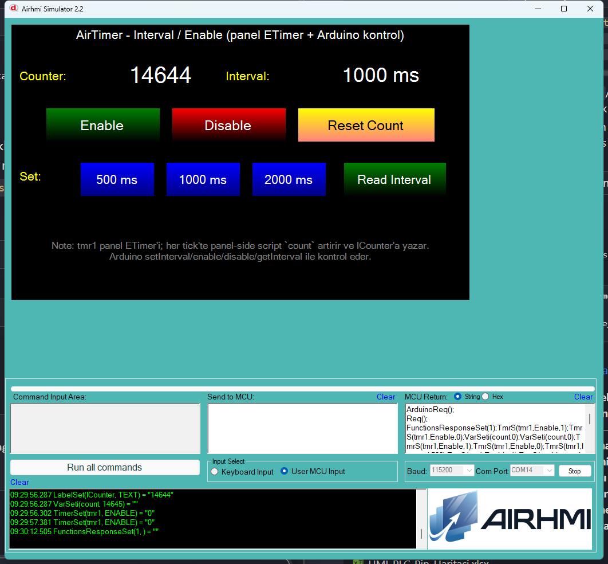

# Arduino ile AirTimer Kontrolu

Bu ornek, panel'deki bir **ETimer** nesnesini Arduino tarafindan kontrol eder.

- `setInterval(ms)` : timer interval'ini degistir
- `getInterval(&v)` : mevcut interval'i oku (panel firmware'da yeni eklendi)
- `enable()`        : timer'i baslat
- `disable()`       : timer'i durdur

> **Tick olayi panel-side calisir.** ETimer'in `<event>` picoc script'i her
> tick'te `count` EVariable'ini artirir ve `lCounter` etiketine yazar.
> Arduino tarafina dogrudan tick frame'i gonderilmiyor — Arduino sadece
> set/get/enable/disable yapar.

## Klasor Yapisi

```
Basics/
| - Basics.ino
| - Basics.ahi
| - 1.png
| - README.md
```

## Kullanilan Metotlar

```cpp
AirTimer tmr1 = AirTimer("tmr1");

tmr1.setInterval(500);   // 500 ms
tmr1.setInterval(1000);  // 1000 ms
tmr1.setInterval(2000);  // 2000 ms

tmr1.enable();           // baslat
tmr1.disable();          // durdur

uint32_t v;
tmr1.getInterval(&v);    // mevcut interval'i oku
```

Panel komutlari: `TmrS(name, Interval, N)` / `TmrS(name, Enable, 0|1)` /
`TimerGet(name, Interval, NULL)`.

## Panel Tarafi (Basics.ahi)

| Nesne | Tur | Islev |
|---|---|---|
| `tmr1`        | ETimer (Interval=1000, Enable=False) | her tick'te `count++` ve `lCounter` guncelle |
| `count`       | EVariable (int, 0) | tick sayaci |
| `lCounter`    | ELabelBox          | panel-side script'in yazdigi count |
| `lInterval`   | ELabelBox          | Arduino'nun `getInterval` sonucunu yazdigi etiket |
| `bEnable` / `bDisable` | EButton | `tmr1.enable()` / `tmr1.disable()` |
| `b500` / `b1000` / `b2000` | EButton | `tmr1.setInterval(500/1000/2000)` |
| `bRead`       | EButton | `tmr1.getInterval(&v)` -> `lInterval` |
| `bResetCount` | EButton | `count` EVariable'ini 0'a resetle (`VarSeti`) |

## Genel Ozet

| Yon | Arduino Cagrisi | Panel Komutu |
|---|---|---|
| Yazma  | `setInterval(uint32_t ms)` | `TmrS(name, Interval, N)` |
| Yazma  | `enable()`                 | `TmrS(name, Enable, 1)` |
| Yazma  | `disable()`                | `TmrS(name, Enable, 0)` |
| Okuma  | `getInterval(uint32_t*)`   | `TimerGet(name, Interval, NULL)` |

## Notlar

### 🔧 Bu Ornekte Yapilan Eklemeler / Duzeltmeler

1. **`AirTimer.cpp` BUG fix** — `enable()` ve `disable()` 2-parametreli
   `TmrS(name, 0|1)` gonderiyordu ama panel sadece 3-parametreli versiyonu
   destekliyor (`TmrS(char *, char *, char *)`). Komut hicbir zaman
   tetiklenmiyor, `recvRetCommandFinished` timeout'a dusuyordu.
   Simdi `TmrS(name, Enable, 0|1)` gonderiliyor.
2. **`10_timer.c` (panel firmware)** — `CTimerGetEx` fonksiyonu **yoktu**;
   eklendi. INTERVAL ve ENABLE attribute'lerini destekler, Arduino bagli
   moddaysa `0x01..0x7E 0x6F` framing ile yanit doner.
3. **`library_common.c`** — `CTimerGet` picoc wrapper + function table
   binding eklendi (`TimerGet`, `TmrG` aliaslari).
4. **`PicocParser.cs` (simulator)** — `TimerGet` / `TmrG` 3-param case
   eklendi; `TimerSet` / `TmrS` her cagrida `timerState` dictionary'sini
   gunceller, `TimerGet` icin son set edilen degeri Arduino'ya frame'leyerek
   doner.

### Test Sonucu

- `Enable` -> `tmr1` calisir, `lCounter` her tick'te artar
- `Disable` -> tick durur
- `500/1000/2000 ms` -> sim'in panel ETimer'i interval'i degistirir
- `Read Interval` -> Arduino `getInterval` cagirir, sim mock interval
  doner, `lInterval` etiketine "1000 ms" gibi yazilir
- `Reset Count` -> `count` EVariable'i 0'a duser

### Panel Kaynak Kodu Durumu

`10_timer.c` ve `library_common.c` **kaynak guncel** (CTimerGetEx + binding);
panel donanima flash test yapilmadi — sim uzerinden test.


