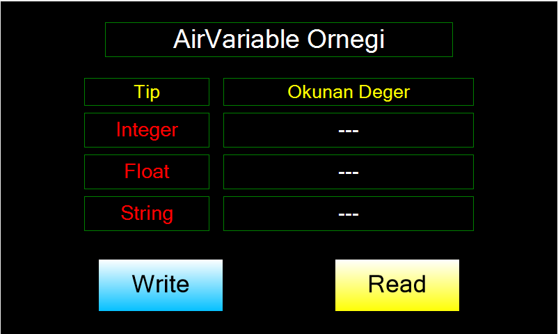

# Arduino ile AIRHMI Değişken Yönetimi (AirVariable)

Bu örnek, **Arduino** üzerinden **AIRHMI** panelindeki `Variable` nesnelerine veri yazmak ve bu nesnelerden veri okumak için `AirVariable` sınıfının nasıl kullanılacağını gösterir.

## Klasör Yapısı

```
AirVariable/
├── AirVariable.ino   ← Arduino sketch'i (AirVariable sınıfının tüm metodlarını kullanır)
├── AirVariable.ahi   ← AIRHMI Studio panel projesi (Variable + Label + Button nesneleri)
└── README.md         ← Bu doküman
```

## AirVariable Sınıfının İşlevi

### 1. Değişkene Veri Yazma

`AirVariable` sınıfı üç farklı yazma metodu sağlar:

#### a) Tam Sayı (`uint32_t`) Yazma
```cpp
AirVariable vInt = AirVariable("vInt");

vInt.VarSeti(12345UL);
```
- Panelde adı `vInt` olan **int** tipli değişkene `12345` değerini gönderir.

#### b) Ondalıklı Sayı (`double`) Yazma
```cpp
AirVariable vFloat = AirVariable("vFloat");

vFloat.VarSetf(-3.14159);
```
- Panelde adı `vFloat` olan **float** tipli değişkene `-3.14159` değerini gönderir.
- İçeride `dtostrf` kullanıldığı için **AVR Arduino'da da** doğru çalışır.

#### c) Metin (`String`) Yazma
```cpp
AirVariable vText = AirVariable("vText");

vText.VarSet(String("Merhaba AirHMI"));
```
- Panelde adı `vText` olan **String** tipli değişkene metni gönderir.

### 2. Değişkenden Veri Okuma

#### a) Tam Sayı Okuma
```cpp
uint32_t i = vInt.VarGeti();
```
- Panelden `vInt` değişkeninin değerini okur ve `uint32_t` olarak döner.

#### b) Ondalıklı Sayı Okuma
```cpp
double f = vFloat.VarGetf();
```
- Panelden `vFloat` değişkeninin değerini okur ve `double` olarak döner.

#### c) Ham Metin Okuma
```cpp
char buf[32] = {0};
uint16_t n = vText.VarGet(buf, sizeof(buf));
```
- Panelden `vText` değişkenini ham byte olarak `buf`'a yazar.
- Dönüş değeri (`n`), okunan byte sayısıdır.

## Panel Tarafı (AirVariable.ahi)

`AirVariable.ahi` dosyası AIRHMI Studio'da açıldığında 800×480 ekranda şu nesneleri içerir:

| Nesne | Tür | Açıklama |
|---|---|---|
| `vInt` | EVariable (int) | Arduino'nun yazdığı tamsayı değeri |
| `vFloat` | EVariable (float) | Arduino'nun yazdığı ondalıklı değer |
| `vText` | EVariable (String) | Arduino'nun yazdığı metin |
| `lInt` | ELabelBox | Okunan tamsayının gösterildiği etiket |
| `lFloat` | ELabelBox | Okunan ondalığın gösterildiği etiket |
| `lText` | ELabelBox | Okunan metnin gösterildiği etiket |
| `bWrite` | EButton | Arduino'ya `Write` callback tetikler |
| `bRead` | EButton | Arduino'ya `Read` callback tetikler |

## Çalışma Akışı

1. **Yükleme**
   - `AirVariable.ahi` dosyasını AIRHMI Studio ile karta veya simülatöre yükle.
   - `AirVariable.ino` dosyasını Arduino IDE'de aç ve hedef Arduino'ya yükle.
2. **Bağlantı**
   - Panel/simülatör ile Arduino arasında 115200 baud seri haberleşme kurulur (UNO için `airSerial = Serial`).
3. **Test**
   - Panelde **Write** butonuna bas → Arduino üç değişkene de değer yazar.
   - Panelde **Read** butonuna bas → Arduino üç değişkeni de okur ve `lInt` / `lFloat` / `lText` etiketlerine yansıtır.

## Genel Özet

| Yön | Arduino Çağrısı | Tip | Panel Nesnesi |
|---|---|---|---|
| Yazma | `VarSeti(value)` | `uint32_t` | `vInt` (int) |
| Yazma | `VarSetf(value)` | `double` | `vFloat` (float) |
| Yazma | `VarSet(String)` | `String` | `vText` (String) |
| Okuma | `VarGeti()` | `uint32_t` | `vInt` |
| Okuma | `VarGetf()` | `double` | `vFloat` |
| Okuma | `VarGet(buf, len)` | `char[]` | `vText` |

`AirVariable`, Arduino kodu ile AIRHMI ekranı arasında **iki yönlü değişken paylaşımı** sağlar — sensör verisini panele yansıtmak veya panelden gelen kullanıcı girdisini Arduino'ya almak için temel araçtır.


