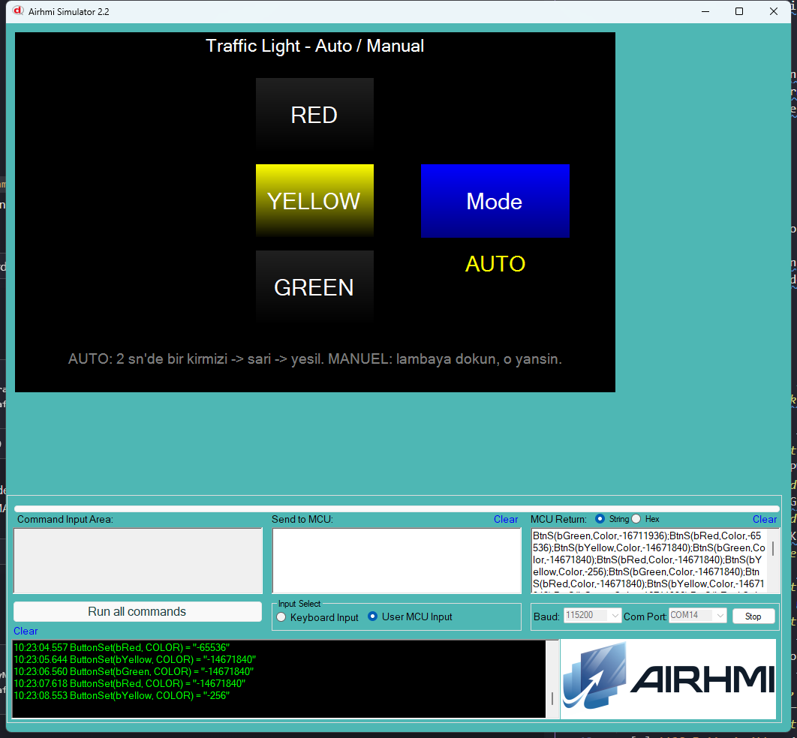

# 01 — Traffic Light (Trafik Isigi)

3 lambali bir trafik isigi simulasyonu. Auto modda Arduino otomatik
2 sn'de bir donus yapar; manuel modda kullanici dokundugu lambayi yakar.

## Calisma Akisi

- **AUTO modu:** `loop()` icinde `millis()` ile 2 sn'de bir
  `lampState = (lampState+1) % 3` ve `updateLights()` cagrilir.
  Aktif lambanin rengi parlak, digerlerinin koyu gri olur.
- **MANUEL modu:** `bRed/bYellow/bGreen` callback'leri `lampState`'i
  manuel set eder. Auto loop o sirada calismaz.
- **Mode toggle:** `bMode` butonu auto/manuel arasinda gecis yapar,
  `lMode` etiketini gunceller.

## Kullanilan Component'lar

| Nesne | Tur | Islev |
|---|---|---|
| `bRed` / `bYellow` / `bGreen` | EButton | hem gosterge hem (manuel modda) dokunmatik kontrol |
| `bMode`   | EButton | mod toggle |
| `lMode`   | ELabelBox | aktif mod ("AUTO" / "MANUEL") |

## API Cagrilari

```cpp
button.Set_background_color(COLOR_RED_ON);   // 0xFFFF0000
button.Set_background_color(COLOR_OFF);      // 0xFF202020
label.setText("AUTO");
```

## Donanim

Sadece panel + Arduino + UART. Ek donanim gerekmez.


