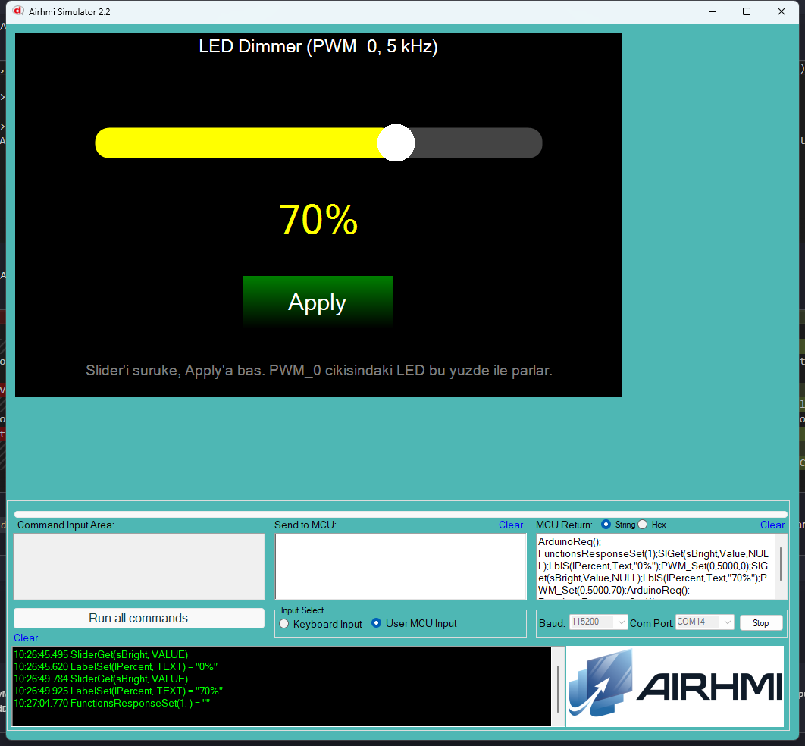

# 02 — LED Dimmer (PWM)

Bir slider'la PWM_0 cikisinin duty cycle'ini ayarla. Apply'a basinca son
slider degeri PWM'e uygulanir, etiket yuzde olarak guncellenir.

## Calisma Akisi

1. Kullanici `sBright` slider'i (0..100) suruke ile istedigi seviyeye getirir.
2. `bApply` butonuna basinca callback `Get_Value` ile slider'in son
   degerini okur.
3. `gpio.set_pwmfreq(0, 5000, v)` ile PWM_0 5 kHz'de `%v` duty olarak ayarlanir.
4. `lPercent` etiketi "X%" olarak guncellenir.

## Kullanilan Component'lar

| Nesne | Tur | Islev |
|---|---|---|
| `sBright`  | ESlider   | 0..100 parlaklik |
| `bApply`   | EButton   | son degeri PWM'e uygula |
| `lPercent` | ELabelBox | "X%" gosterge |

## API Cagrilari

```cpp
sBright.Get_Value(&v);
gpio.set_pwmfreq(0, 5000, v);  // ch=0, freq=5000 Hz, duty=v
lPercent.setText("50%");
```

## Donanim

PWM_0 cikisina (panel kart datasheet'ine bakin) bir LED + sinirlayici
direnc bagla. Slider'i hareket ettirip Apply'a basinca LED'in parlakligi
degisir.


