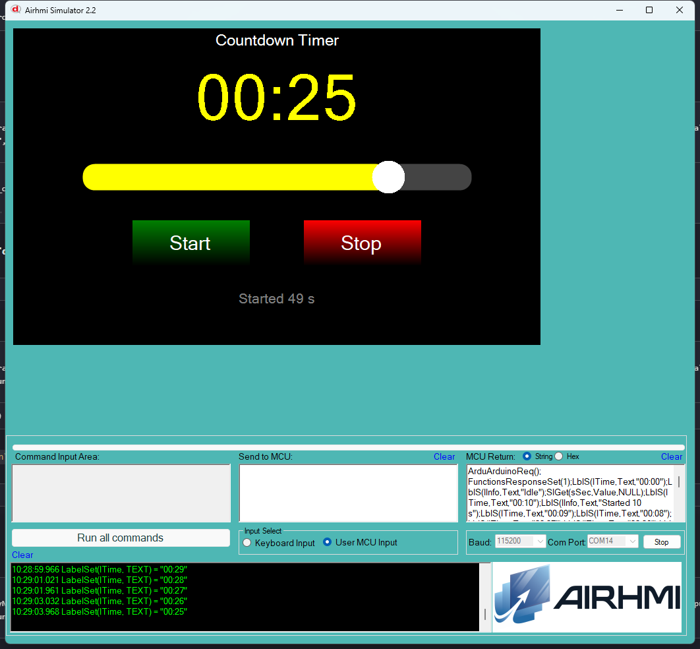

# 03 — Countdown Timer

Slider'la sure (1..60 sn) sec, Start'a bas, geri sayim baslar. Son 3 sn'de
kisa beep, bitiminde uzun beep.

## Calisma Akisi

1. `sSec` slider'iyla istenen sure secilir (1..60 saniye).
2. `bStart` -> `Get_Value(&v)` ile slider degeri okunur, `remainSec`'e
   atanir, `running = true`.
3. Her saniyede `loop()` icinde `remainSec--` ve `lTime` "MM:SS" olarak
   guncellenir.
4. `remainSec` 1..3 araliginda her saniyede `Set_Buzzer(80)` (kisa beep).
5. `remainSec == 0` -> `Set_Buzzer(800)` (uzun bitis sesi), running false.
6. `bStop` istendigi an durdurur, "00:00" gosterir.

## Kullanilan Component'lar

| Nesne | Tur | Islev |
|---|---|---|
| `sSec`   | ESlider | 1..60 sn |
| `bStart` / `bStop` | EButton | baslat / durdur |
| `lTime`  | ELabelBox | "MM:SS" |
| `lInfo`  | ELabelBox | durum bilgisi |
| `buz`    | AirBuzzer | beep + bitis tonu |

