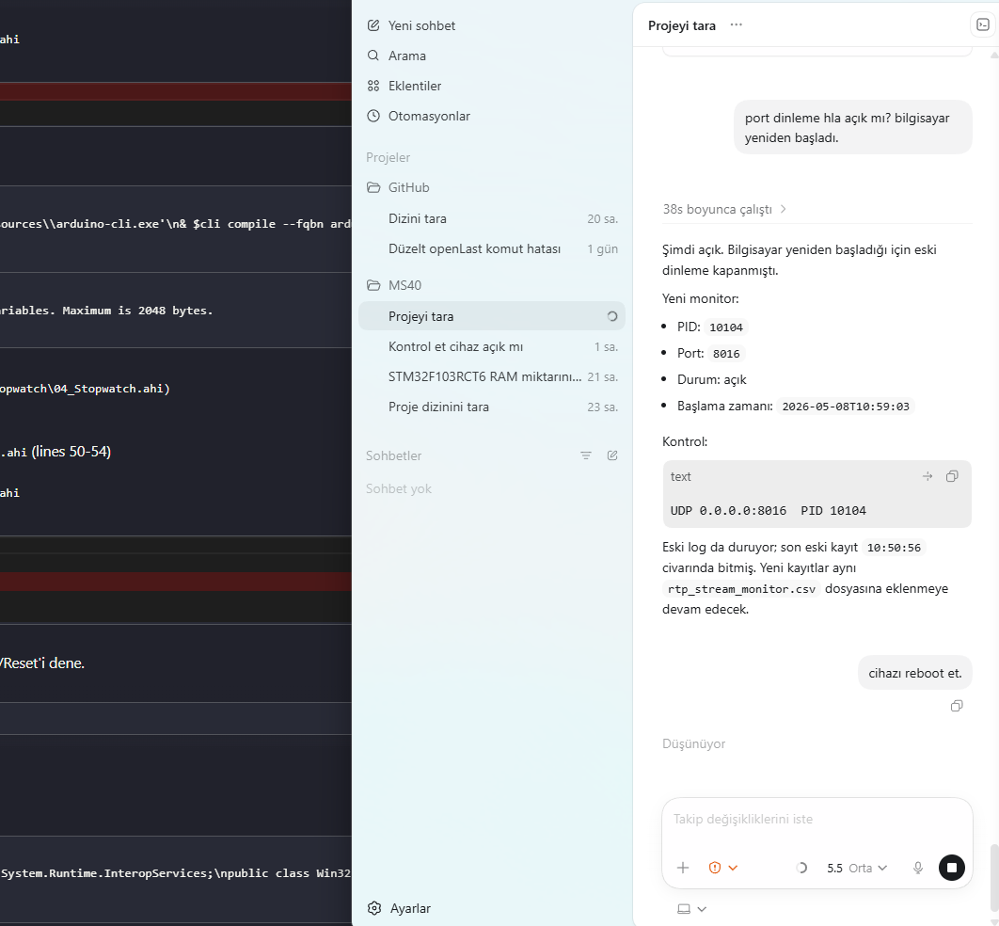

# 04 — Stopwatch (Kronometre)

Klasik kronometre: Start/Stop/Reset. Format `MM:SS.cc` (cc = 1/100 sn).

## Calisma Akisi

- **Start**: `startMs = millis() - elapsedMs` (pause sonrasi devam icin).
- **Stop**: `elapsedMs = millis() - startMs`, running false.
- **Reset**: `elapsedMs = 0`, etiket `00:00.00`.
- Loop'ta running iken her 50 ms'de bir `renderTime(now - startMs)` cagrilir
  (UI 20 Hz refresh; ms sayaci her zaman tam millis() temelli, drift yok).

## Kullanilan Component'lar

| Nesne | Tur | Islev |
|---|---|---|
| `lTime`  | ELabelBox | "MM:SS.cc" |
| `bStart` / `bStop` / `bReset` | EButton | kontrol |

