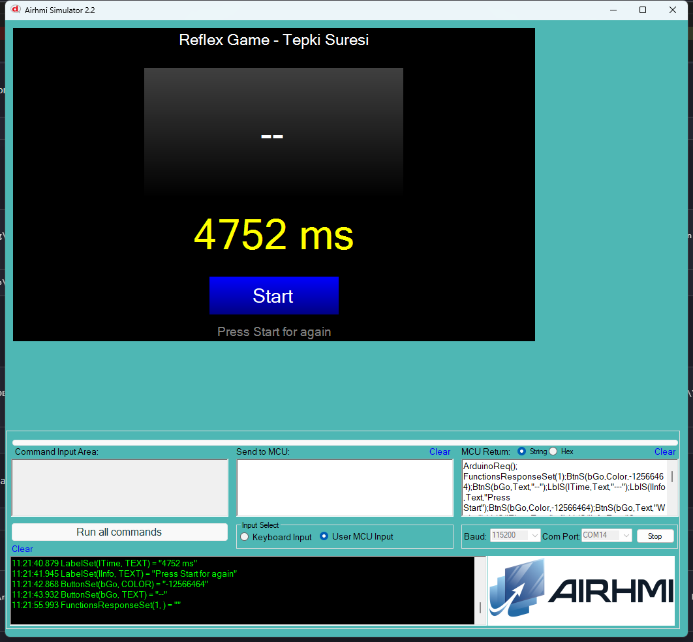

# 05 — Reflex Game (Tepki Suresi)

Start'a basinca 1..4 sn arasi rastgele bekleme; sonra bGo yesile doner ve
"HIT!" yazar. bGo'ya bastigin anda tepki suresin ms cinsinden olculur.

## Calisma Akisi

| State    | Olay                                           | Aksiyon |
|----------|------------------------------------------------|---------|
| IDLE     | Start basildi                                  | bGo gri "Wait...", random 1..4 sn icinde GO'ya gec |
| WAITING  | sure dolmadan bGo basildi                      | "Too soon!" hata, IDLE'a don |
| WAITING  | sure doldu                                     | bGo yesil "HIT!", goAtMs kaydedilir, GO state |
| GO       | bGo basildi                                    | `millis() - goAtMs` ms hesapla, lTime guncelle |

## Kullanilan Component'lar

| Nesne | Tur | Islev |
|---|---|---|
| `bStart` | EButton | oyunu baslatir |
| `bGo`    | EButton | tepki butonu (renk + caption degisir) |
| `lTime`  | ELabelBox | "X ms" sonuc |
| `lInfo`  | ELabelBox | durum / talimat |

## Notlar

- `randomSeed(analogRead(A0))` ile floating-pin gurultusu seed olarak
  kullanilir; her acilista farkli sira.
- `Set_background_color` Arduino'dan panel'e komut gonderir, AVR uzerinde
  yer almaz; her cag UART roundtrip vardir, fakat tepki olcumu icin
  `goAtMs = millis()` komut gonderildikten **sonra** atanmaz; render
  baslatildigi an `millis()` ile yakalanir, ~5 ms hata payi olabilir.

