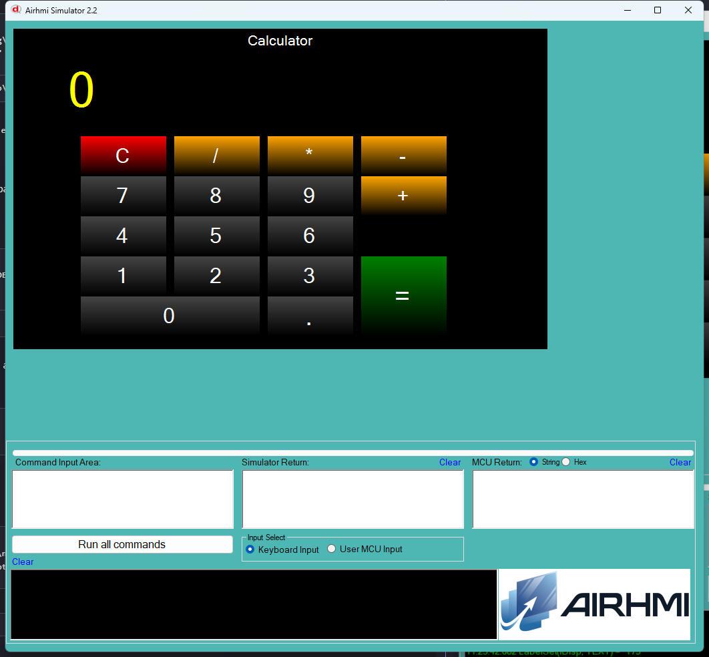

# 06 — Calculator (Hesap Makinesi)

Standart 4-islem mini hesap makinesi. Layout:

```
[ C ] [ / ] [ * ] [ - ]
[ 7 ] [ 8 ] [ 9 ] [ + ]
[ 4 ] [ 5 ] [ 6 ]
[ 1 ] [ 2 ] [ 3 ] [ = ]
[   0   ] [ . ]
```

## Calisma Akisi

- `buf` (12 char) — kullanici girdigi/sonuc gosterilen sayi
- `acc` (double) — birikmis sonuc
- `op` — bekleyen islem (+, -, *, /, 0=yok)
- `startNew` — sonraki rakam yeni sayinin baslangici mi

`compute()` fonksiyonu `buf`'taki sayiyi `acc`'a uygular, `dtostrf` ile
geri yazar, trailing-zero ve nokta temizligi yapar.

## Kullanilan Component'lar

| Nesne | Tur |
|---|---|
| `lDisp` | ELabelBox (display) |
| `b0..b9`, `bDot` | EButton (rakam girisi) |
| `bAdd`, `bSub`, `bMul`, `bDiv` | EButton (islem) |
| `bEq` | EButton (=) |
| `bC`  | EButton (clear) |

## Notlar

- AVR `double` aslinda `float` (4 bayt). Hassasiyet ~7 hane.
- Sifira bolme `Err` yazar.
- 17 buton 32K UNO flash icine rahat sigar.


