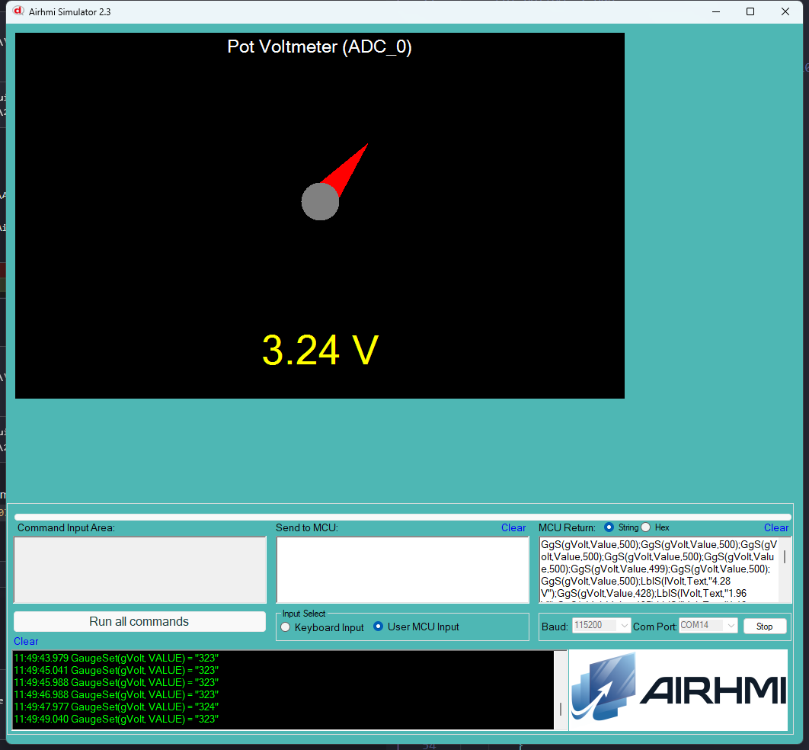

# 07 — Pot Voltmeter (Arduino ADC)

Potansiyometre Arduino UNO'nun **A0** pinine baglanir, `analogRead(A0)` ile
0..1023 arasi 10-bit ham deger okunur, 5.0V referansla volt'a cevrilir,
panel'deki AirGauge ve AirLabel ile gosterilir.

## Calisma Akisi

`loop()` icinde her 250 ms'de bir:

1. `analogRead(A0)` -> 0..1023 ham deger
2. `v = raw * (5.0 / 1023.0)` -> 0..5.0 V
3. `lVolt.setText("X.XX V")` (`dtostrf` ile formatlanir, sadece deger
   degisirse update gonderilir -> UART trafik dusuk)
4. `gVolt.Set_value((uint32_t)(v * 100))` -> 0..500 araligi
   (gauge MaxValue=500, 0.01 V hassasiyet)

## Donanim

```
        ┌─────────┐
   5V ──│ TOP     │
        │   POT   │── WIPER ── Arduino A0
   GND ─│ BOTTOM  │
        └─────────┘
```

- 10K linear potansiyometre onerilir
- 5V Arduino pininden, GND ortak
- Wiper (orta bacak) A0'a

> Panel tarafinin ADC'si KULLANILMIYOR -- okuma tamamen Arduino'da.
> Bu yaklasim Elementary serilerinde de calisir (panelde ADC yok bile).

## Kullanilan Component'lar

| Nesne | Tur | Islev |
|---|---|---|
| `gVolt` | EveGauge | 0..500 (= V * 100), kirmizi ibre |
| `lVolt` | ELabelBox | "X.XX V" sayisal gosterge |


