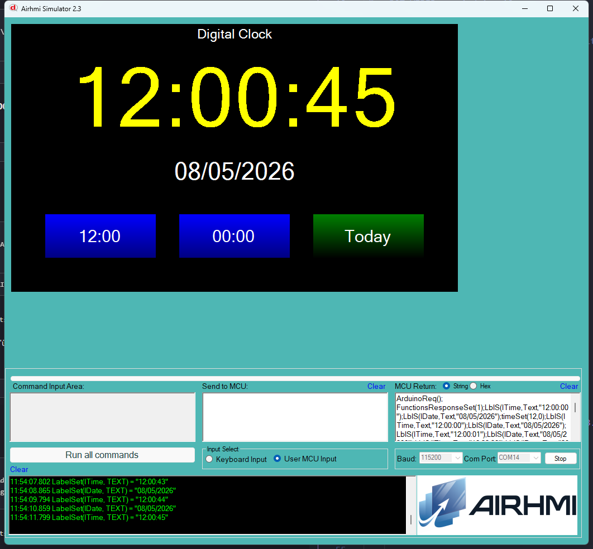

# 08 — Digital Clock (Dijital Saat)

Arduino tarafinda saat/tarih state'i tutulur, her saniye `lTime` ve
`lDate` etiketleri guncellenir. Preset butonlari (12:00, 00:00, Today)
panel RTC chip'ine `dateSet`/`timeSet` ile yazar **ve** Arduino state'ini
ayni degere getirir.

## Calisma Akisi

- `Clock` struct: h, m, s, day, month, year
- Preset butonlari saat/tarih ayarini hem panel RTC'sine yazar hem de
  Arduino state'ini ayni degere kurar
- Loop'ta her 1000 ms'de bir saniye ileri gidilir; 60 -> dakika, 60 ->
  saat, 24 -> gun roll-over (`daysIn` ile leap year destegi)

## Kullanilan Component'lar

| Nesne | Tur | Islev |
|---|---|---|
| `lTime` | ELabelBox | "HH:MM:SS" buyuk yazi |
| `lDate` | ELabelBox | "DD/MM/YYYY" |
| `bSetNoon` / `bSetMidnight` / `bSetToday` | EButton | preset |

## Notlar

- AirRtc kutuphanesinde Get yok; bu yuzden Arduino kendi state'ini tutar.
  Panel RTC ile uyum kullanici sorumlulugu (panel-side script ile RTC
  okunabilir, tasarima dahil edilmedi).
- AVR `millis()` 32-bit; ~49.7 gunde overflow yapar; bu sketch icin
  problem degil cunku `lastSecMs += 1000UL` cumulative.

