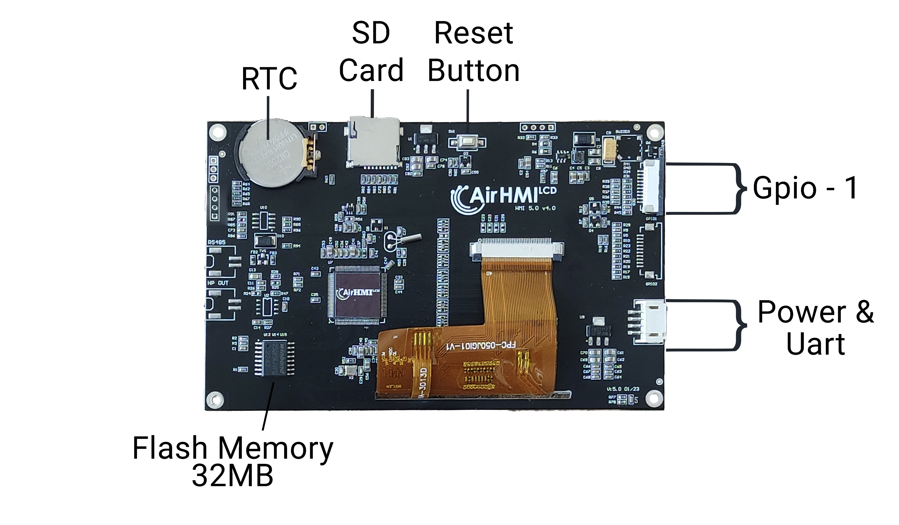

# AIR1024X600C101_A

AIRHMI'nin 10.1 inç kapasitif dokunmatik gelişmiş HMI ekranı, endüstriyel kontrol ve otomasyon uygulamaları için tasarlanmış yüksek performanslı bir üründür. Bu ekran, 1024x600 çözünürlüğe sahip TFT LCD paneli ve kapasitif dokunmatik özelliği ile kullanıcı dostu bir arayüz sunar.

## Temel Özellikler:

Ekran: 10.1 inç TFT LCD, 1024x600 çözünürlük

Dokunmatik Panel: Kapasitif dokunmatik

İşlemci: Yüksek performanslı mikrodenetleyici

Giriş/Çıkış Portları: Çeşitli endüstriyel uygulamalar için uygun I/O portları

Genişletilebilir Hafıza: İhtiyaca göre artırılabilir hafıza seçenekleri

Dayanıklılık: Endüstriyel ortamlarda uzun süreli kullanım için sağlam yapı

Bu HMI ekranı, kullanıcıların endüstriyel süreçleri verimli bir şekilde izlemelerine ve kontrol etmelerine olanak tanır. Kapasitif dokunmatik ekranı sayesinde hassas ve hızlı tepki verir, böylece kullanıcı deneyimini iyileştirir. Ayrıca, genişletilebilir hafıza ve çeşitli I/O portları ile farklı uygulama ihtiyaçlarına uyum sağlar.

AIRHMI'nin bu ürünü, endüstriyel otomasyon projelerinde güvenilir ve esnek bir çözüm arayan profesyoneller için idealdir.

