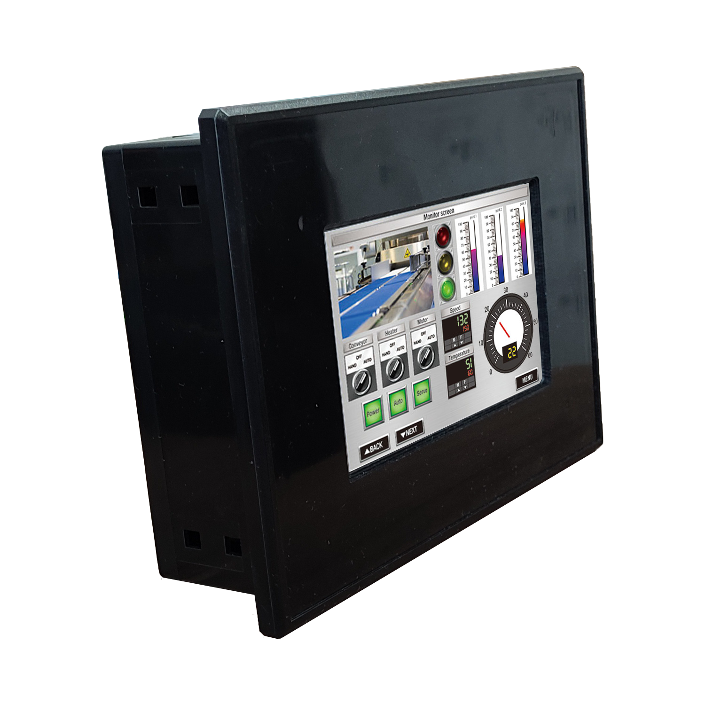
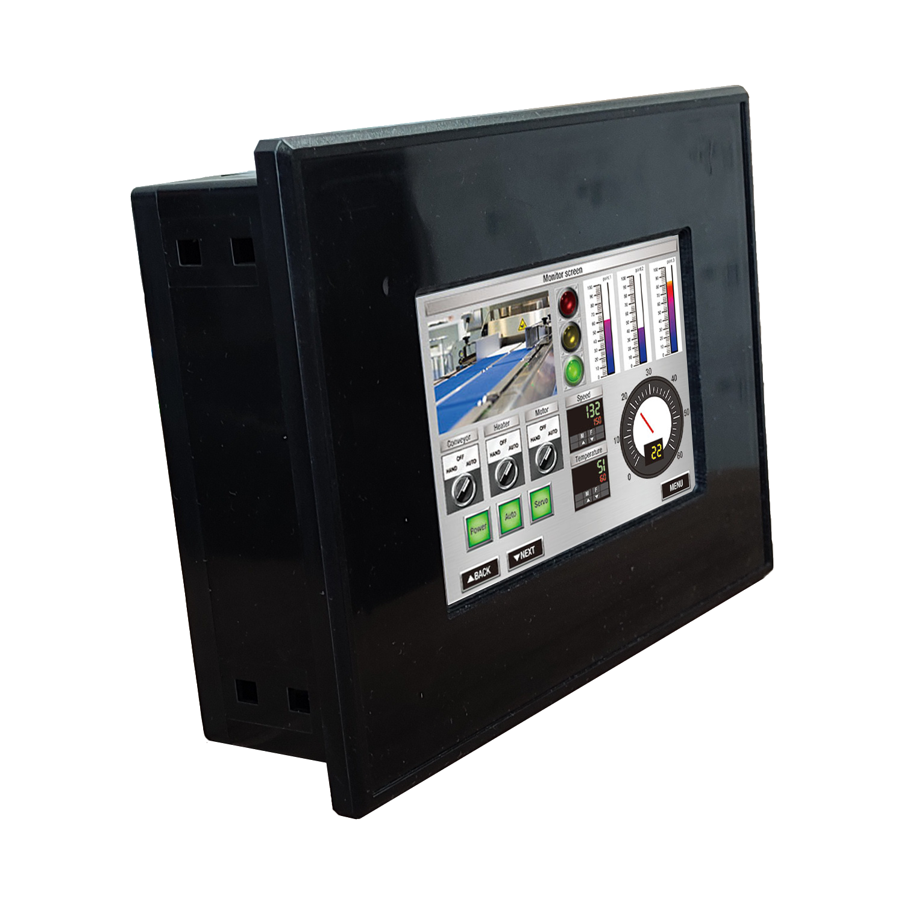
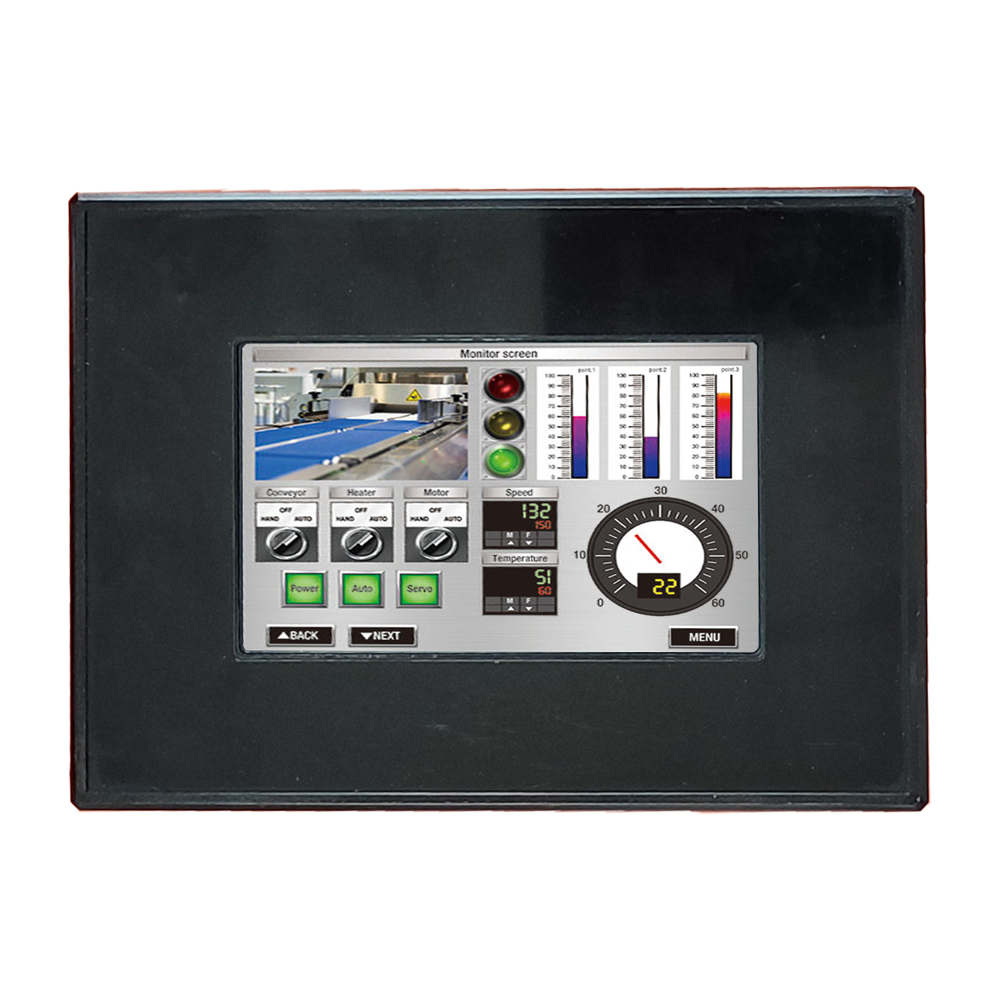
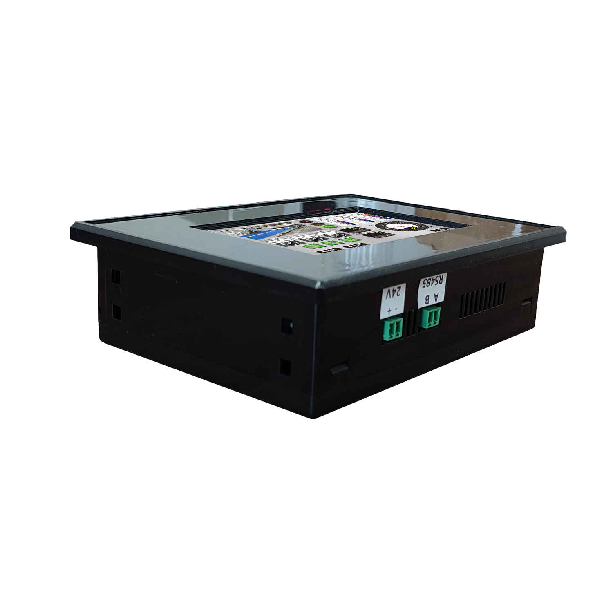
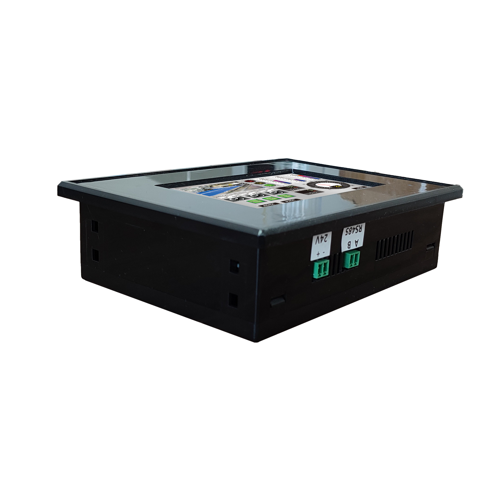

AIRHMI - HMI Panel PC ile 24V enerji ile çalışır.

 

RS485 ve Modbus desteği ile PLC v.b. cihazlarınızı kolaylıkla kontrol edebilirsiniz.

 

Kullanıcı dostu arayüzü sayesinde  tasarımlarınızı kolaylıkla oluşturabilirsiniz. AIRHMI bu konuda da buton, label, image, progress bar, slider, ibre (gauge) gibi birçok nesne ile yardımcı olmaktadır. Editörü ve basit kullanım yapısı sayesinde geliştirmelerinizde zamandan tasarruf sağlayarak hızlı bir şekilde tasarımınızı hazırlayabilirsiniz.

 

Dahili Buzzer basit bir şekilde çaldırılabilir. Dokunmatiğe her dokunduğunuzda veya uyarılarda buzzer fonksiyon setleri ile kullanabilirsiniz.

 

32MB Flash kapasitesi ile projelerinize daha geniş alan sağlar.

 

Yerli üretim olan AIRHMI Firması ürünleriniz 2 yıl garantili olarak sunmaktadır.

 

AIRHMI ekranlar ile projelerinizin sınırı hayal gücünüz olacak.

 

 

Diğer AIRHMI’lerden farkı

 

24V enerji ile çalışarak PLC gibi cihazlarla aynı voltajda çalışarak ayrıca bir güç kaynağına ihtiyaç duymaz.

 

RS485 ve Modbus desteği standart olarak sunulmaktadır.

 

Kutulu olduğundan projelerinize tak – kullan olarak rahatlıkla entegre edebilirsiniz.

