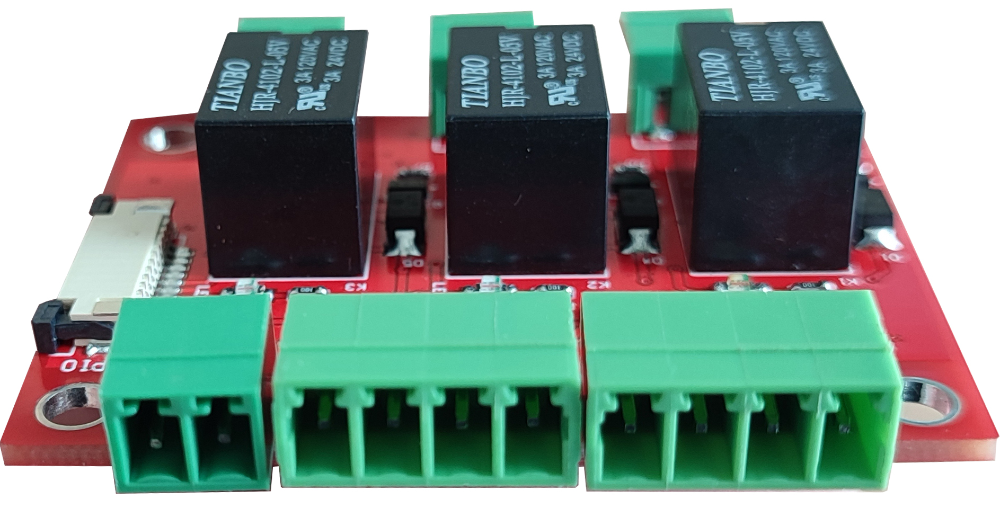
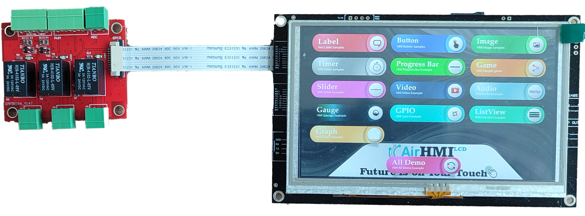
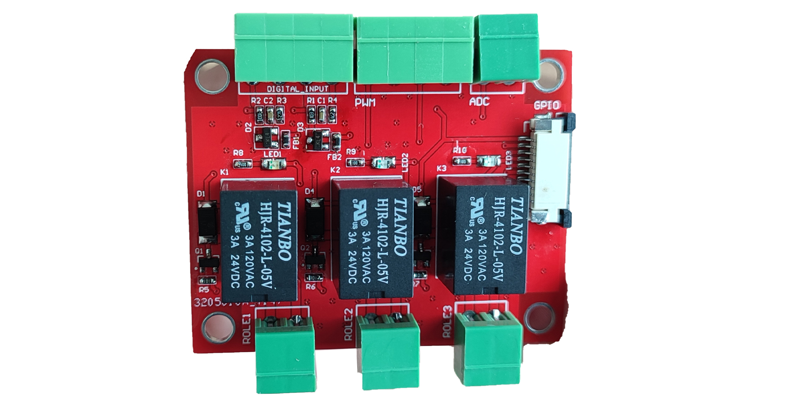

10pin Flat kablo ile AIRHMI ekranlarınıza bağlayarak kolaylıkla kullanabileceğiniz basit kontrol ve röle kartıdır.

 

2 adet Digital Giriş
2 Adet Pwm Giriş
1 Adet Analog(ADC) Giriş
3 Adet (5V 3A) Röle
 

Bağlantı kolaylığı sağlar.

 

AIRHMI Ekranınızın GPIO yapısıyla birebir uyumludur ve dışarıdan herhangi bir beslemeye ihtiyaç duymaz. Enerjisini ekran kartı üzerinden flat kablo aracılığıyla alır.

 

Herbir Röle için kontrol ledi bulunmaktadır.

