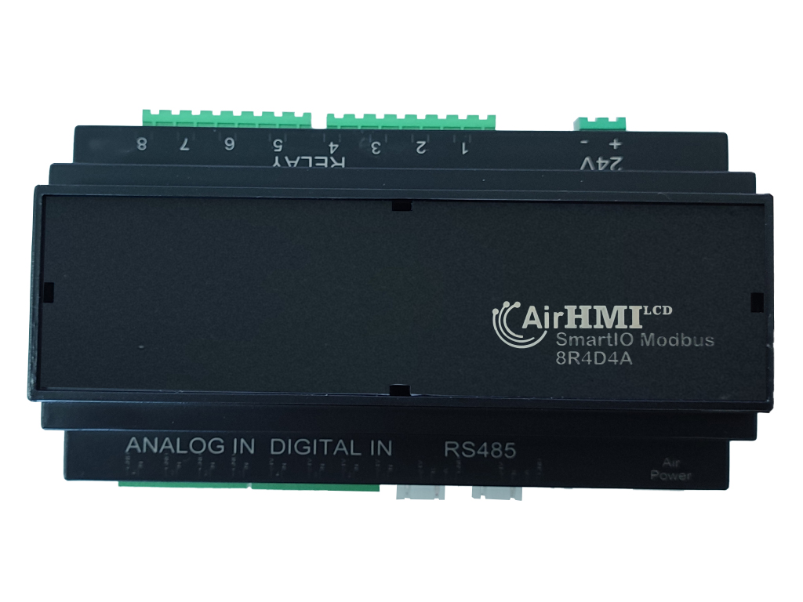
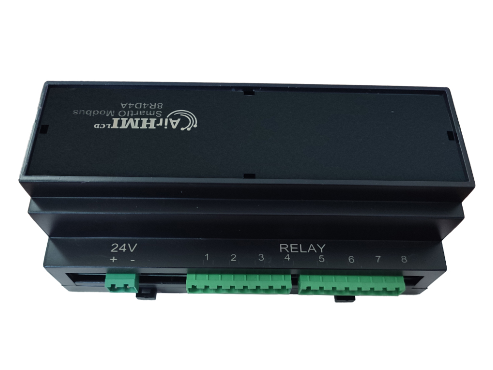
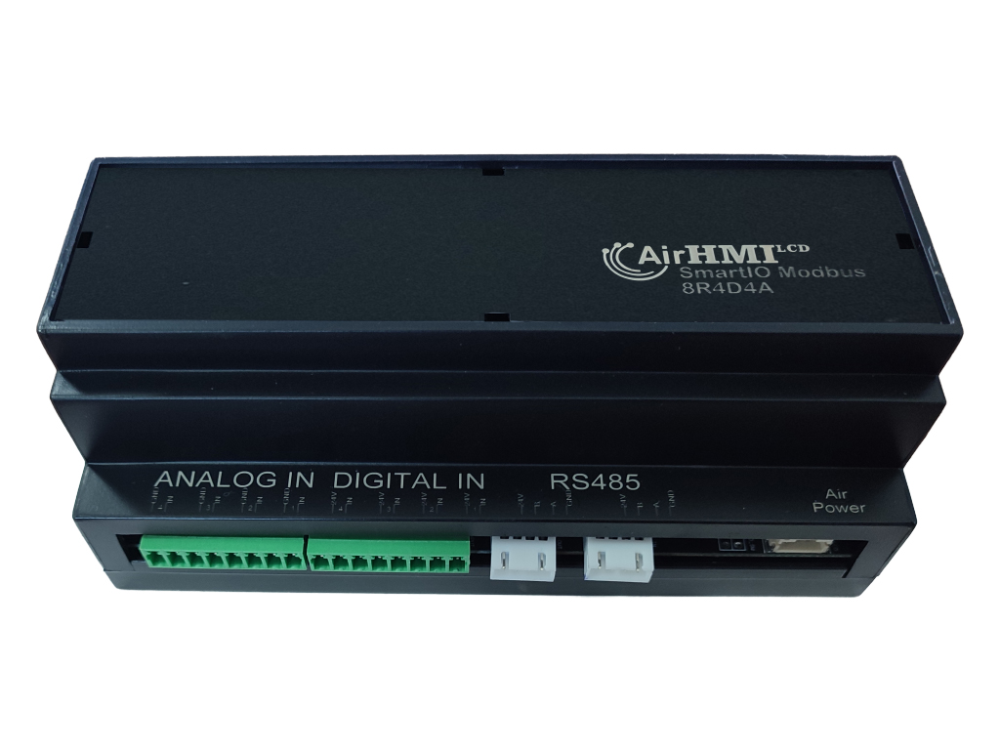
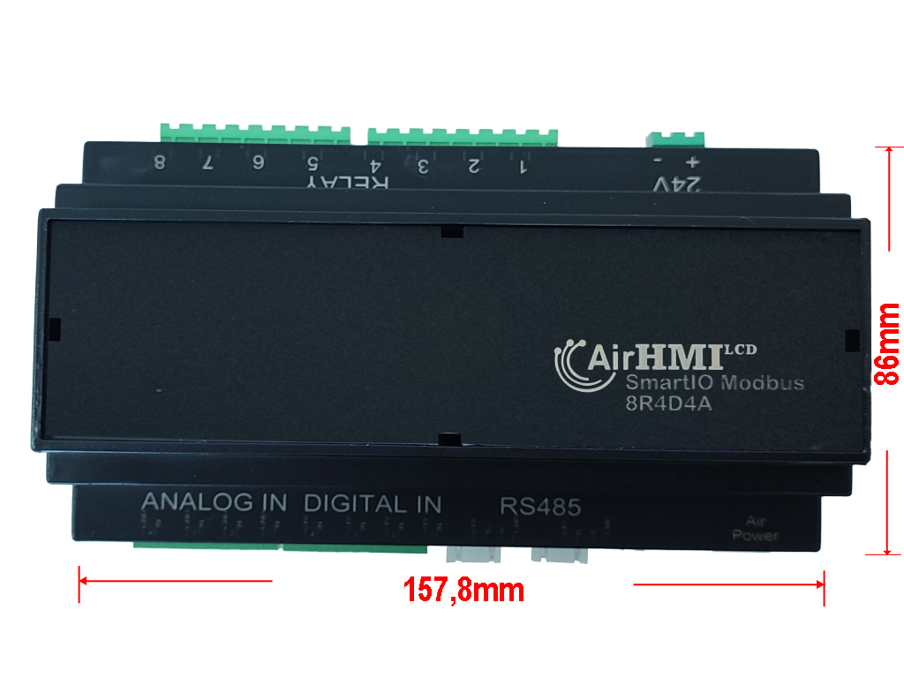
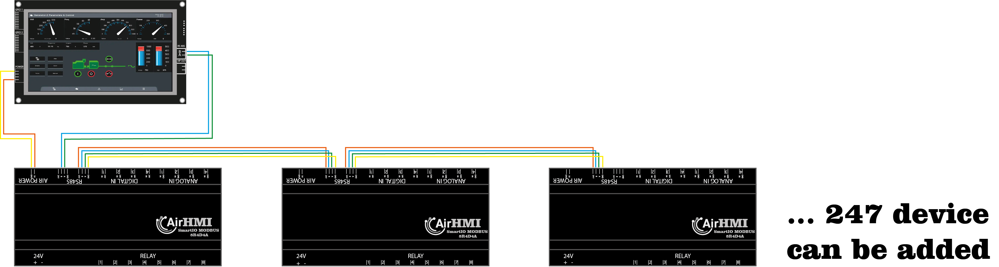
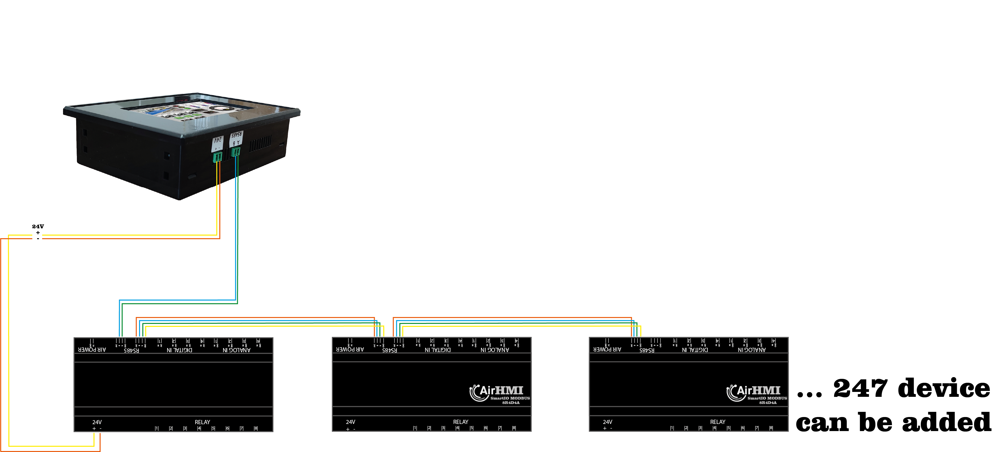

# ÜRÜN TANITIMI
SmartIO Modbus ile girişlerinizi (analog ve dijital) yönetebilir, üzerinde bulunan rölelerle kontrol işlemlerini kolaylıkla yapabilirsiniz.

 

Yapılandırılabilir cihaz adresi (1~255), çoklu cihazlar RS485 veri yoluna bağlanabilir. Bu sayede tek bir kontrolcüye 255 adet SmartIO Modbus eklenebilir.
24V enerji ile çalışır. Her cihaza ayrı enerji verebileceğiniz gibi aynı zamanda tek bir cihaza enerji verip eklediğiniz diğer cihazlara atlama ile enerjilendirebilirsiniz.
Ters korumalı besleme devresi, devrenin yanlış bağlantı nedeniyle kazara hasar görmesini önler
Yüksek kaliteli röle, kontak derecesi: ≤10A 250VAC/30VDC
Analog Inputlar ile 0-30V değerlerinde 4 adet ölçüm yapabilme. Örnekleme sayısını ayarlayabilme. 
4 adet Dijital Input ile IO okuyabilme.
AirHMI için 5V çıkışı ile ekranlı kullanımda kolaylık.
Ray montajlı ABS plastik muhafaza, kurulumu kolay, kullanımı güvenli

