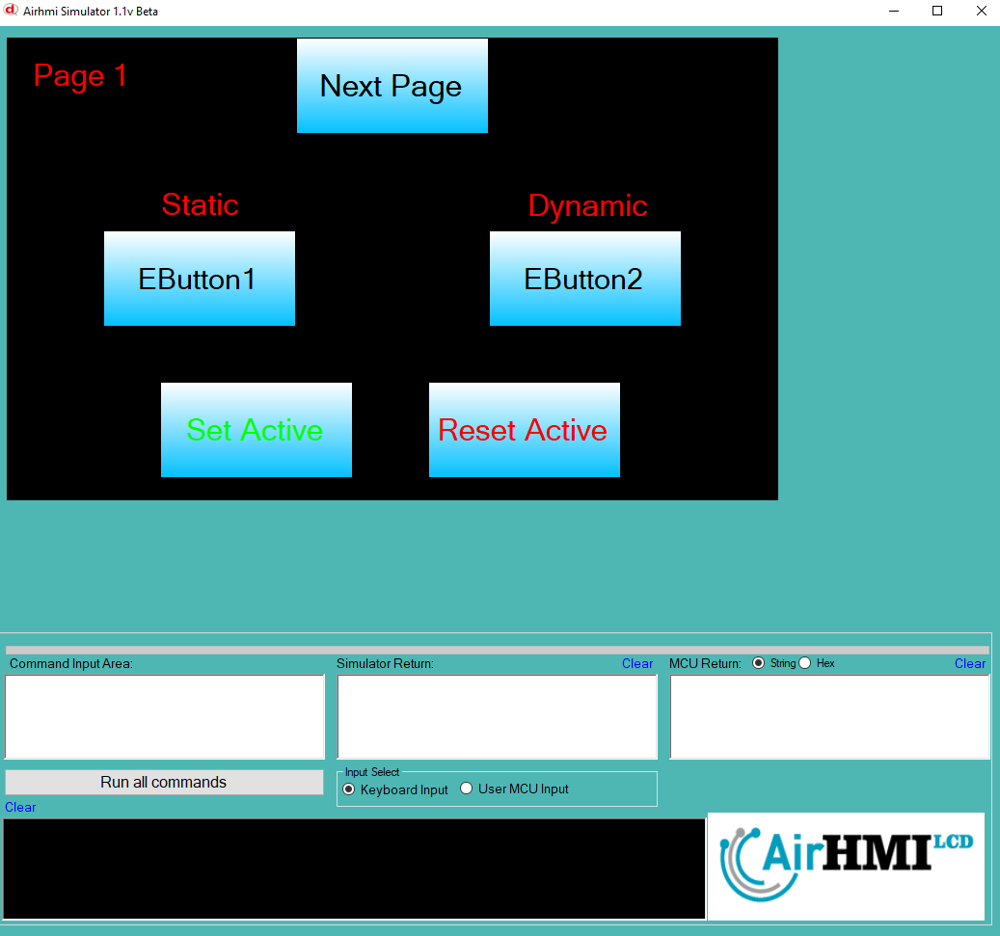

# Buton Active Özelliği

Active özelliği butonun basma işlemi için açma ve kapatma özelliğine sahip olması anlamına gelir.
Bu dokümanda, statik ve dinamik olmak üzere iki farklı butonun Active özelliği üzerinde etkili olan faktörler incelenmiştir.
Statik butonlar her sayfadan tüm özelliklerine ulaşılıp değiştirilebilen butonlardır. Static(false) yani dinamik butonlar ise sayfaya özgüdür.
Sayfa değiştiği zaman hiçbir özelliği tutulmaz. Sayfa değişip tekrar aynı sayfaya gidildiği zaman buton ilk hali ile baştan meydana getirilir. 

## 📌 1. Butonların Tanımı
- **🟢 Statik Buton**: Static özelliği true olan butondur. Active özelliği **hem aynı sayfadan hem de diğer sayfalardan** değiştirilebilir.
- **🔵 Dinamik Buton**: Statik özelliği false olan butondur. Active  özelliği **yalnızca aynı sayfada** değiştirilebilir, diğer sayfalardan değiştirilemez.

## 🔍 2. Buton Active Değiştirme Durumları
### 🏠 Aynı Sayfada Olası Senaryolar
- Kullanıcı **statik butonun Active değerini** değiştirebilir.
- Kullanıcı **dinamik butonun Active değerini** değiştirebilir.

### 🔄 Farklı Sayfadan Olası Senaryolar
- Kullanıcı **statik butonun Active değerini** değiştirebilir.
- Kullanıcı **dinamik butonun Active değerini değiştiremez.**
- **Statik buton**, farklı sayfadan Active değerini değiştirirsek, aynı sayfaya dönüldüğünde **yeni değiştirilen Active değeri gelir.**
- **Dinamik butonun Active değerini değiştirsek bile etki etmez.**

## 🎯 4. Sonuç
✔️ Aynı sayfada **her iki butonun Active değerini değiştirilebilir**.  
✔️ **Statik butonun Active değerini** diğer sayfalardan değiştirilebilir.  
✔️ **Dinamik butonun Active değerini** yalnızca oluşturulduğu sayfada değiştirilebilir.  

