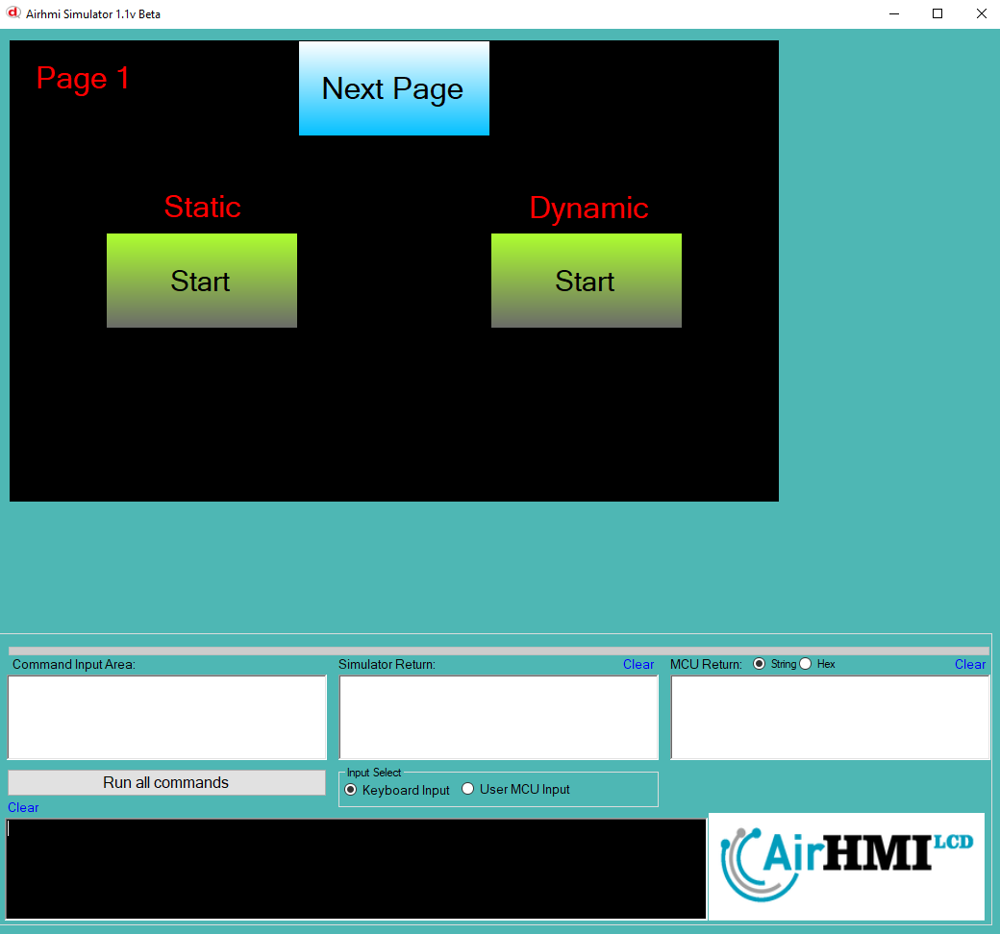
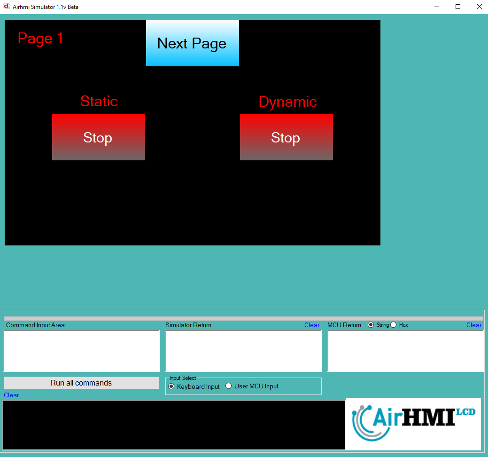

# Buton PushPull Özelliği

Butonda PushPull özellği true ise, bir kez basıldığında onDown çalışır. Sonraki basıldığında ise onUp kodu çalışır. Bu sayede buton switch gibi kullanılır.

Bu dokümanda, statik ve dinamik olmak üzere iki farklı butonun pushpull özelliği üzerinde etkili olan faktörler incelenmiştir.
Statik butonlar her sayfadan tüm özelliklerine ulaşılıp değiştirilebilen butonlardır. Static(false) yani dinamik butonlar ise sayfaya özgüdür.
Sayfa değiştiği zaman hiçbir özelliği tutulmaz. Sayfa değişip tekrar aynı sayfaya gidildiği zaman buton ilk hali ile baştan meydana getirilir. 

## 📌 1. Butonların Tanımı
- **🟢 Statik Buton**: Static özelliği true olan butondur. pushpull özelliği **hem aynı sayfadan hem de diğer sayfalardan** değiştirilebilir.
- **🔵 Dinamik Buton**: Statik özelliği false olan butondur. pushpull  özelliği **yalnızca aynı sayfada** değiştirilebilir, diğer sayfalardan değiştirilemez.

## 🔍 2. Buton pushpull Değiştirme Durumları
### 🏠 Aynı Sayfada Olası Senaryolar
- Kullanıcı **statik butonun pushpull değerini** değiştirebilir.
- Kullanıcı **dinamik butonun pushpull değerini** değiştirebilir.

### 🔄 Farklı Sayfadan Olası Senaryolar
- Kullanıcı **statik butonun pushpull değerini** değiştirebilir.
- Kullanıcı **dinamik butonun pushpull değerini değiştiremez.**
- **Statik buton**, farklı sayfadan pushpull değerini değiştirirsek, aynı sayfaya dönüldüğünde **yeni değiştirilen pushpull değeri gelir.**
- **Dinamik butonun pushpull değerini değiştirsek bile etki etmez.**

## 🎯 4. Sonuç
✔️ Aynı sayfada **her iki butonun pushpull değerini değiştirilebilir**.  
✔️ **Statik butonun pushpull değerini** diğer sayfalardan değiştirilebilir.  
✔️ **Dinamik butonun pushpull değerini** yalnızca oluşturulduğu sayfada değiştirilebilir.  

