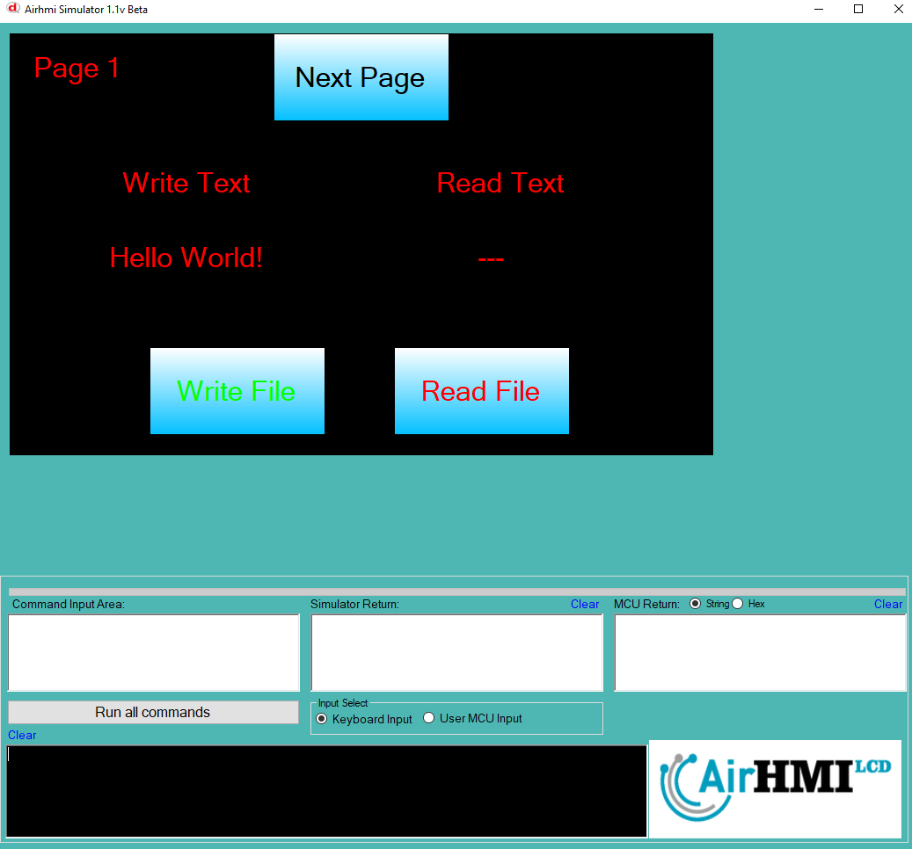
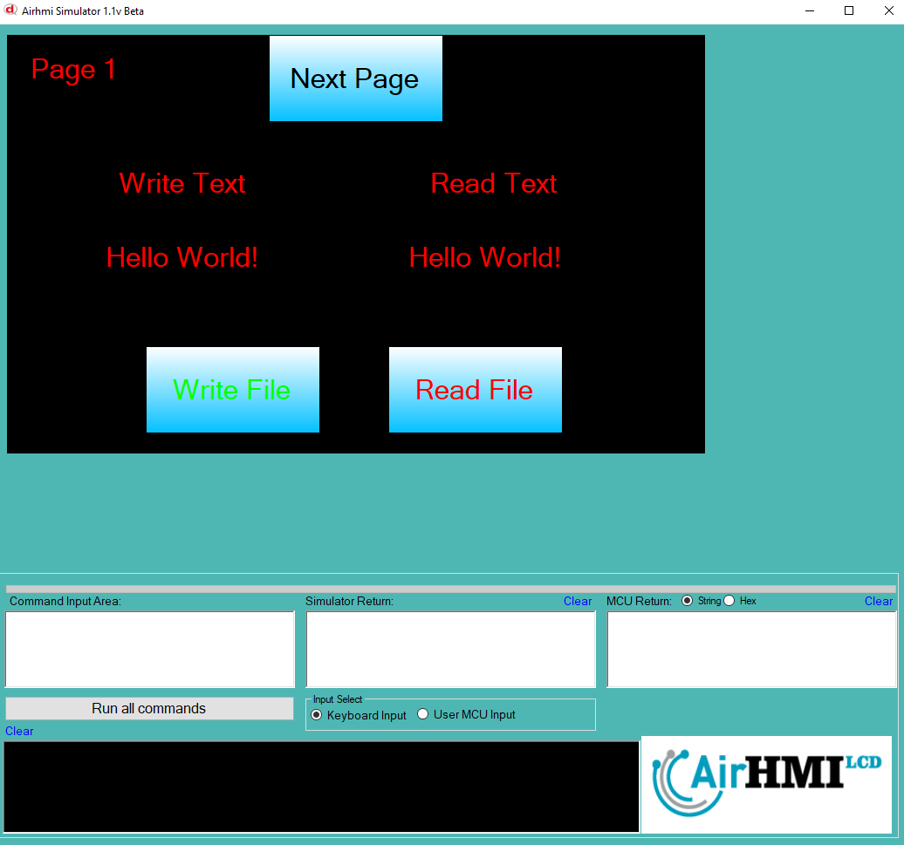
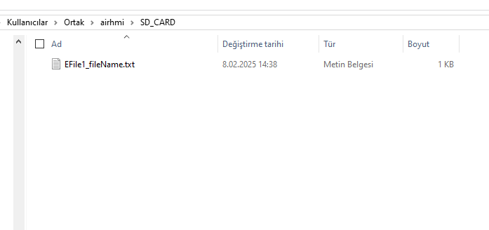

## SD Karta Dosya Yazma ve Okuma

Airhmi, SD karta dosya yazma ve okuma işlemlerini dahili flash hafızasında gerçekleştirir.

Simülatörde SD kart olarak **C:\Users\Public\airhmi\SD_CARD** dizini kullanılır. Bu dizine dosyaları manuel olarak da kopyalayabilir ve işlemlerinizi buradan gerçekleştirebilirsiniz.

## Program İlk Açılışta Görünümü
Uygulama ilk başlatıldığında, dosyanın içeriği henüz değiştirilmeyip varsayılan olarak belirlenen değer bulunmaktadır. Aşağıdaki görselde, programın açılış ekranı görülmektedir.

## Dosya Yazma ve Okuma İşlemi
File Write butonuna bastığımızda, LabelBox içerisinde bulunan "Hello World" ifadesi dosyaya yazılır. Ardından, File Read butonuna tekrar basarak dosyanın güncellenmiş içeriğini okuruz ve bu yeni değer LabelBox üzerinde görüntülenir.

## SD Kart dizinini
Simülatörün kullandığı SD Kart dizini, aşağıdaki yapıya sahiptir:
Bu dizin yapısını kullanarak dosya işlemlerini gerçekleştirebilirsiniz.

