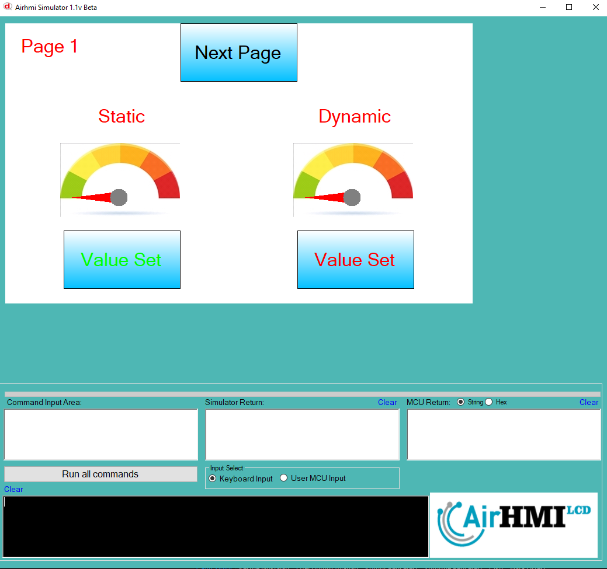
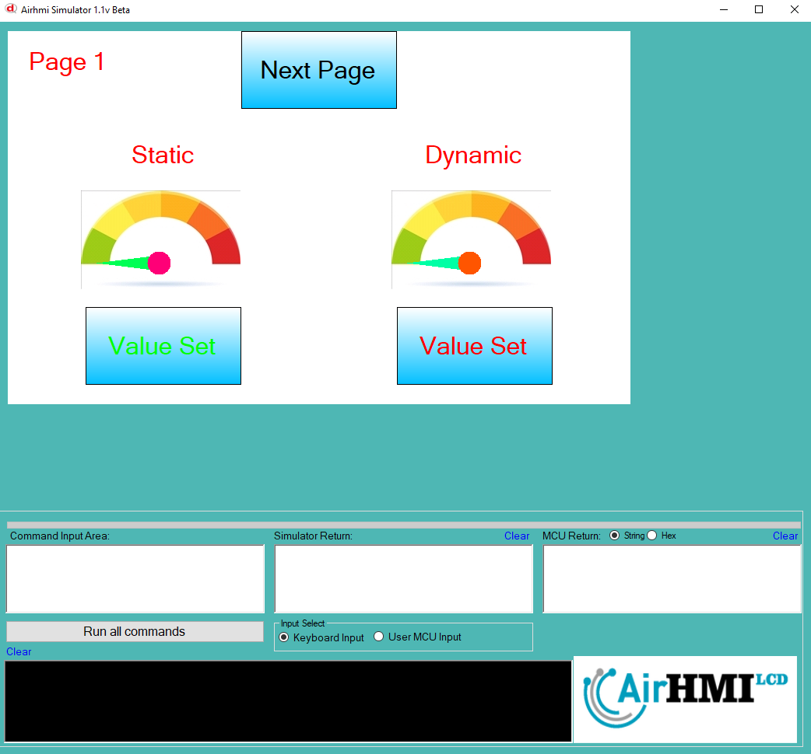
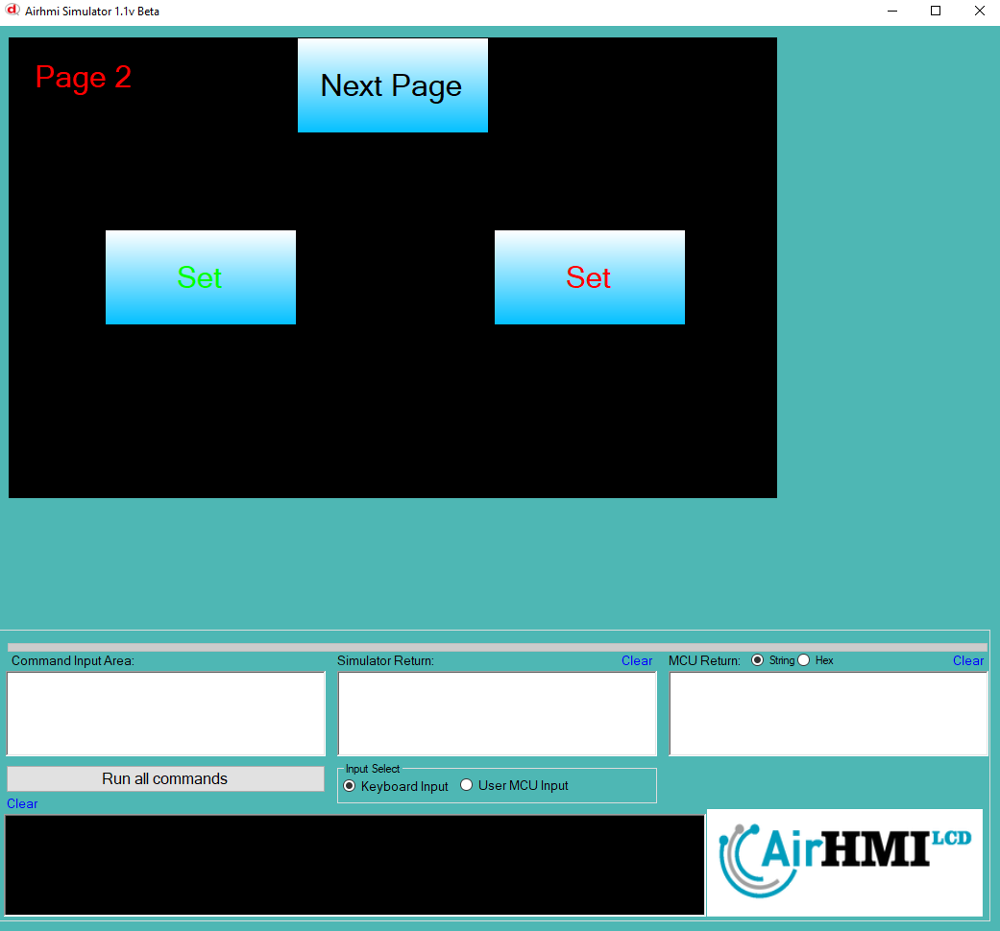

# Gauge Color Özelliği

**NEEDLE_COLOR** Gauge nesnesinin ibresinin rengini değiştirmek için kullanılan özellik. 

**NEEDLE_CIRCLE_COLOR** Gauge nesnesinin ortasındaki yuvarlağı değiştirmek için kullanılan özellik.

```
GaugeSet("Gauge1" ,"NEEDLE_COLOR" , "#ffFFCC");
GaugeSet("Gauge1" ,"NEEDLE_CIRCLE_COLOR" , "#000088");
```

Bu dokümanda, statik ve dinamik olmak üzere iki farklı Gaugeun rengi özelliği üzerinde etkili olan faktörler incelenmiştir.
Statik Gaugelar her sayfadan tüm özelliklerine ulaşılıp değiştirilebilen Gaugelardır. Static(false) yani dinamik Gauge'lar ise sayfaya özgüdür.
Sayfa değiştiği zaman hiçbir özelliği tutulmaz. Sayfa değişip tekrar aynı sayfaya gidildiği zaman Gauge ilk hali ile baştan meydana getirilir. 

## 📌 1. Gauge Tanımı
- **🟢 Statik Gauge**: Static özelliği true olan Gauge'dur. Color özelliği **hem aynı sayfadan hem de diğer sayfalardan** değiştirilebilir.
- **🔵 Dinamik Gauge**: Statik özelliği false olan Gauge'dur. Color  özelliği **yalnızca aynı sayfada** değiştirilebilir, diğer sayfalardan değiştirilemez.

## 🔍 2. Gauge NEEDLE_COLOR ve NEEDLE_CIRCLE_COLOR Değiştirme Durumları
### 🏠 Aynı Sayfada Olası Senaryolar
- Kullanıcı **statik Gaugeun Color değerini** değiştirebilir.
- Kullanıcı **dinamik Gaugeun Color değerini** değiştirebilir.


### 🔄 Farklı Sayfadan Olası Senaryolar
- Kullanıcı **statik Gaugeun Color değerini** değiştirebilir.
- Kullanıcı **dinamik Gaugeun Color değerini değiştiremez.**
- **Statik Gauge**, farklı sayfadan Color değerini değiştirirsek, aynı sayfaya dönüldüğünde **yeni değiştirilen Color değeri gelir.**
- **Dinamik Gaugeun Color değerini değiştirsek bile etki etmez.**

## 🎯 4. Sonuç
✔️ Aynı sayfada **her iki Gaugeun Color değerini değiştirilebilir**.  
✔️ **Statik Gaugeun Color değerini** diğer sayfalardan değiştirilebilir.  
✔️ **Dinamik Gaugeun Color değerini** yalnızca oluşturulduğu sayfada değiştirilebilir.  








