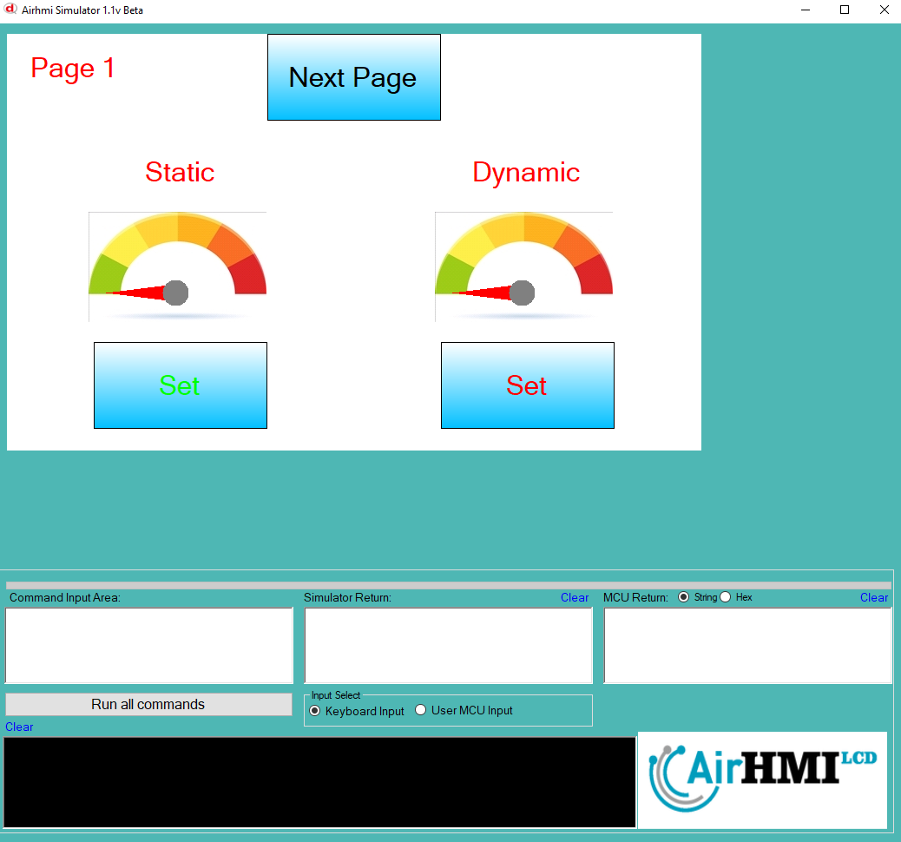
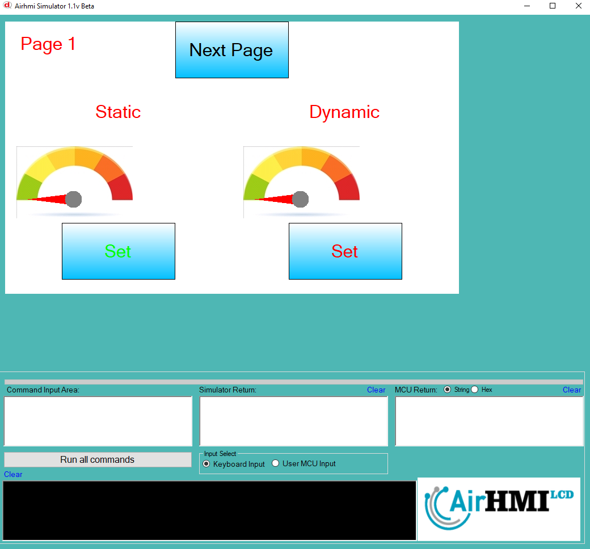
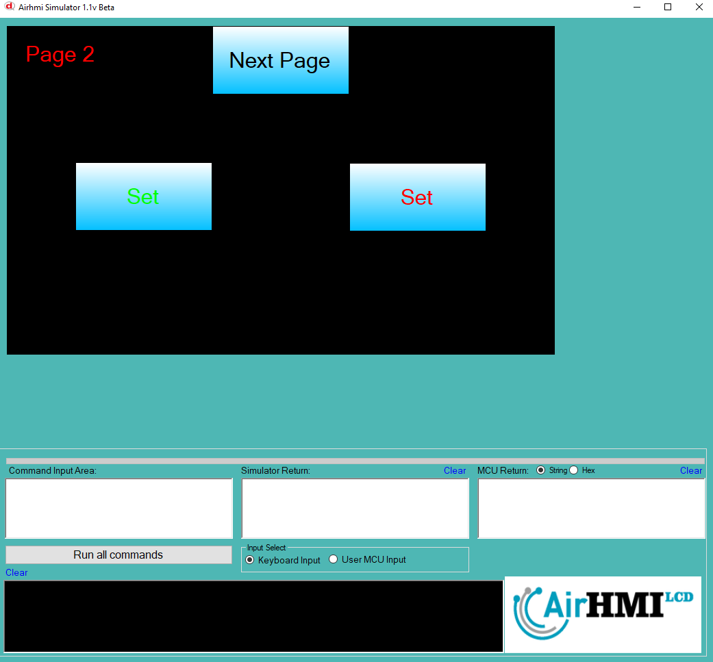
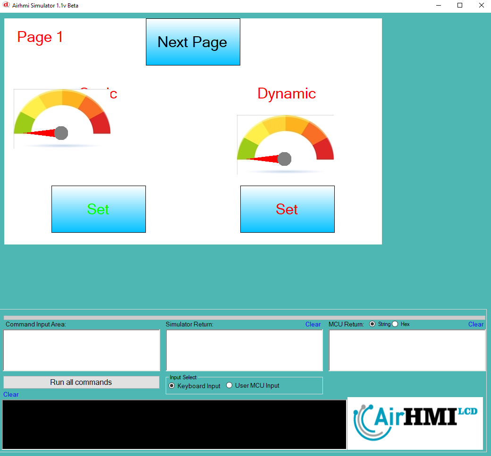

# Gauge Left Top Özelliği

Gauge'un ekran üzerindeki konumunu değiştirme işlemidir. 
Bu dokümanda, statik ve dinamik olmak üzere iki farklı Gauge konum özelliği üzerinde etkili olan faktörler incelenmiştir.

Statik Gauge'lar, her sayfadan tüm özelliklerine erişilip değiştirilebilen Gauge'lardır. **Static(false)** yani dinamik Gauge'lar ise yalnızca ilgili sayfaya özgüdür. Sayfa değiştiğinde hiçbir özelliği korunmaz. Sayfa tekrar açıldığında, Gauge başlangıçtaki haliyle yeniden oluşturulur.

## 📌 1. Gauge Tanımları
- **🟢 Statik Gauge**: `Static` özelliği **true** olan Gauge'dur. **Left** ve **Top** özellikleri **hem aynı sayfadan hem de diğer sayfalardan** değiştirilebilir.
- **🔵 Dinamik Gauge**: `Static` özelliği **false** olan Gauge'dur. **Left** ve **Top** özellikleri yalnızca aynı sayfada değiştirilebilir, farklı sayfalardan değiştirilemez.

## 🔍 2. Gauge Left ve Top Değiştirme Durumları
### 🏠 Aynı Sayfada Olası Senaryolar
- Kullanıcı, **statik Gauge Left ve Top değerlerini** değiştirebilir.
- Kullanıcı, **dinamik Gauge Left ve Top değerlerini** değiştirebilir.

### 🔄 Farklı Sayfadan Olası Senaryolar
- Kullanıcı, **statik Gauge Left ve Top değerlerini** değiştirebilir.
- Kullanıcı, **dinamik Gauge Left ve Top değerlerini değiştiremez.**
- **Statik Gauge**, farklı bir sayfadan `Left` ve `Top` değerleri değiştirildiğinde, aynı sayfaya dönüldüğünde **yeni konumunda görünür.**
- **Dinamik Gauge** için `Left` ve `Top` değerleri farklı bir sayfadan değiştirilse bile etkili olmaz.

## 🎯 3. Sonuç
✔️ Aynı sayfada, **hem statik hem de dinamik Gauge'lerin Left ve Top değerleri değiştirilebilir**.  
✔️ **Statik Gauge Left ve Top değerleri** farklı sayfalardan değiştirilebilir.  
✔️ **Dinamik Gauge Left ve Top değerleri** yalnızca oluşturulduğu sayfada değiştirilebilir.  

---

