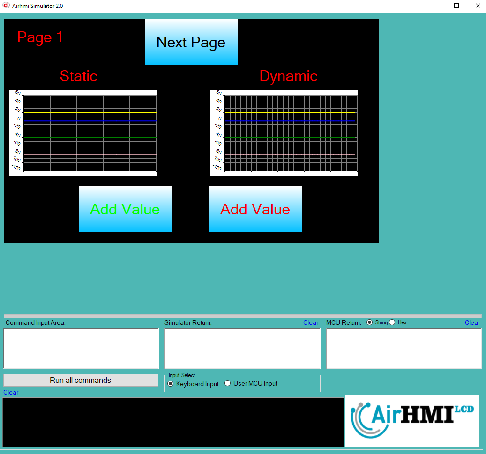
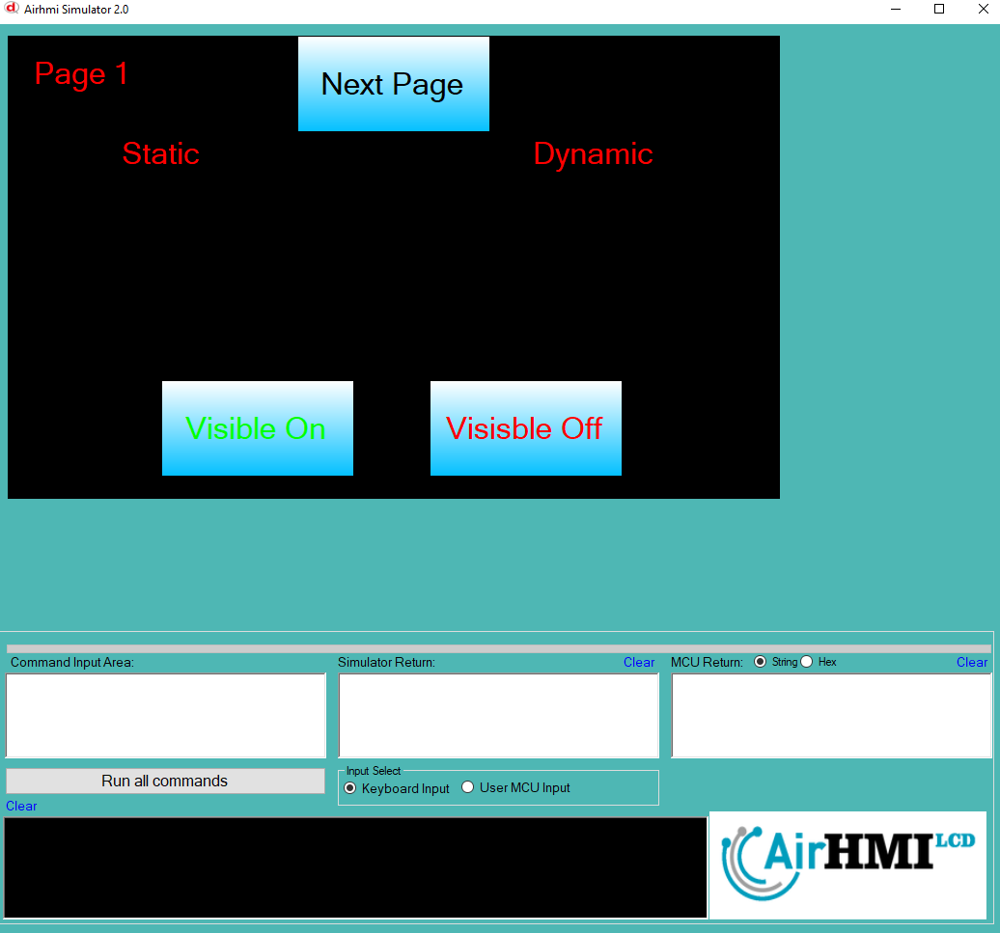
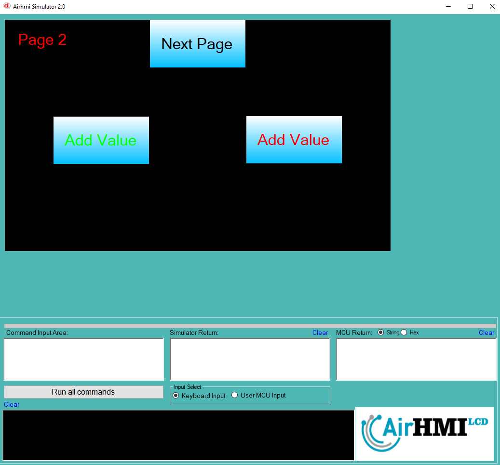
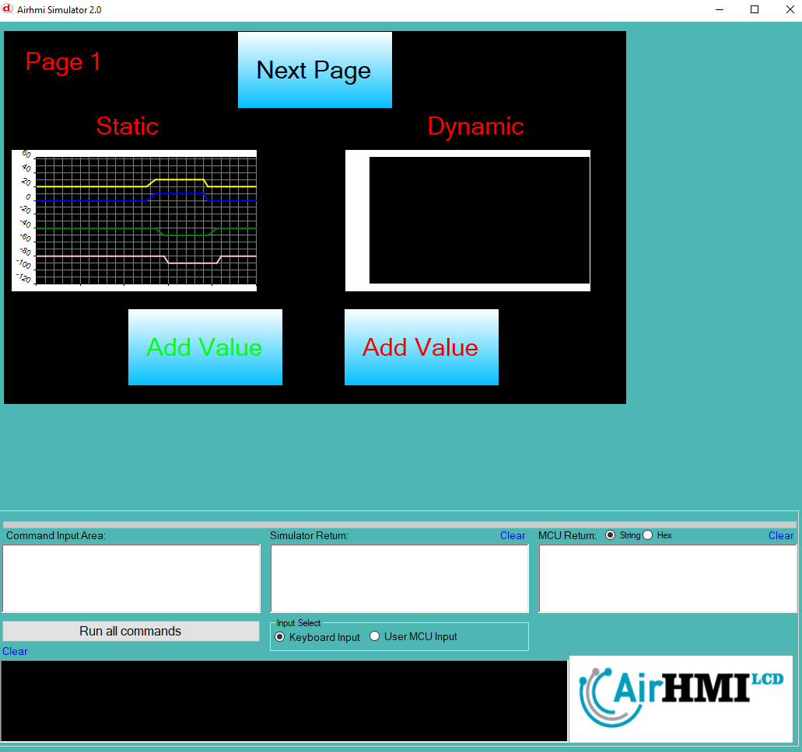

# Graph Görünürlük Özelliği

Bu dokümanda, statik ve dinamik olmak üzere iki farklı Graph görünürlük durumları üzerinde etkili olan faktörler incelenmiştir.
Statik Graphlar her sayfadan tüm özelliklerine ulaşılıp değiştirilebilen Graphlardır. Static(false) yani dinamik Graphlar ise sayfaya özgüdür.
Sayfa değiştiği zaman hiçbir özelliği tutulmaz. Sayfa değişip tekrar aynı sayfaya gidildiği zaman Graph ilk hali ile baştan meydana getirilir. 

## 📌 1. Graphların Tanımı
- **🟢 Statik Graph**: Static özelliği true olan Graphdur. Görünürlük (`Visible`) özelliği **hem aynı sayfadan hem de diğer sayfalardan** değiştirilebilir.
- **🔵 Dinamik Graph**: Statik özelliği false olan Graphdur. Görünürlük (`Visible`) özelliği **yalnızca aynı sayfada** değiştirilebilir, diğer sayfalardan değiştirilemez.

## 🔍 2. Graph Görünürlük Durumları
### 🏠 Aynı Sayfada Olası Senaryolar
- Kullanıcı **statik Graph görünürlüğünü** `true` veya `false` yapabilir.
- Kullanıcı **dinamik Graph görünürlüğünü** `true` veya `false` yapabilir.
- **Her iki Graph da görünür olabilir.**
- **Her iki Graph da gizlenebilir.**

### 🔄 Farklı Sayfadan Olası Senaryolar
- Kullanıcı **statik Graph görünürlüğünü** `true` veya `false` yapabilir.
- Kullanıcı **dinamik Graph görünürlüğünü değiştiremez.**
- **Statik Graph**, farklı sayfadan gizlenirse, aynı sayfaya dönüldüğünde **görünmez** olur.
- **Dinamik Graph görünürlük durumu korunur.**

## 📊 3. Olasılıklar Tablosu

| Senaryo | Statik Graph (Visible) | Dinamik Graph (Visible) | Açıklama |
|---------|------------------------|------------------------|-----------|
| ✅ 1 | `true`  | `true`  | Her iki Graph da görünür. |
| ✅ 2 | `true`  | `false` | Statik Graph görünür, dinamik Graph gizli. |
| ✅ 3 | `false` | `true`  | Statik Graph gizli, dinamik Graph görünür. |
| ✅ 4 | `false` | `false` | Her iki Graph da gizli. |
| ✅ 5 | `false` (Dışarıdan değiştirildi) | `true` | Farklı sayfada statik Graph kapatıldı, dinamik Graph etkilenmedi. |
| ✅ 6 | `true`  | `true` (Dışarıdan değiştirilemedi) | Statik Graph değiştirildi, dinamik Graph aynı kaldı. |

## 🎯 4. Sonuç
✔️ Aynı sayfada **her iki Graph görünürlük durumu değiştirilebilir**.  
✔️ **Statik Graph görünürlüğü** diğer sayfalardan değiştirilebilir.  
✔️ **Dinamik Graph görünürlüğü** yalnızca oluşturulduğu sayfada değiştirilebilir.  

Bu bilgiler ışığında, **görünürlük değişikliklerinin beklenen sonuçları doğru şekilde ele alınmalıdır.** 🚀

