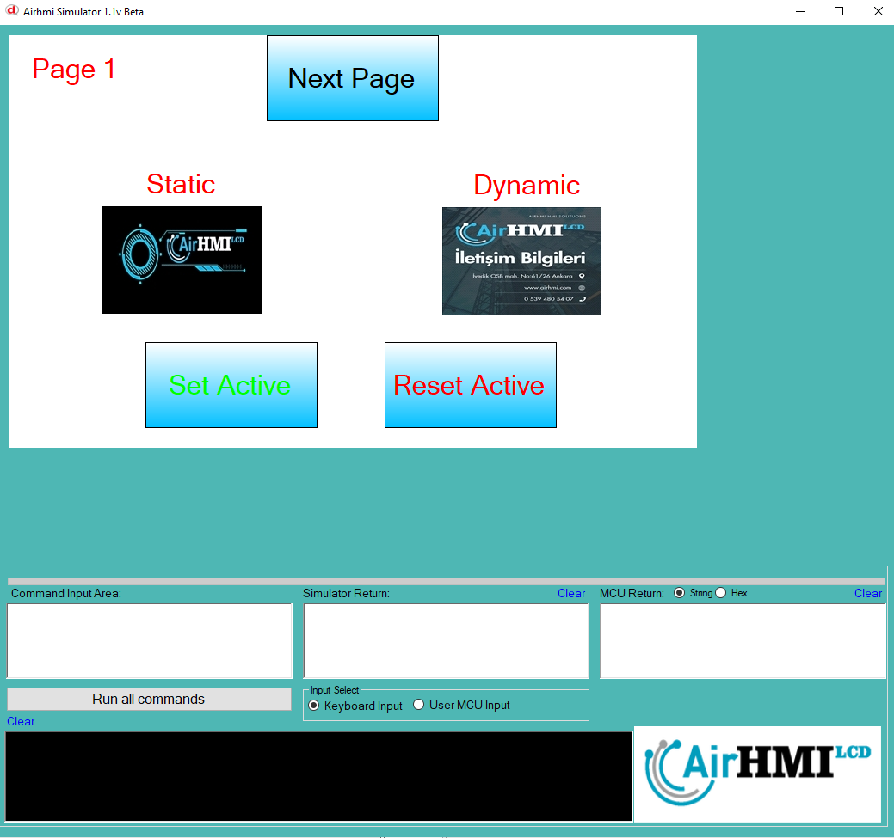

# Image Active Özelliği

Active özelliği Image basma işlemi için açma ve kapatma özelliğine sahip olması anlamına gelir.
Bu dokümanda, statik ve dinamik olmak üzere iki farklı Image Active özelliği üzerinde etkili olan faktörler incelenmiştir.
Statik Imagelar her sayfadan tüm özelliklerine ulaşılıp değiştirilebilen Imagelardır. Static(false) yani dinamik Imagelar ise sayfaya özgüdür.
Sayfa değiştiği zaman hiçbir özelliği tutulmaz. Sayfa değişip tekrar aynı sayfaya gidildiği zaman Image ilk hali ile baştan meydana getirilir. 

## 📌 1. Image Objesinin Tanımı
- **🟢 Statik Image**: Static özelliği true olan Imagedur. Active özelliği **hem aynı sayfadan hem de diğer sayfalardan** değiştirilebilir.
- **🔵 Dinamik Image**: Statik özelliği false olan Imagedur. Active  özelliği **yalnızca aynı sayfada** değiştirilebilir, diğer sayfalardan değiştirilemez.

## 🔍 2. Image Active Değiştirme Durumları
### 🏠 Aynı Sayfada Olası Senaryolar
- Kullanıcı **statik Image Active değerini** değiştirebilir.
- Kullanıcı **dinamik Image Active değerini** değiştirebilir.

### 🔄 Farklı Sayfadan Olası Senaryolar
- Kullanıcı **statik Image Active değerini** değiştirebilir.
- Kullanıcı **dinamik Image Active değerini değiştiremez.**
- **Statik Image**, farklı sayfadan Active değerini değiştirirsek, aynı sayfaya dönüldüğünde **yeni değiştirilen Active değeri gelir.**
- **Dinamik Image Active değerini değiştirsek bile etki etmez.**

## 🎯 4. Sonuç
✔️ Aynı sayfada **her iki Image Active değerini değiştirilebilir**.  
✔️ **Statik Image Active değerini** diğer sayfalardan değiştirilebilir.  
✔️ **Dinamik Image Active değerini** yalnızca oluşturulduğu sayfada değiştirilebilir.  

