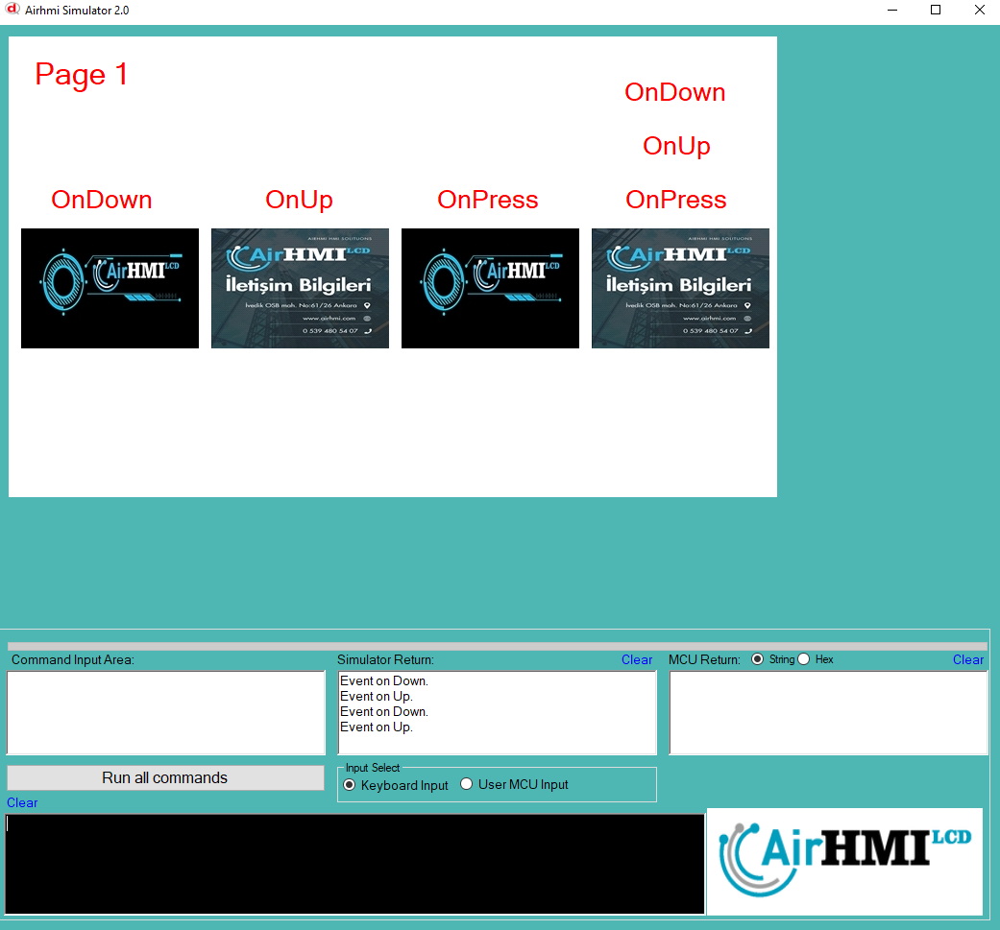

# Image Events

AIRHMI (Human-Machine Interface) ekranlarında kullanılan OnDown, OnUp ve OnPress eventları, dokunmatik ekran veya endüstriyel kontrol cihazları için önemli olan temel kullanıcı etkileşimlerini tanımlar.

🔹 1. OnDown (Basılınca)
Bu olay, kullanıcı HMI ekranında resmin üzerine dokunduğunda tetiklenir. Yani, dokunmatik ekrana basıldığı anda çalışır.

📌 Kullanım Senaryoları:

Bir resime basıldığında anında görsel değişiklik yapmak (örneğin, gölgelendirme eklemek).

Dokunulduğunda anında bir fonksiyon tetiklemek (örneğin, bir motoru başlatmak).

🔹 2. OnUp (Bırakınca)
Bu olay, kullanıcı dokunmayı bıraktığında (parmağını ekrandan çektiğinde) tetiklenir.

📌 Kullanım Senaryoları:

Dokunmayı bıraktıktan sonra bir işlemi başlatmak (örneğin, bir valfi açmak).

OnDown sırasında değişen görsel efekti eski haline getirmek.

Uzun basma işlemi tamamlandıktan sonra belirli bir komutu çalıştırmak.

🔹 3. OnPress (Basılı Tutma)
Bu olay, kullanıcı resmin üzerinde belirli bir süre boyunca basılı tuttuğunda tetiklenir.

📌 Kullanım Senaryoları:

Uzun basınca ayar menüsünü açmak.

Bir butonun basılı tutulduğu süre boyunca bir motorun hızını artırmak.

Sürükleme veya seçme işlemleri için kullanılabilir.

