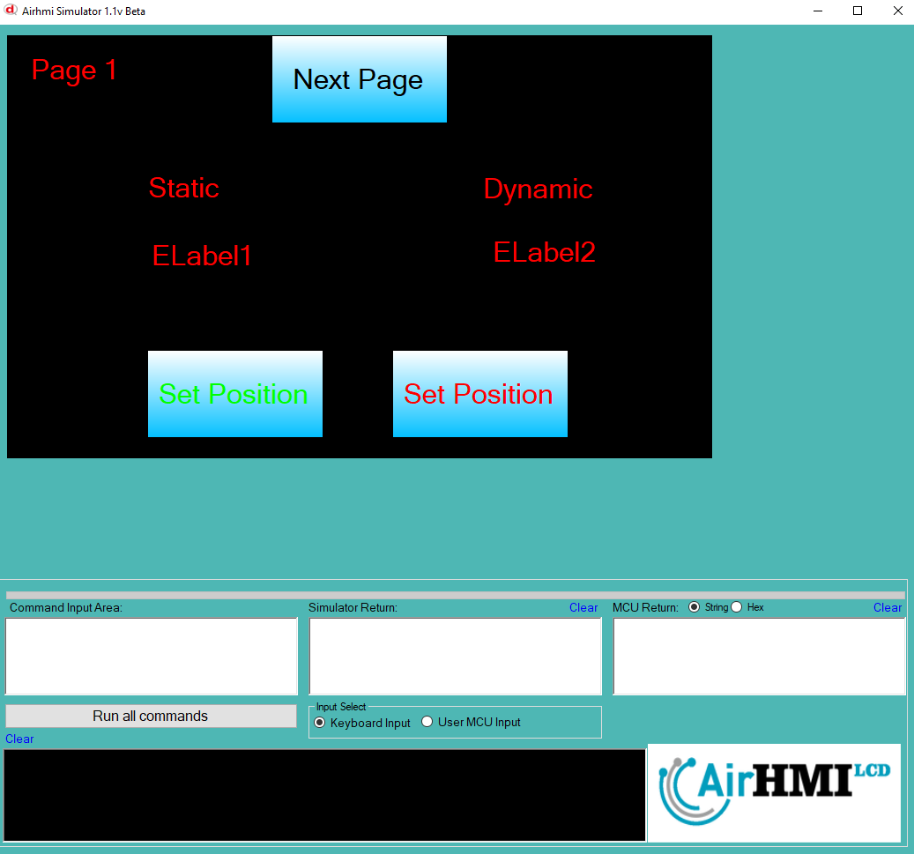
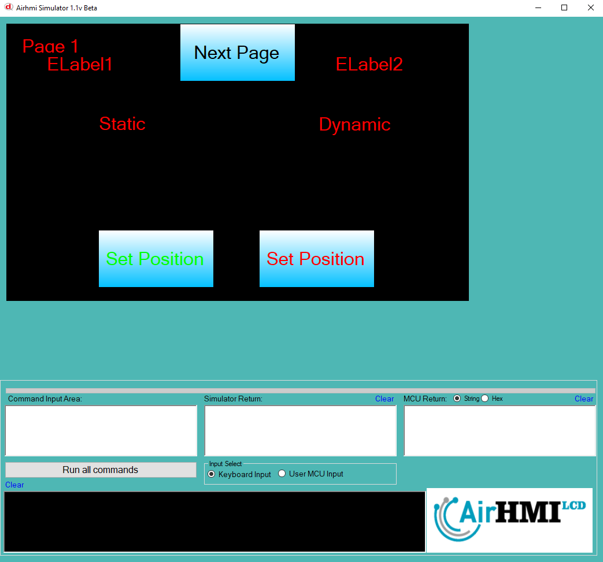
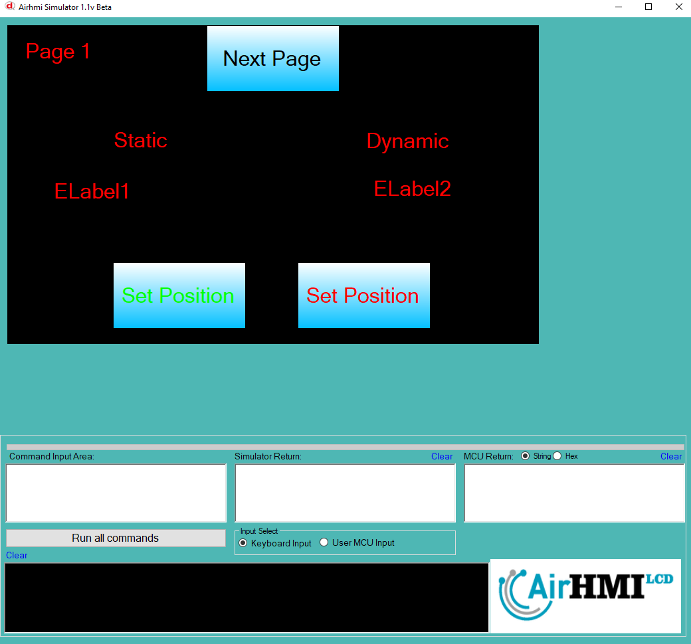

# Label Left Top Özelliği

Label ekran üzerindeki konumunu değiştirme işlemdir. 
Bu dokümanda, statik ve dinamik olmak üzere iki farklı Label Text özelliği üzerinde etkili olan faktörler incelenmiştir.
Statik Labellar her sayfadan tüm özelliklerine ulaşılıp değiştirilebilen Labellardır. Static(false) yani dinamik Labellar ise sayfaya özgüdür.
Sayfa değiştiği zaman hiçbir özelliği tutulmaz. Sayfa değişip tekrar aynı sayfaya gidildiği zaman Label ilk hali ile baştan meydana getirilir. 

## 📌 1. Label ların Tanımı
- **🟢 Statik Label**: Static özelliği true olan Labeldur. Left ve Top özelliği **hem aynı sayfadan hem de diğer sayfalardan** değiştirilebilir.
- **🔵 Dinamik Label**: Statik özelliği false olan Labeldur. Left ve Top özelliği **yalnızca aynı sayfada** değiştirilebilir, diğer sayfalardan değiştirilemez.

## 🔍 2. Label Left ve Top Değiştirme Durumları
### 🏠 Aynı Sayfada Olası Senaryolar
- Kullanıcı **statik Label Left ve Top değerini** değiştirebilir.
- Kullanıcı **dinamik Label Left ve Top değerini** değiştirebilir.

### 🔄 Farklı Sayfadan Olası Senaryolar
- Kullanıcı **statik Label Left ve Top değerini** değiştirebilir.
- Kullanıcı **dinamik Label Left ve Top değerini değiştiremez.**
- **Statik Label**, farklı sayfadan Left ve Top değerini değiştirirsek, aynı sayfaya dönüldüğünde **yeni değiştirilen text değeri gelir.**
- **Dinamik Label Left ve Top değerini değiştirsek bile etki etmez.**

## 🎯 4. Sonuç
✔️ Aynı sayfada **her iki Label Left ve Top değerini değiştirilebilir**.  
✔️ **Statik Label Left ve Top değerini** diğer sayfalardan değiştirilebilir.  
✔️ **Dinamik Label Left ve Top değerini** yalnızca oluşturulduğu sayfada değiştirilebilir.  

