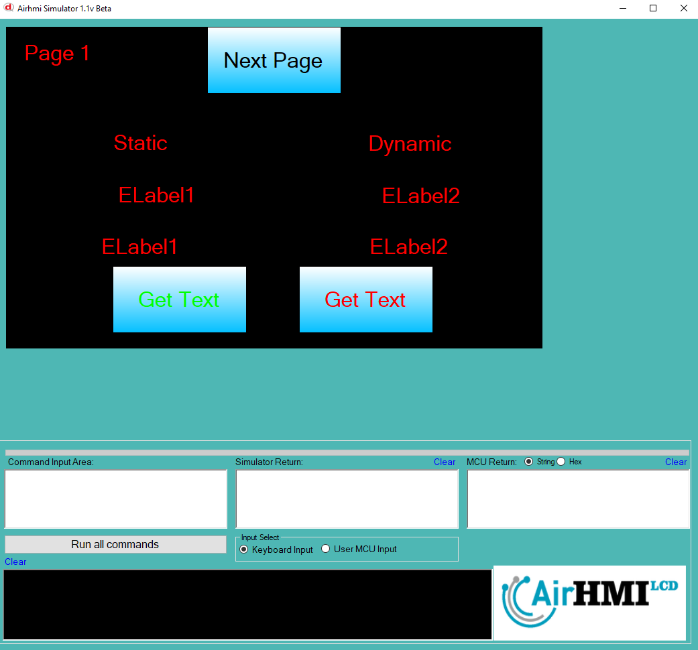
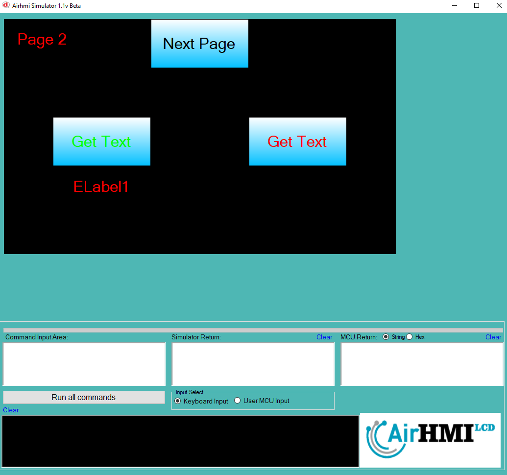

# Label Text Değeri Alma

Bu dokümanda, statik ve dinamik olmak üzere iki farklı Label Text özelliği üzerinde etkili olan faktörler incelenmiştir.
Statik Labellar her sayfadan tüm özelliklerine ulaşılıp değiştirilebilen Labellardır. Static(false) yani dinamik Labellar ise sayfaya özgüdür.
Sayfa değiştiği zaman hiçbir özelliği tutulmaz. Sayfa değişip tekrar aynı sayfaya gidildiği zaman Label ilk hali ile baştan meydana getirilir. 

## 📌 1. Labelların Tanımı
- **🟢 Statik Label**: Static özelliği true olan Labeldur. Text (`Caption`) özelliği **hem aynı sayfadan hem de diğer sayfalardan** değeri okunabilir.
- **🔵 Dinamik Label**: Statik özelliği false olan Labeldur. Text (`Caption`) özelliği **yalnızca aynı sayfada** değiştirilebilir, diğer sayfalardan değeri alınamaz.

## 🔍 2. Label Text Caption Değerini Alma Durumları
### 🏠 Aynı Sayfada Olası Senaryolar
- Kullanıcı **statik Label Text değerini** alabilir.
- Kullanıcı **dinamik Label Text değerini** alabilir.

### 🔄 Farklı Sayfadan Olası Senaryolar
- Kullanıcı **statik Label Text değerini** alabilir.
- Kullanıcı **dinamik Label Text değerini alamaz.**

## 🎯 4. Sonuç
✔️ Aynı sayfada **her iki Label Text değerini alabiliriz**.  
✔️ **Statik Label Text değerini** diğer sayfalardan okuyabiliriz.  
✔️ **Dinamik Label Text değerini** yalnızca oluşturulduğu sayfada değeri okunabilir.  

