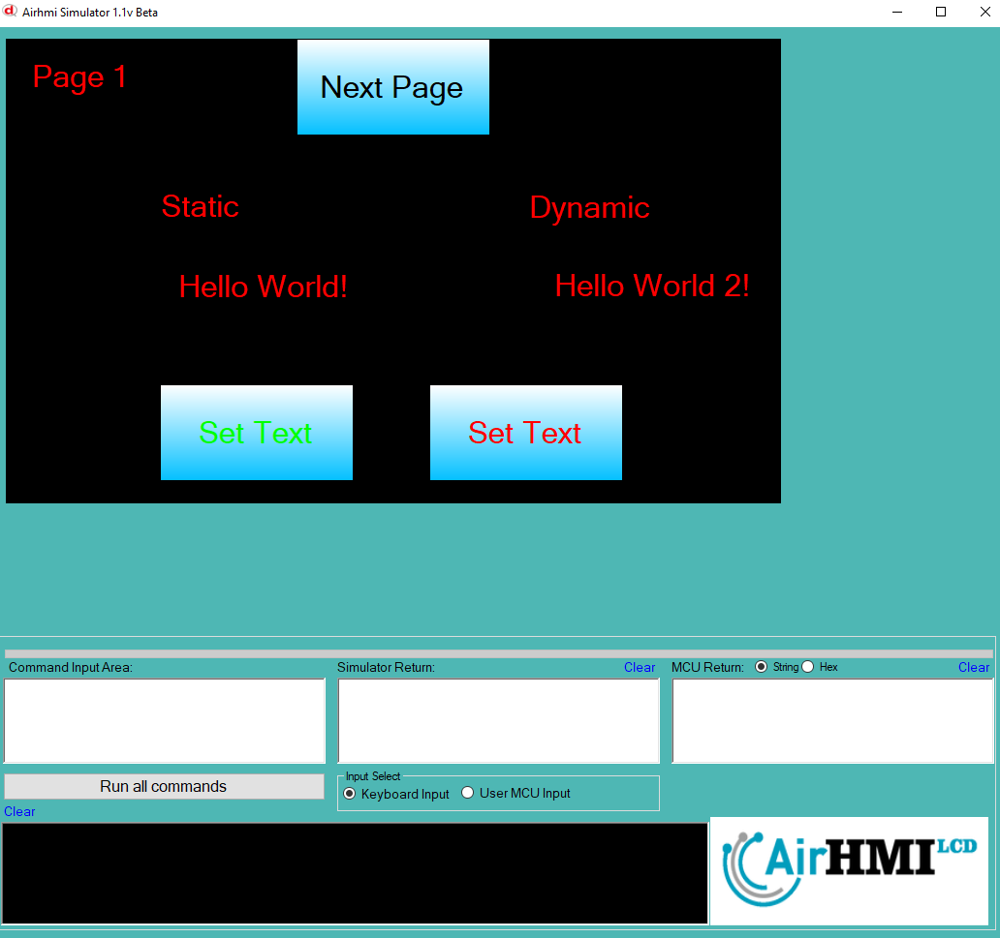
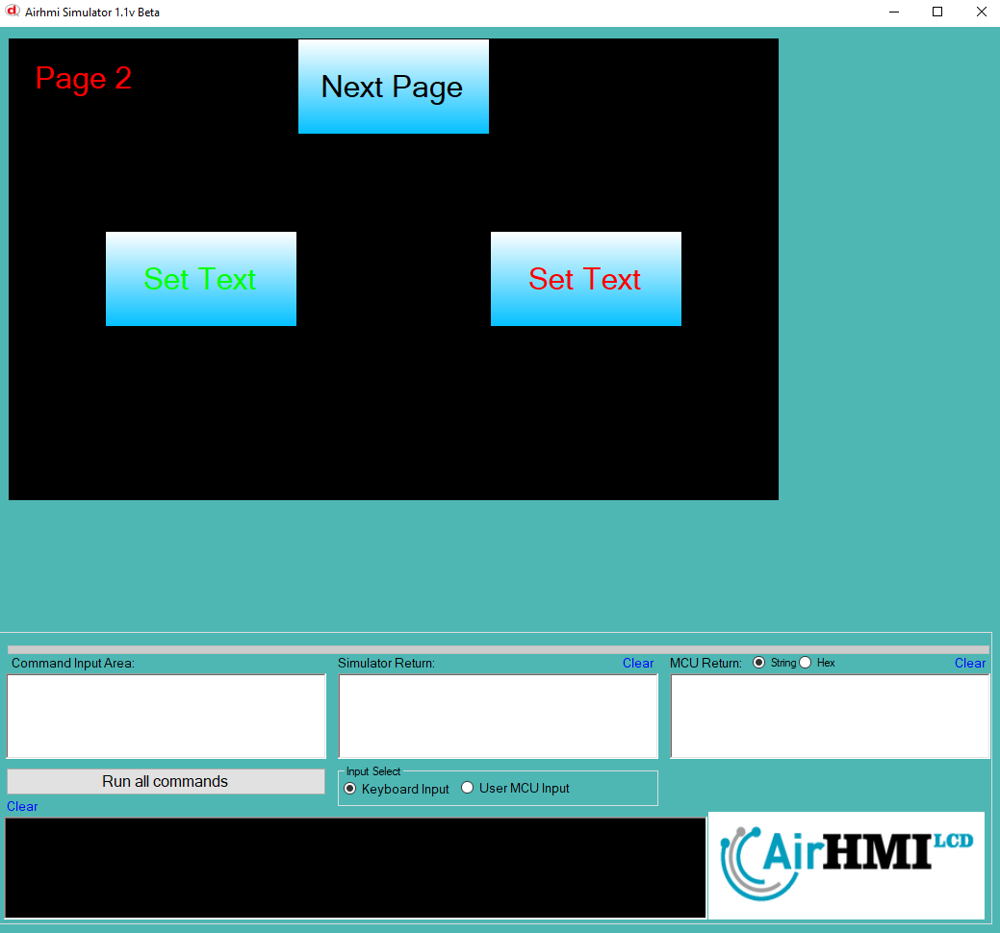

# Label Text Özelliği

Bu dokümanda, statik ve dinamik olmak üzere iki farklı Label Text özelliği üzerinde etkili olan faktörler incelenmiştir.
Statik Labellar her sayfadan tüm özelliklerine ulaşılıp değiştirilebilen Labellardır. Static(false) yani dinamik Labellar ise sayfaya özgüdür.
Sayfa değiştiği zaman hiçbir özelliği tutulmaz. Sayfa değişip tekrar aynı sayfaya gidildiği zaman Label ilk hali ile baştan meydana getirilir. 

## 📌 1. Labelların Tanımı
- **🟢 Statik Label**: Static özelliği true olan Labeldur. Text (`Caption`) özelliği **hem aynı sayfadan hem de diğer sayfalardan** değiştirilebilir.
- **🔵 Dinamik Label**: Statik özelliği false olan Labeldur. Text (`Caption`) özelliği **yalnızca aynı sayfada** değiştirilebilir, diğer sayfalardan değiştirilemez.

## 🔍 2. Label Text Caption Değiştirme Durumları
### 🏠 Aynı Sayfada Olası Senaryolar
- Kullanıcı **statik Label Text değerini** değiştirebilir.
- Kullanıcı **dinamik Label Text değerini** değiştirebilir.

### 🔄 Farklı Sayfadan Olası Senaryolar
- Kullanıcı **statik Label Text değerini** değiştirebilir.
- Kullanıcı **dinamik Label Text değerini değiştiremez.**
- **Statik Label**, farklı sayfadan Text değerini değiştirirsek, aynı sayfaya dönüldüğünde **yeni değiştirilen text değeri gelir.**
- **Dinamik Label Text değerini değiştirsek bile etki etmez.**

## 🎯 4. Sonuç
✔️ Aynı sayfada **her iki Label Text değerini değiştirilebilir**.  
✔️ **Statik Label Text değerini** diğer sayfalardan değiştirilebilir.  
✔️ **Dinamik Label Text değerini** yalnızca oluşturulduğu sayfada değiştirilebilir.  

