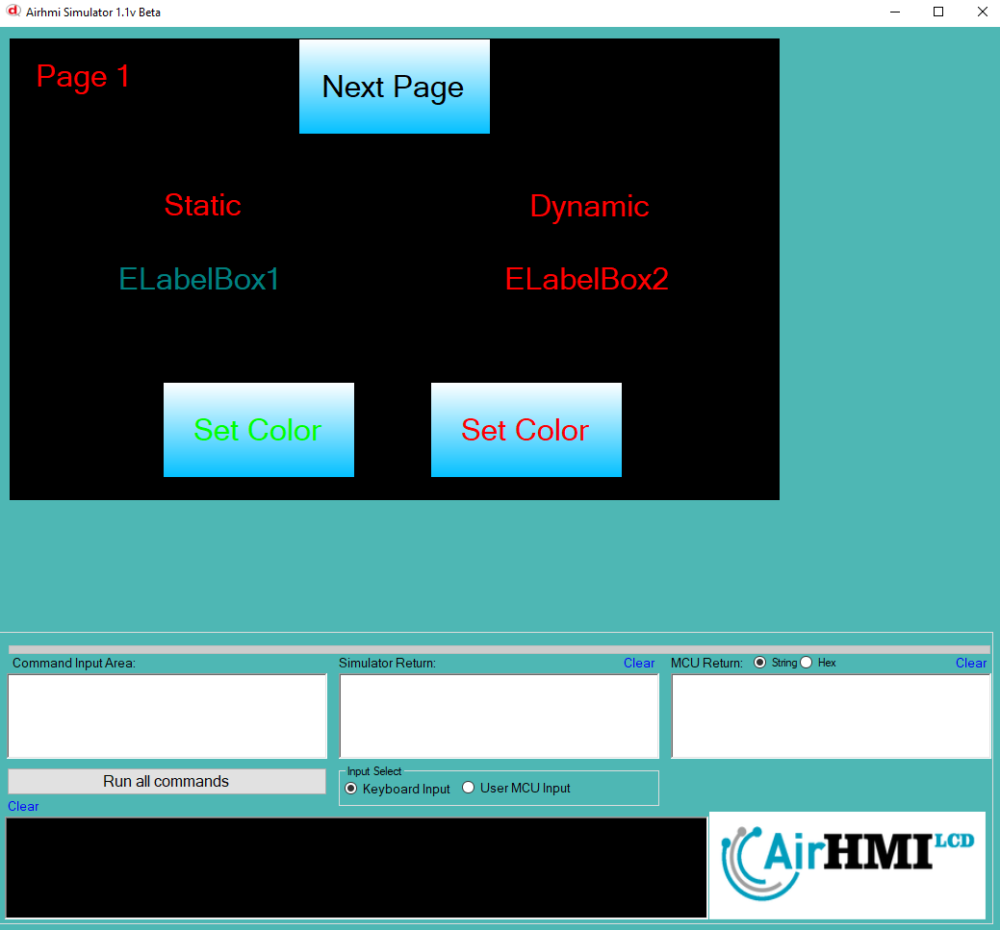

# LabelBox Color Özelliği

Bu dokümanda, statik ve dinamik olmak üzere iki farklı LabelBox rengi özelliği üzerinde etkili olan faktörler incelenmiştir.
Statik LabelBoxlar her sayfadan tüm özelliklerine ulaşılıp değiştirilebilen LabelBoxlardır. Static(false) yani dinamik LabelBoxlar ise sayfaya özgüdür.
Sayfa değiştiği zaman hiçbir özelliği tutulmaz. Sayfa değişip tekrar aynı sayfaya gidildiği zaman LabelBox ilk hali ile baştan meydana getirilir. 

## 📌 1. LabelBoxların Tanımı
- **🟢 Statik LabelBox**: Static özelliği true olan LabelBoxdur. Color özelliği **hem aynı sayfadan hem de diğer sayfalardan** değiştirilebilir.
- **🔵 Dinamik LabelBox**: Statik özelliği false olan LabelBoxdur. Color  özelliği **yalnızca aynı sayfada** değiştirilebilir, diğer sayfalardan değiştirilemez.

## 🔍 2. LabelBox Font_Color Değiştirme Durumları
### 🏠 Aynı Sayfada Olası Senaryolar
- Kullanıcı **statik LabelBox Color değerini** değiştirebilir.
- Kullanıcı **dinamik LabelBox Color değerini** değiştirebilir.

### 🔄 Farklı Sayfadan Olası Senaryolar
- Kullanıcı **statik LabelBox Color değerini** değiştirebilir.
- Kullanıcı **dinamik LabelBox Color değerini değiştiremez.**
- **Statik LabelBox**, farklı sayfadan Color değerini değiştirirsek, aynı sayfaya dönüldüğünde **yeni değiştirilen Color değeri gelir.**
- **Dinamik LabelBox Color değerini değiştirsek bile etki etmez.**

## 🎯 4. Sonuç
✔️ Aynı sayfada **her iki LabelBox Color değerini değiştirilebilir**.  
✔️ **Statik LabelBox Color değerini** diğer sayfalardan değiştirilebilir.  
✔️ **Dinamik LabelBox Color değerini** yalnızca oluşturulduğu sayfada değiştirilebilir.  

