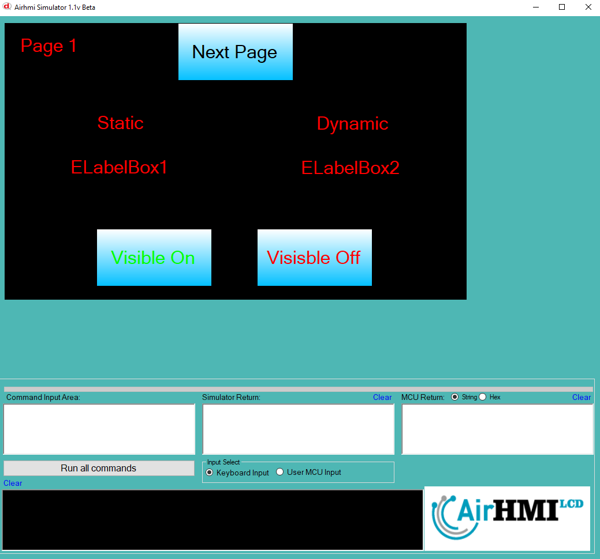

# LabelBox Görünürlük Özelliği

Bu dokümanda, statik ve dinamik olmak üzere iki farklı LabelBox görünürlük durumları üzerinde etkili olan faktörler incelenmiştir.
Statik LabelBoxlar her sayfadan tüm özelliklerine ulaşılıp değiştirilebilen LabelBoxlardır. Static(false) yani dinamik LabelBoxlar ise sayfaya özgüdür.
Sayfa değiştiği zaman hiçbir özelliği tutulmaz. Sayfa değişip tekrar aynı sayfaya gidildiği zaman LabelBox ilk hali ile baştan meydana getirilir. 

## 📌 1. LabelBoxların Tanımı
- **🟢 Statik LabelBox**: Static özelliği true olan LabelBoxdur. Görünürlük (`Visible`) özelliği **hem aynı sayfadan hem de diğer sayfalardan** değiştirilebilir.
- **🔵 Dinamik LabelBox**: Statik özelliği false olan LabelBoxdur. Görünürlük (`Visible`) özelliği **yalnızca aynı sayfada** değiştirilebilir, diğer sayfalardan değiştirilemez.

## 🔍 2. LabelBox Görünürlük Durumları
### 🏠 Aynı Sayfada Olası Senaryolar
- Kullanıcı **statik LabelBox görünürlüğünü** `true` veya `false` yapabilir.
- Kullanıcı **dinamik LabelBox görünürlüğünü** `true` veya `false` yapabilir.
- **Her iki LabelBox da görünür olabilir.**
- **Her iki LabelBox da gizlenebilir.**

### 🔄 Farklı Sayfadan Olası Senaryolar
- Kullanıcı **statik LabelBox görünürlüğünü** `true` veya `false` yapabilir.
- Kullanıcı **dinamik LabelBox görünürlüğünü değiştiremez.**
- **Statik LabelBox**, farklı sayfadan gizlenirse, aynı sayfaya dönüldüğünde **görünmez** olur.
- **Dinamik LabelBox görünürlük durumu korunur.**

## 📊 3. Olasılıklar Tablosu

| Senaryo | Statik LabelBox (Visible) | Dinamik LabelBox (Visible) | Açıklama |
|---------|------------------------|------------------------|-----------|
| ✅ 1 | `true`  | `true`  | Her iki LabelBox da görünür. |
| ✅ 2 | `true`  | `false` | Statik LabelBox görünür, dinamik LabelBox gizli. |
| ✅ 3 | `false` | `true`  | Statik LabelBox gizli, dinamik LabelBox görünür. |
| ✅ 4 | `false` | `false` | Her iki LabelBox da gizli. |
| ✅ 5 | `false` (Dışarıdan değiştirildi) | `true` | Farklı sayfada statik LabelBox kapatıldı, dinamik LabelBox etkilenmedi. |
| ✅ 6 | `true`  | `true` (Dışarıdan değiştirilemedi) | Statik LabelBox değiştirildi, dinamik LabelBox aynı kaldı. |

## 🎯 4. Sonuç
✔️ Aynı sayfada **her iki LabelBox görünürlük durumu değiştirilebilir**.  
✔️ **Statik LabelBox görünürlüğü** diğer sayfalardan değiştirilebilir.  
✔️ **Dinamik LabelBox görünürlüğü** yalnızca oluşturulduğu sayfada değiştirilebilir.  

Bu bilgiler ışığında, **görünürlük değişikliklerinin beklenen sonuçları doğru şekilde ele alınmalıdır.** 🚀

