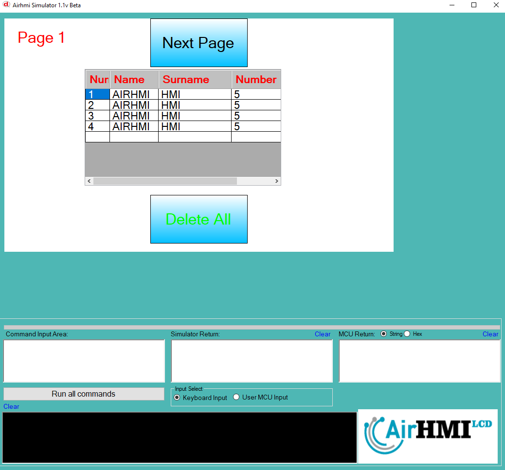
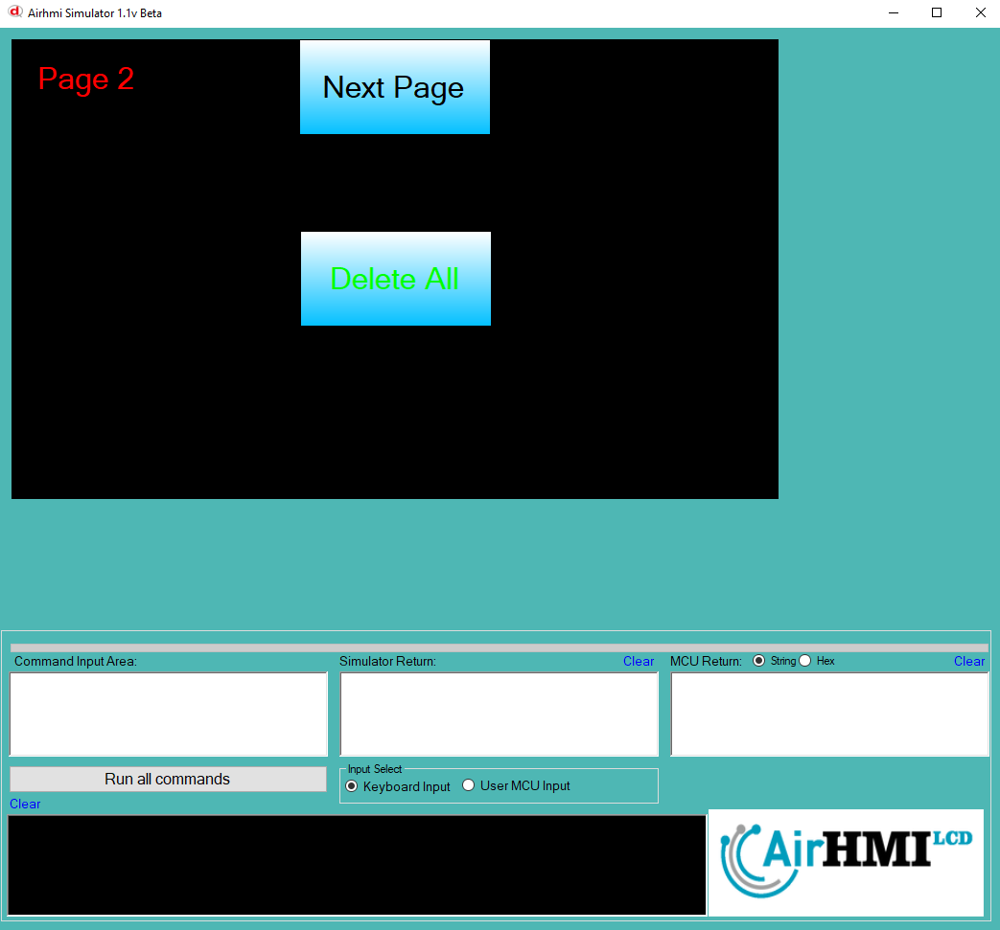
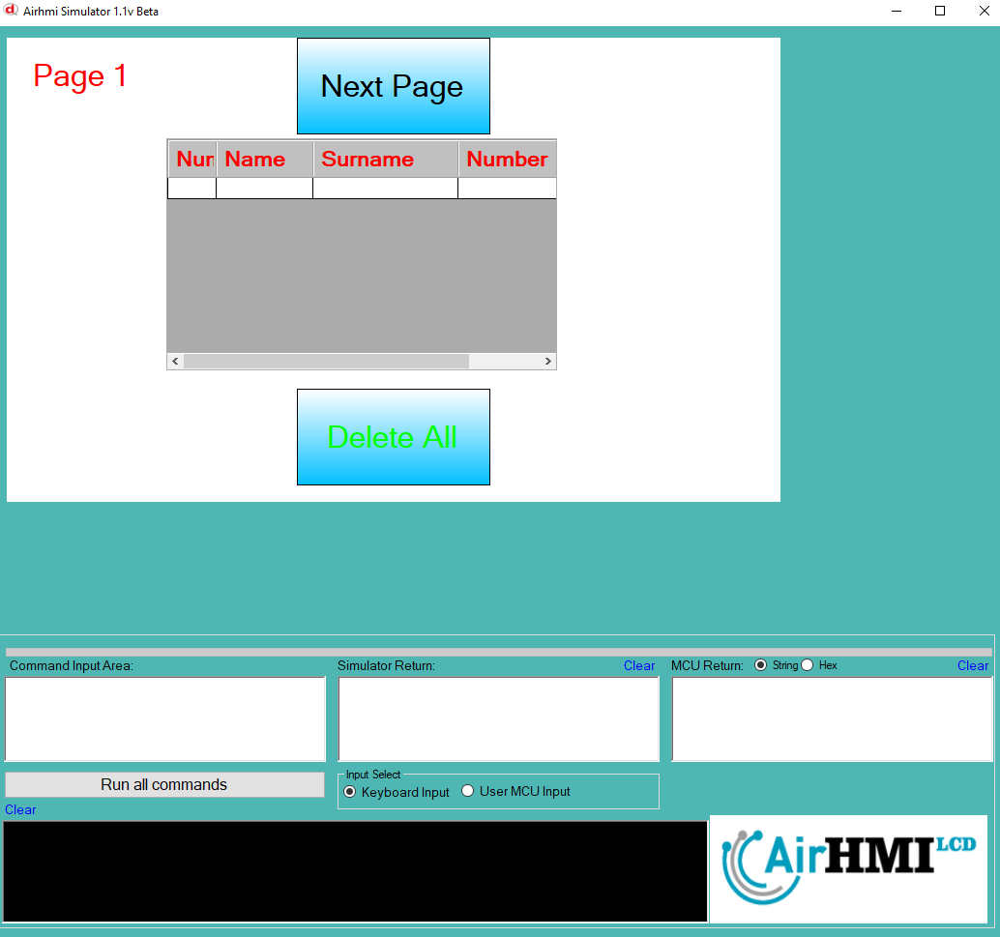

# ListViewDeleteAllRows Özelliği


ListView'de istedğimiz satırı bu komut ile silebiliriz. 

```
ListViewDeleteAllRows("ListView1");  // Listeyi komple sil.
```

ListView nesnesi statik dir. Her sayfadan erişilibilinir. 

## Program İlk Açılış Görüntüsü

## Herki ListView in tüm satırlarını siliyoruz. 

## Sonraki Sayfaya geçiyoruz. tüm satırlarını siliyoruz. 

## Birinci sayfaya tekrar dönüyoruz. 


